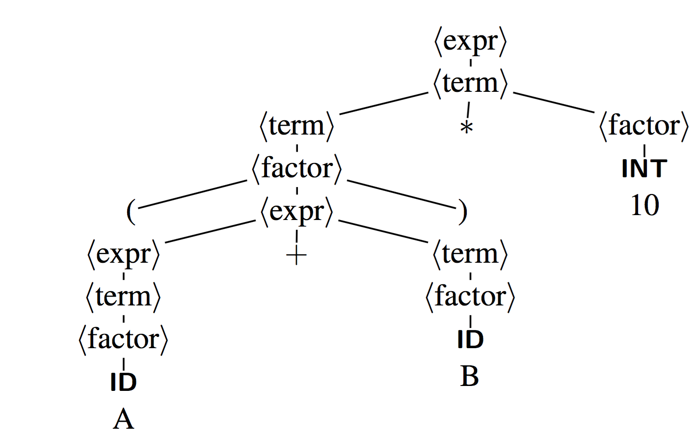
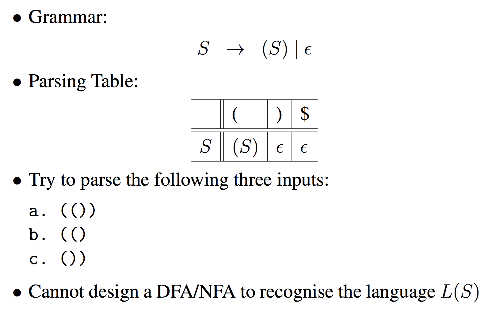
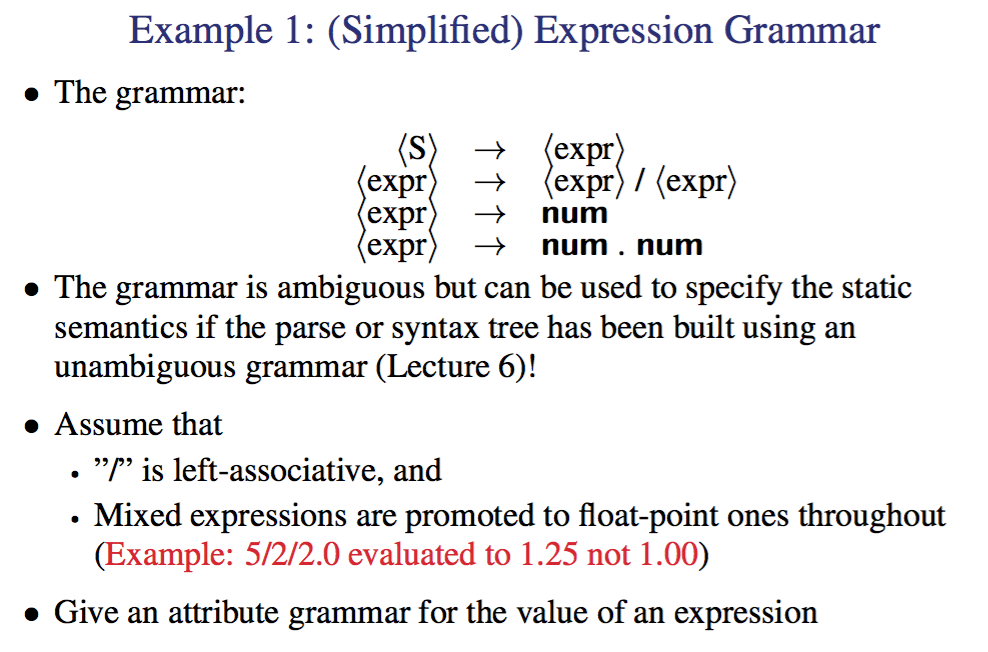

# Course Information

Assignment 1 : week 3 <br>
Assignment 2 : week 6 <br>
Assignment 3 : week 8 <br>
Assignment 4 : week 11 <br>
Assignment 5 : week 12

The 5 assignments build upon one another:

1. Scanner – reads text and produces tokens
2. Recogniser – reads tokens and checks syntax errors
3. Parser– builds abstract syntax tree (AST)
4. Static Semantics – checks semantics at compile time
5. Code Generator – generates Java bytecode

Tutorials start week 3

Work on the assignments should be consistent in leu of regular labs. There are 5 and the first is due in week 3 before the first tutorial. Start working on it in week 1./Set aside a regular amount of time maybe 4-10 hours a week to consistently work on the next assignment. 

# Compiler overview
#### What is a compiler
---
It is just a program to take in code and produce Machine code / other representation of code usually at a lower level of abstraction. In doing this the compiler will output errors and warnings to the user. 

This is because as well as just compiling down a language a compiler must be able to reocgnise what a legal program is and ensure that it only produces legal programs. 
It may generate a program that does not have the expected behavior but it should not produce code that can not run. 

Although not always true a compiler should strive to generate optimal and efficient code wherever possible. 

#### Typical Compiler structure
---
We take in code and we start by feeding it into a scanner. This will split the code into tokens. 
These tokens are then passed into he parser which produces a abstract syntax tree, A tree representation of the code that holds the syntactical meaning of the original code. 
This then goes through the Semantic analyser to produce a decorated tree. At this point the analysis stage of the compilation is over and the compiler now moves into the synthesis stage. 
Immediate code generator creates the IR (Intermediate Represetnation) which can then be fed into code optimization and code generators (out of the scope of this course lmao)
Note that the decorates AST can be passed directly into the code optimization stage. 


#### Examples
---

Here you should note that the decorated tree simply adds in the step to convert the int literal to a float because all values in this register based machines are floats. 


Now we can move this tree into code form by shifting it first into a IR

```
Temp1 = i2f(60)
Temp2 = id3 ∗ Temp1
Temp3 = id2 + Temp2
id1 = Temp3
```
You may already notice that here the code is a bit inefficient. 
rather then moving 60 into a temp we can multiply it by id3 directly. And rather then assinging id2 * Temp2 to Temp 3 only to have that reassigned to id1 we can just assign it directly to id1

```
Temp2 = id3 ∗ 60.0
id1 = id2 + Temp2
```

This now can be used to generate some machine code as it is split up into simple single arithamtic steps. Note that this is the main step that relys on specific chip arcitecture and thus this step will need to know if there is a multiply by immediate command or not. 


```
MOVF rate, R2
MULF #60.0, R2
MOVF initial, R1
ADDF R2, R1
MOVF R1, position
```

Take a look at this example for the java compiler


Here we have assignment expressions (`AssExp` lol) which splits up the expression into a left side and right side. I.e left = right or `position = initial + rate * 60`
This is then split into a simple variable called position to the left and a binary expression to the right. 

a binary expression being a expression with 2 variables involved. 
this contines to be split down untill we have the syntax tree. 
Note the need to know what variabels are simple because in java sometimes variables may be more complex such as objects/pointers 

#### Retargetble compilers
----
THe idea is that multiple different languages can be compiled into the same IR using multiple front ends. 
Once in this form you can use generic IR optimization tools and then feed this ir into different back ends depending on the system


This means we can simplify retargeting using this "everybody gets the same IR" thing
M languages + N architectures -> M frontends + N backends not
MN frontends + NN backends


#### Overview
---

#### Lexical Analysis

The tool that does this is the scanner!
It just groups characters into tokens. 

> Tokens are just the basic unit of syntax

A line like this

```
position = initial + rate * 60
```

splits into 7 tokens

1. The identifier position
2. The assignment operator =
3. The identifier initial
4. The plus sign
5. The identifier rate
6. The multiplication sign
7. The integer constant 60.

The key issue with this is speed. You need it to be fast but it is a inherently slow process. 

Do note that there is a token and a lexeme this is the difference taken from 
Using "Compilers Principles, Techniques, & Tools, 2nd Ed." (WorldCat) by Aho, Lam, Sethi and Ullman

A lexeme is a sequence of characters in the source program that matches the pattern for a token and is identified by the lexical analyzer as an instance of that token.

A token is a pair consisting of a token name and an optional attribute value. The token name is an abstract symbol representing a kind of lexical unit, e.g., a particular keyword, or sequence of input characters denoting an identifier. The token names are the input symbols that the parser processes.

> The lexeme is the actual text forming a token

#### Syntax analysis

and now we come to the parser

This just groups tokens together into gramatical phrases, which it represents as a AST. 

In doing this it can produce meaningful error messages that define what the issue is in terms of grammer rather then what actually goes wrong on the compiler level, because it understands the grammer is can also attempt error detection and recovery. 

Note that how this tree is constructed is defined by the grammer, usually this is context free (Context free grammer or CFG).

A context free grammer is just a grammer that does not depend on context amazingly enough. That is to say that 7=5 is interperted the same way regardless of the context it is seen in. A non context free grammer is html as because the compiler will fix issues instead of raising compiler warnings it must treat the same tags differently depending on where they are. I.e if a tag is in a illegal place it doesn't raise a warning it just compiles it differently to fix the issue. 

anyway usually the typical grammer is defined

```
⟨expr⟩ → ⟨expr⟩ + ⟨term⟩ | ⟨expr⟩ − ⟨term⟩ | ⟨term⟩
⟨term⟩ → ⟨term⟩ ∗ ⟨factor⟩ | ⟨term⟩ / ⟨factor⟩ | ⟨factor⟩
⟨factor⟩ → ( ⟨expr⟩ ) | ID | INTLITERAL
```
This just says that a expression is either a expression + a term, a expression - a term or a term. 
so something like `7 + 5 - 8` breaks down as such

```
(7 + 5) - 8      // expr - term
((7)+5)-8        // (expr + term) - term
```

similarly we have that a term is a term times a factor or just a factor
and finally that a factor is either a expression, an id to some memory, or a literal. 


> 3 lines of grammer allow the parser to parse any concievable expression which is a amazing exponetial growth of complexity

#### Symantic analyser

This is when we get to the Static Semanatics section of the compiler.

suprise suprise it checks the program for semantic errors
1. variables defined before used
2. operands called with compatible types
3. procedures called with the right number and types of arguments

It also does a incredibly important task. `Type checking`

It usually just uses a symbol table that defines every variable and it's type 
And then makes sure that given this type the context the variable is used in is valid. You can't use a float to index an array! Do note that this step will convert types if permitted by the language.

#### Immediate code generation

The Intermediate Code Generator generates an explicit IR from the AST. 
The IR isn't like universally defined but it must be easy to generate while also being easy to convert into machine code. 

This usually is the place where subtle small changes effect the speed and effectivness of a compiler. 

Popular IRs:
1. Abstract Syntax trees (ASTs)
	Note that this means that the parser tree is edited minimally.
2. Directed acyclic graphs (DAGs)
3. Postfix notation
4. Three address code (3AC or quadruples)

#### Optimization

Some common optimization is to remove code that can never be reached, discover some constant value and propergate it so it doesn't have to be called from a variable, remove reduant computation and remove it or sometimes moving a computation to a different place where it has equal effect but is run redunently less often. 

#### Generation


- generates target code: either relocatable machine code or assembly code
- chooses instructions for each IR operation
- decide what to keep in registers at each point

A crucial aspect is the assignment of variables to registers.


#### Errors


Handling errors is split up into 3 parts

1. What is the error
	a. Is it lexical like a unterminated string "123
	b. is it syntax like forgetting a closing parenthis
	c. is it semantic like passing a int where a float was expected
2. Report
	a. report the error and importantly `WHERE` it occured
3. Recover
	a. you could crash right here but it's more useful to recover what you can and keep compiling so you can find other errors 
	

We can optionally implement error recovery in your parser.


#### The Role of a scanner
---


Due to this structure usually the scanner runs as a sub routine within the parser

note that we will not be using a symbol table until assignment 3

So java has a stringTokeniser built in!

```
import java.util.*;
// the first string in the input
// the second is the token deliminators
// the third is if the delimator should be included in the token or not
StringTokenizer s = new StringTokenizer("(02) 9385 4889", "() ", false);

while (s.hasMoreTokens())
  System.out.println(s.nextToken());
```

You can have different tokens depending on the language. In english tokens are words and can be classified as noun tokens or verb tokens etc. 

In VC (variant of C) there are 5

1. identifiers
	a. This is just variables
2. keywords
	a. int, if, while, etc 
3. operators
	a. “+” or “∗”, “<=” ...
4. separators
	a. “{”, ‘}”, “;” ...
5. literals
	a. integer, real, boolean and string constants

Now you define tokens with regex patterns (just called patterns in the context of compilers) but do note you can do assignment 1 `without regex`

Some patterns:

| Token Type   | Pattern | example |
|--------------|---------|---------|
| intLiteral   | `\d+` | 764     |
| floatLiteral | `\d(.\d+)?( [Ee][\+\-]?\d+)` | 7.2 E3 |

There is also a formal system for defining tokens revolving around finate state machiens but this is covered in more detail week 2

we can represent tokens as such

```
Token                   Representation
------------------------------------------------------------
sum      new Token(Token.ID, "sum", sourcePosition);
123      new Token(Token.INTLITERAL, "123", sourcePosition);
1.1      new Token(Token.FLOATLITERAL, "1.1", sourcePosition);
+        new Token(Token.PLUS, "+", sourcePosition);
,        new Token(Token.COMMA, ",", sourcePosition);
```

SourcePosition is an instance of the Class SourcePosition and has these fields:
- charStart: the beginning column position of the token
- charFinish: the ending column position of the token
- lineStart=lineFinish: the number of the line where the token is found.

note you can have the scanner return a error token if it reaches some text that it does not have a matching pattern for. This can thus raise a `lexical error`. This would happen with a string with no end " as this isn't a valid token at all! some examples from VC:

```
/*  -> prints an error message (unterminated comment)
|, ^, %, etc.   -> returns an error token and continues lexical analysis
```

note how we can't recover from a untermined comment because it could very well comment out all the code in the document. 
now there are many different ways to create a scanner but 2 things must always be true when the scanner is calle to produce a token. 
1. currentChar is pointing to either the beginning of whitespace, a comment or a token. 
2. The pattern must always be a greedy match. Always match the longest possible string. ">=" not ">"

#### Design Issues in Hand-Crafting a Scanner (for VC)
---
1. What are the tokens of the language?

	`see Token.java`
2. Are keywords reserved?
	`yes in VC, as in C and Java`
3. How to distinguish identifiers and keywords?
	`see Token.java`
4. How to handle the end of file
	`return a special Token`
5. How to represent the tokens?
	`see Token.java`
6. How to handle whitespace and comments?
	`throw them away`
7. What is the structure of a scanner?
	`see Scanner.java`
8. How to detect and recover from lexical errors?

	`have partial token matches to detect them and possible fix them by adding in a missing "?`
9. How many characters of lookahead are needed to recognise a token?

	`depends on the token, for a exponent it's 3 and for i++ it's 2`

#### Reservered words
---

you may have used languages like python that let you use words defined by the language as variables (known as identifiers in this course)

there is a language called PL/1 where the line `if then = else then if = then; else then = if` is legal because `if` and `then` are used as variables

How does the compiler handle this? well either the scanner interacts with the parser to help it out by giving it more context or it regard the identifiers and keyword as having the same token type, leaving the task of distinguishing them to the parser. here you could do something like "any `if` that isn't followed by a expression is a variable"


# Alphabet, Strings and Languages

## Definitions
---

#### Alphabet
denoted by Σ is any finite set of symbols. 
For example this set {0,1} is a alphabet that describes every symbol used in binary strings. This can be call

#### String
A finite sequence of symbols drawn from Σ, i.e a string is just a series of symbols from a alphabet connected. 
Note that in this notation |s| means the length of string which is just the number of symbols contained. 
We use the symbol (\\(\epsilon\\))

#### Language
any set of strings over Σ, that is to say a series of strings. 
note that it has two special cases

- ∅: the empty set
- {\\(\epsilon\\)} : the set with only empty strings

#### Examples of languages

Σ = {0, 1} defines the a language where the only valid symbols are 0 and 1, in this language strings are just 0's and 1's. 
lets say every string in this language is a instruction
This language now defines the set of M68K, MIPS, Pentium instructions etc. 

now if we say Σ = {a,b,c,...} i.e Σ = ASCII set. We can now define most high level languages such as C, Haskell, VC etc. as every program in C is just a string in this alphabet. the '\n' is just another symbol. 

## String transformations
---

We can split up a string into multiple parts

| Term | Definition |
| --- | --- |
| prefix of s | s with 0 or more trailing (on the end) symbols removed|
| suffix of s | same as prefix but done with the leading symbols |
| substring of s | s after a prefix and suffix have been removed |
proper prefix suffix, substring of s | Any nonempty string x that is, respectively, a prefix, suffix or substring of s such that s != x |

We can also concatenate strings, if we have \\(x\\) and \\(y\\) adding y onto x or concatenating x and y gives us \\(xy\\)

if x is key and y is work xy is keyword. 

Not too complicated, but do note that with this we have this property with \\(\epsilon\\)

\\(\epsilon x= x\epsilon = x\\)

Again kinda obvious but it's good to have this formalised. 

## Language Transformations

Here is a quick table to outline some of these transformations on two languages L and M


This may seem hard to visualise, take a look at the example first


The union of two languages is just a combination of all the symbols in both. 

The superscript number just defines length of the string. 

the concatenation of two languages is a set of all combinations of a symbol from L followed by a symbol of M. 

The Kleene Closure is just the same as the * in regex. I.e it represents 0 or more consecutive instances of a string. 
The mathematical representation just says that L* is the set of every possible number of repetitions of L including the empty string, otherwise known as 0 or more concatenations of L. 

The Positive closure just states that the empty string is not included in this set. 

# Regular Expressions

RE is build on top of this. REs define `regular languages` (RL) or regular sets. That is to say a certain Regular Expression simply refers to a specific regular language or regular set of strings. 

This makes sense as a RE is used to match a certain type of string and thus must represent some set of correct matching expressions. 

You can formally define regular expressions in two steps, the inductive base (setting up the base cases) and then inductive steps which is the general cases. 

## Inductive Base
---
1. \\(\epsilon\\) is a RE, denoting the RL {\\(\epsilon\\)}
2. a ∈ Σ is a RE,denoting the RL{a}f

In simple terms, \\(\epsilon\\) represents a set of empty strings so the regular expression "" matching nothing. 
And in addition a regular expression with just a symbol defines a set with that symbol. i.e it can only match with every instance of that symbol. 

##  Inductive Step
---

Suppose r and s are REs, denoting the RLs L(r) and L(s)

Now we can start forming the regular expression language while linking it to our formal definition of languages, strings and alphabets. 

1. (r)|(s) is a RE, denoting the RL L(r) \\(\cup\\) L(s)
2. (r)(s) is a RE, denoting the RL concatination L(r)L(s) 
3. (r)∗ is a RE, denoting the RL kleene closure L(r)∗
4. (r) is a RE, denoting the RL postive closure L(r)

## Rules
---

But we do have to define some rules around this now

#### Precedence

- “∗” has the highest precedence
- “Concatenation” has the second highest precedence
- “|” has the lowest precedence

#### Associativity

all are left-associative, if you don't have brackets, evaluate left to right, and all special symbols apply to the symbol to the left of it. 

\\(a|b^\*c\\) is the same as \\((a)|((b)^\*(c))\\)

## Examples
---

• Alphabet: Σ = {0, 1}
• RE: 0(0|1)*

What is the language defined by the RE?

Well we know from basic regex that 0(0|1)* is just any string that starts with a 0 and contains any combination of 0's and 1's afterwards. 

how this breaks down formally though is

\\(L(0(0|1)^\* )\\)
\\(= L(0)L((0|1)^\* )\\)
\\(= \{0\}L(0|1)^\*\\)
\\(= \{0\}(L(0) ∪ L(1))^\*\\)
\\(= \{0\}(\{0\} ∪ \{1\})^\*\\)
\\(= \{0\}\{0, 1\}^\*\\)
\\(= \{0\}\{\epsilon ,0,1,00,01,10,11,...\}\\)
\\(= \{0,00,01,000,001,010,011,...\}\\)

Kinda takes the magic out of regex doesn't it?

## Notational Shorthands
---

If you have used regex before you may be thinking what about the life savers like `?` or `[]`. These are actually defined by the language but  just in longer forms. So we use these shorthands

\\(r? = r|\epsilon\\)
\\([a-z] = \{abcdefghijklmnopqrstuvwxyz\}\\)
and using the caret (`^`) just means the set of all valid symbols in the alphabet excluding the symbols specified. 

## VC
---

Just note that in VC you can use the following regex to tag identifiers (variable names etc.) 
`letter(letter|digit)*`
But note that in the spec letter includes the `_` character. For us letter will be ascii letters but in java it can be any unicode character awesome enough.
You can have variable names in greek letters or mandarin. 

Just has a heads up the RE for reals is a bit complex because you can have digits fractions and exponents. 
It ends up being a set of regex: (NOTE that in this . does not represent any character)

```perl
digit: 			/0|1|2|3|4|5|6|7|8|9/
fraction: 		/.digit+/
exponent: 		/(E|e)(+|-)?digit+/
floatLiteral:	/digit* fraction exponent? | digit+. | digit+.?exponent/
```

# Finite Automata / Finite State Machines

## Defintion
---

A finite automaton consists of a 5-tuple:
`(Σ,S,T,F,I)`

- Σ is an alphabet
- S is a finite set of states
- T is a state transition function: T : S × Σ → S
- F is a finite set of final or accepting states
- I is the start state: I ∈ S.

In essence it is just a way to represent a machine/automata/system which has a finite number of states and a fixed set of ways to transition between those state. 

## Representation
---

We can represent finite state automata (FA) with Transition graphs. Details below


Note that a FA will only accept a string x if there is some path on the machine which fits in with the string. I.e if x was hello there must be some path in the machine that starts with h at a valid start state and transitions legally to a end state with o.

## Example
---


This state will accept `strings of 0 and 1 with an odd number of 1's`

if we were to break this down into it's 5 tuple we would get this

- Σ : {0,1} 
- S : {S,A}
- T <br>
	: T(S,0) = S<br>
	: T(S,1) = A<br>
	: T(A,0) = A<br>
	: T(A,1) = S<br>
- F : {A}
- I : S

The alphabet is just 0 or 1, there are 2 states S or A. there is only 1 Final ending state, A, and there is only 1 start state, S. 

The transitions are listed as T(state, symbol) = result
Thus we can summarise the Transition functions as 

S -- 0 --> S
S -- 1 --> A
A -- 0 --> A
A -- 1 --> S

Remember that T is a function S×Σ to S.
But aside from this we also need to consider invalid input.

Lets sat that A -- 0 --> A wasn't defined and suddenly we get to the point where we need to calculate T(A, 0). Although this isn't on the graph it is implied to be = to error. These extra error transitions arn't drawn on but implied, by convention at least. 

## Determinism
---

You are filled with `DETERMINATION`

#### Deterministic Finite State Automata
a FA is a DFA if 

- no state has an \\(\epsilon\\)-transition, i.e. an transition on an empty string input
- for each state s and input symbol a, there is
at most one path out of the state. I.e there arn't two paths that you could take. 

#### Nondeterministic Finite State Automata
a FA is NFA if it is not a DFA i.e

- you can make several parallel transitions on a given input
- you can have a \\(\epsilon\\) state

but a NFA still must have Acceptance, the existence of at least one path that leads to a finishing or accepting state.

#### Difference

`from http://math.stackexchange.com/questions/563829/difference-between-nfa-and-dfa`

in a DFA each possible input determines the resulting state uniquely. Every input causes a state change, and the new state is completely determined by the input. Moreover, the automaton can change state only after reading an input.

If it’s an NFA, some inputs may allow a choice of resulting states, and some may cause the automaton to choke, because there is no new state corresponding to that input. Moreover, the automaton may be constructed so that it can change state to some new state without reading any input at all. (epsilon loops for example)

If you start a DFA in its initial state and input some word w, the state in which the DFA ends up is completely determined by w and w will produce a `deterministic` consistent result.

If you start an NFA in its initial state and input some word w, there may be several possible states in which it can end up, since some of the inputs along the way may have allowed a choice of state changes.
 
Consequently, you can’t predict from ww alone in exactly which state the automaton will finish; hence `nondeterministic`. 

If it’s a DFA, we know that each word completely determines the final state of the automaton, and we say that the word is accepted if that state is an acceptor state.

If it’s an NFA, there might be several possible final states that could result from reading a given word; as long as at least one of them is an acceptor state, we say that the automaton accepts the word.

Note that this is why we want to soon be able to go from a nfa to a dfa. DFA is a lot more reliable in producing a output, something we want in our program.

## Thompson’s Construction of NFA from REs
---

You can convert RE into NFA's through a series of ways, One of those ways is Thompsons construction. 
This method is syntax driven, Inductive, and important. 

Inductive just means the cases in the construction of the NFA follow
the cases in the definition of REs and important means that if a symbol occurs several times in a RE , a separate NFA is constructed for each occurrence

#### Inductive base


#### Inductive step
suppose N(r) and N(s) are NFAs for REs r and s.


note that `r|s` branches off into two NFA's. Also note that you can take a epsilon path without taking in another token. great for looping. 
 
The `rs` blends together so you transition from r to s to acceptance. 

the \\(r^\*\\) can either skip the NFA or enter into it with a variable number of repeats Before exit. again the repeat happens without needing a specific input token. 

#### Example

Converting \\((0|10^{∗}1)^∗10^∗\\) to an NFA

now we have some rules on how to handle r|s rs and r* so lets break this down into those terms

Let (0|10\*1) be A and 0 be B

thus we get

A* -- 1 --> B*

and as we know *'s are represented with 4 states, something like this


Where you can go from one state to the next then check if you are done and if not keep looping. There is also of course the option to skip as this is a * not a +.

now using this we can evaluate B quite easily. note the numbers on the states are arbitrary. 

0* is represented as 


We enter in, and we can either skip if there is no 0 or register the 0 as many times as there is one. Once it's done we go to the terminal state. 

A is more complex. We have (0|10*1) which we need to break up into two branches 0 and 10\*1. both of which can be looped due to the \*.

so we start the loop, either branch into 0 or 1 -> 0* -> 1 and then at the end of both loop back and repeat the branch. 
Thus we get this at the end


## Subset construction NFA to DFA
---

It's actually very difficult to go from a RE to DFA directly but going first to a NFA then to a DFA is very possible, especially in code. 
Why would we want to do this? NFA's are easy to generate in code but not as efficient to execute as DFA's for similar reasons we usually take a DFA and minimise it to further increase the speed and efficiency of the graph. (as well as this DFA's are way better to run in code because they are deterministic and give consistent results)

Note this algorithm is called subset construction because a DFA state corresponds to a subset of NFA states. This is because in DFA we can't have \\(\epsilon\\) so part of this is compressing those and reducing the total number of states as a result 

There are at most \\(2^n\\) DFA states, where \\(n\\) is the total number of the NFA states. This is because sometimes the conversion does increase the number of states in attempting to make a deterministic graph.

#### Operations

There are 3 main operations used to help convert NFA's to DFA's
Note that T is a set of NFA states and s is a single NFA state

OPERATION | DESCRIPTION
--- | ---
\\(\epsilon\\)-closure(`s`) | the set of states that you can get to from a given state `s` via a \\(\epsilon\\) link/transition
\\(\epsilon\\)-closure(T) | Same as above but takes in a set and checks every s
move(T , `a`) | Looks through all the states in T and finds all the states you can get to via a `a` transition. I.e every state you can get too from a given set of states if the input character was `a`

#### Algorithm

1. Create the start state of the DFA by taking the \\(\varepsilon\\)-closure of the start state of the NFA.
2. Perform the following for the new DFA state: 
	- For each possible input symbol:
		- Apply move(T,a) to the newly-created state and the input symbol; this will return a set of states.
		- Apply the \\(\varepsilon\\)-closure to this set of states, possibly resulting in a new set.
	- This set of NFA states will be a single state in the DFA.
3. Each time we generate a new DFA state, we must apply step 2 to it. The process is complete when applying step 2 does not yield any new states.
4. The finish states of the DFA are those which contain any of the finish states of the NFA.

[video](https://www.youtube.com/watch?v=taClnxU-nao)

Here is a small example


the overall code is something like this

```python
for state in todo:
	for input in state.paths():
		new = closure(move(state, input))
		if new not in todo:
			todo.append(new)
		finalGraph((state, input)) = new
```
What we did here was take state 1 and throw it into the \\(epsilion\\)-closure function to get the set of states that you can get to via a epsilion transition, this is just 1 in this case, a empty string can only result in the state staying the same as there is no epsilon path. 

so lets say `todo = [1]`

Now we go through all the possible input symbols and apply move after we remove 1 from the todo list.  

`move(1,a) -> 2`
as a input character a can take you to 2

`move(1,c) -> (4,3)`

now we apply closure to these 2 and if we haven't done them yet, add them to the todo list. 

`closure(2) -> (2,1) // add to list`
`closure(4) -> (4,3)  // add to list`

Now just take the result of the closure of the moves and add them to the final graph. 

`1 -- a --> (2,1)`
`1 -- c --> (4,3)`

at this point the todo list is `[(2,1),(4,3)]` lets repeat

`move((2,1),a) --> (2) --> (2,1) //done`
`move((2,1),b) --> (3) --> (3) // add`
`move((2,1),c) --> (4) --> (4,3) //done`

`(2,1) -- a --> (2,1)`
`(2,1) -- b --> 3`
`(2,1) -- c --> (4,3)`

now we have `[(4,3),3]`

`move((4,3),a) --> 2 -->(2,1) // done`
`move((4,3),b) --> none --> none`
`move((4,3),c) --> (3) --> (3) // done`

`(4,3) -- a --> (2,1)`
`(4,3) -- b --> None`
`(4,3) -- c --> (3)`

todo is `[3]`

`move((3),a) --> 2 --> (2,1)`
`move((3),b) --> none`
`move((3),c) --> none`

`(3) -- a --> (2,1)`
`(3) -- b --> None`
`(3) -- c --> none`

and we are done!!

#### Fun

You can understand the basis of how this works without even needing the mathematical proof, because the main functions we use are move and closure. Move is obvious is just telling us neighbours of a node but closure is just as obvious. a dfa is not allowed to have any empty string transitions, closure takes two nodes connected by a empty string and "closes" them, merging them into 1 state while maintaining relevant connections. 

#### Definition

given a original NFA with (Σ, S, T, F, s0)
The resultant DFA is:
• The alphabet: Σ
• The states: all states in our finalGraph
• The start state: ε-closure(s0)
• The accepting states: all states in DFAstates containing at least one accepting state from the original NFA
• The transitions: All the transitions in the final graph

##  Minimising DFA Statements
---
This is just the process to take a DFA and minimise it down to it's simplest form so it can run faster and be represented with less complexity and space. 

#### Algorithm

Initially, let \\(\Pi\\) be the partition with the two groups:

1. one is the set of all final states
2. the other is the set of all non-final states

Let \\(\Pi_{new} = \Pi\\)

for each group G in \\(\Pi_{new}\\):
- Create subgroups from G that group together states with identical transitions to states within G.
replace G in \\(\Pi_{new}\\) by the set of subgroups formed

 Begins with the most optimistic assumption
 
 observe below
 
 
 
 the DFA is first split into 2 groups
 
 1. {A,D,E}
 2. {B,C}
 
 now for 1. A transitions into D with 0 and D transitions into D with 0 and E transitions into D with 0.
 
for 2. B ans C both transition into C with 0.

we now have 2 sub groups, ADE and BC. 

now ADE all transition into B with 1 and B and C both transition into E with 1. 

hence the final graph. 

# Scanner Generators

## Jflex
---

Jflex is a java generated scanner. What happens is a set of token specs via RE are taken in, a DFA is generated through some method and that can then be used as the actual scanner. 

This can generate any scanner given a arbitrary set of regex tokens. 

How jflex works is it takes in a spec in the form

```
	user code
  	%%
  	Jflex directives
  	%%
  	regular expression rules
```

an example is

```java
	some user code
  	%%
  	LETTER=[A-Za-z_]
  	DIGIT=[0-9]
  	%%
  	"if"  { return new Token(Token.IF, "if", pos); }
  	"<"   { return new Token(Token.LT, "<", pos); }
  	"<="  { return new Token(Token.LE, "<=", pos); }
  	{LETTER}({LETTER}|{DIGIT})*
   	     { return new Token(Token.ID, "itsSpelling", pos); }
```

This matches as much as possible into 1 token and also will take the first match if in the list of token regexs you give multiple match with a given input. 
so first we create a NFA


then we generate a DFA (note this is already minimal so we can skip that step)


Note you can represent every DFA as a transition table (refer to the video in the section above

Note though these are usually spase as some will be empty and thus represent errors (you can compress these though, check the textbook for some techniques)

Now what jflex does is actually SIMULATE a DFS through code without actually generating one. 

```java
 state = initial_state
  while (TRUE) {
    next_state = T[state][current_char];
    if (next_state == ERROR)  // cannot move any further
      break;
    state = next_state;
    if (current_char == EOF)  // input exhausted
      break;
    current_char = getchar(); // fetch the next char
  }
  Backtrack to the most recent accepting state
  if (such a state exists)
    /* return the corresponding token
       reset current_char to the first after the token
*/ else
    lexical_error(state);
```

## Limitations of RE
---

- Cannot “count”
- Cannot recognise palindromes (e.g., racecar & rotator)
- The language of the balanced parentheses {(n)n |n􏰀1}
is not a regular language and can't be encoded in RE
	- but this can be specified by a CFG (covered Week 3)

## Chomsky’s Hierarchy
---

Depending on the form of production
\\(\alpha → \beta\\)
four types of grammars (and accordingly, languages) are distinguished:


# Syntax And Semantics

## Defintion
---

Syntax is the t he form or structure of English sentences, there isnNo concern with the meaning of English sentences. 
`john ate the apple` vs `apple ate the john`

the english grammar defines how english is put together and hence defines the syntax. 
Semantics is the meaning of English sentences, which can be defined by a dictionary or more broadly humans in general.

## Semantics
---

For programming languages this can be split into two parts

#### Static Semantics
Context-sensitive restrictions enforced at compile-time stuff like 

```c
// All identifiers declared before used
int c;
c = 0;

// Assignment must be type-compatible
c = 6; //rather then 
c="hi";

//Operands must be type-compatible with operators
5 + "hi" - 6.7

//Methods called with the proper number of arguments
printf("hi");
```
#### Run Time Semantics
What the program does or computes, i.e the meaning of a program or what happens when it is executed

Is specified by code generation routines.

# Grammer / CFG

## Why?
---

we use grammars as a way to give a generic language a precise and easy-to-understand syntactic specification. 

Because it is a defined structure we can add to it over time to extend a language or to remove obsolete features without have to make large changes to the compiler code base. 

Furthermore because of grammars we can now create language specifications and in turn languages incredibly quickly. 

In 1950s, the first FORTRAN took 18 man-years, Now, a compiler written can be written by a student in a semester. 

In addition they also allow for syntax-directed translation, covered more later but in essence allows us to skip everything after the parser (where the AST is generated)

You just tokenise and the parser will create the bytecode. This is impossible without a standard set out way to define language semantics. 

## Define CFG
---

Context free grammar is one of the ways we can define a languages syntax. It's not as powerful as more complex context-sensitive grammars and phrase-structure grammars but is Simple, widely used, and sufficient for most purposes. 

You can also define a languages grammer via a Regular grammars (i.e., regular expressions) but without the extra info defined in a CFG they are much less powerful, limited to smaller less robust languages. 

In this course we use both CFG and RG. 

## Formal Definition of CFG
---

#### Intro

A grammar G is a quadruple (\\(V_T\\),\\(V_N\\),\\(S\\),\\(P\\)), where

- \\(V_T\\) is a finite set of terminal symbols or tokens (end points)
- \\(V_N\\) is a finite set of nonterminal symbols
	- \\(V_T\\) ∩ \\(V_N\\) = ∅, i.e a symbol has to be either a terminal or non terminal symbol, not both. 
- \\(S\\) is a unique start symbol (S ∈ N)
- \\(P\\) is a finite set of rules or productions of the form (A, α) where
A is a nonterminal, and
	- α is a string of zero or more terminals and nonterminals
	- Note: zero means that α = ǫ is possible

#### Backus-Naur Form (BNF)

just a notation for writing a CFG, here the (A, \\(\alpha\\)) production is the same as saying that A is defined to be \\(\alpha\\) and is denoted as \\(A \rightarrow \alpha\\)

It also allows us to abbreviate something like this 

\\(A \rightarrow \alpha 1\\)
\\(A \rightarrow \alpha 2\\)
\\(A \rightarrow \alpha 3\\)
\\(A \rightarrow \alpha 4\\)

to something like this

\\(A \rightarrow \alpha 1\\)
\\(| \rightarrow \alpha 2\\)
\\(| \rightarrow \alpha 3\\)
\\(| \rightarrow \alpha 4\\)

where the pipe is just a "or else"

#### Conventions


## Micro English
---

lets take a very small simple subset of english and define the CFG for it in BNF. 

```
1 ⟨sentence⟩ → ⟨subject⟩ ⟨predicate⟩
2 ⟨subject⟩ → NOUN
3		| ARTICLENOUN
4 ⟨predicate⟩ → VERB ⟨object⟩
5 ⟨object⟩ → NOUN
6 		| ARTICLENOUN
```

This just says the a sentence is a subject followed by a predicated and then defines a subject as either a noun or article noun and a predicate as a verb followed by a noun or article noun 

For example "John ate pasta"

from this we can extract out our (\\(V_T\\),\\(V_N\\),\\(S\\),\\(P\\)). 

The terminal symbols are Nouns or verbs and everything else is a normal symbol. 
The start symbol is a sentence, (left side of 1st production is always the start)

and the productions themselves are listed. 

## Derivation
---

A grammar derives sentences by
1. beginning with the start symbol, and
2. repeatedly replacing a nonterminal by the right-hand side of a production with that nonterminal on the left-hand side, until there are no more nonterminals to replace.

Such a sequence of replacements is called a `derivation` of the sentence being analysed

The strings of terminals and nonterminals appearing in the various derivation steps are called `sentential forms`

A `sentence` is a sentential form with terminals only and the language is  the set of all sentences thus derived

#### Example

given micro english and given a sentence `PETER PASSED THE TEST` verify that it is a valid sentence given our grammar. 

alright lets break it down

```
Sentence -> subject predicate
	Peter (subject) passed the test (predicate)
subject -> Noun | article noun
	Peter (noun) passed the test (predicate)
predicate -> verb object
	Peter (noun) passed (verb) the test (object)
object -> noun | article noun
	peter (noun) passed (verb) the (article) test (noun)
```
Thus the sentence is `NOUN VERB ARTICLE NOUN`

now when coding this up we have to make a choice

#### Notation

The context-free language (CFL) is the language generated by a CFG


## Leftmost and Rightmost Derivations
---

The algorithm is basically saying "alright what's non terminal and what can i replace it with so it gets closer to non terminal"

and which non terminal the algorithm picks next can be set to be either

1. The Leftmost derivation: always replace the leftmost
nonterminal.
2. The Rightmost derivation: always replace the rightmost nonterminal.

## The language defined by a grammar
---

The language defined by a grammar: all the sentences derived from the grammar.
The language defined by the micro-English grammar:
	`NOUN VERB NOUN`
	`NOUN VERB ARTICLE NOUN`
	`ARTICLE NOUN VERB NOUN`
	`ARTICLE NOUN VERB ARTICLE NOUN`

# Parsing

## Intro
---

Use syntactic rules to break a sentence into its component parts and analyse their relationship. a parser is thus a program that uses a CFG to parse a sentence or a program (Assignment 3). In particular, it constructs its leftmost or rightmost derivation, or builds the parse tree for the sentence.

A recogniser is a parser that checks only the syntax (without having to built the parse tree). It outputs YES if the program is legal and NO otherwise (Assignment 2).


## Parse Trees
---

so you can do the left most and right more derivations to parse a sentence but it's much more useful to use that to construct a parse tree. 


the start symbol here is the root of the tree and non terminals are nodes, the leafs are obviously terminal symbols. 

with this tree we can get the sentence if we read the leafs left to right. 

#### Why?

So we can get the same sort of information from a derivation rather then a parse tree, so why use the tree?
It's a graphical representation of the same information and makes it easier to think, furthermore computer science is deeply familiar  with tree structures and has gotten very good at manipulating them. 

effectively we end up using derivation to construct the tree. 

## Extended Backus-Naur Form (EBNF)
---

This is just BNF + regular expressions. 


#### Example

lets say that a VC program is a sequence of zero or more functions

in BNF that would be

```
program → decl-list
decl-list → decl-list func-decl
		| decl-list var-decl
		| ϵ
```
as in a program is declaration list which in tern 
is either empty strings or function / variable declarations. 

If we wrote this in EBNF we get

```
program → (func-decl | var-decl)∗
```

Reads easier doesn't it?

## Structure of Grammars
---

#### Top Down
This is a grammar which is structured much like the example for a VC Program above where we start with a top level defintion of a program and get more detailed as we go down. 

#### Bottom Up
here the deeper nodes in the parse tree processed first and the deeper operators in the parse tree have higher precedence, think that rather then classifying a whole program you jump right to classifying the first thing you see as a leaf node then building up. 
This is assignment 5 and will be covered more later. 

#### Expressions and Operator associativity 

There is a classic expression grammar

```
⟨expr⟩ → ⟨expr⟩ + ⟨term⟩
		| ⟨expr⟩ − ⟨term⟩
		| ⟨term⟩
⟨term⟩ → ⟨term⟩ ∗ ⟨factor⟩
		| ⟨term⟩/⟨factor⟩
		| ⟨factor⟩
⟨factor⟩ → ( ⟨expr⟩ )
		|ID
		| INT    //Note:integer numbers not the type
```

I.e any math expression can be broken down into some + / - of terms first and then those terms can be expressed as a factor or multiple of factors and terms. 
Finally factors can themselves be contained expressions or leaf ints or ids. 

Thus something like `A + B ∗ 10` becomes this


This is because higher precedence operators bind to their operands before lower precedence operators and thus appear lower in the tree. 

the multiply symbol attaches to the B first, forming a term group meaning that it gets evaluated first. Which is what we want because basic PEDMAS dictates that `A+B*10` is `A+(B*10)`

ok but what if we said `(A+B)*10` the tree expands differently then



Here the expr goes directly to a term which goes to a term * factor. 
the term then evaluates to a factor which evaluates back to a expression. 

Because of this the plus now appears lower in the tree then the multiply and thus is evaluated first at higher precedence 

#### Left and Right Recursive productions 

So remember that as part of a grammar definition we define a set of productions, well those can be left or right and depending on which one they are we get a different tree being formed. 


The formal definition is that `Left-Recursive Productions` have the form

*A→Aα*

and `Right-Recursive Productions` have the form

*A→αA*


this is important because with equations with equal precedence like `A-B-C` the order they are calculated in depends on the direction of the productions. 

## Ambiguity
----

#### intro
anyone who speaks english knows that it's a bit fucked, for example, real sentences written into medical records:

1. By the time he was admitted, his rapid heart had stopped, and he was feeling better.
2. Patient has chest pain if she lies on her left side for over a year.
3. On the second day the knee was better and on the third day it had completely disappeared.
4. The patient was tearful and crying constantly. She also appears to be depressed.
5. Discharge status: Alive but without permission. The patient will need disposition, and therefore we will get Dr. Blank to dispose of him.

PURE FUCKEN GOLD

A grammar is ambiguous if it permits

- more than one parse tree for a sentence,
or in other words,
- more than one leftmost derivation or more than one
rightmost derivation for a sentence.

Basically if the same sentence can be interpreted in more then one way. 

#### Example

An ambiguous expression grammar:

```
⟨expr⟩ → ⟨expr⟩ ⟨op⟩ ⟨expr⟩ | ID | INT | ( ⟨expr⟩ )
⟨op⟩ →+|−|∗|/
```

if we take the Lm (Leftmost derivation) we can get 2 results


#### Coping

well the obvious thing is to rewrite the grammar so it is unambiguous

we can also use disambiguating rules to throw away undesirable parse trees, leaving only one tree for each sentence. I.e we get multiple results but have a system for choosing 1 each time. i.e
- Rule 1: * and / have higher precedence than + and −
- Rule 2: The operators of equal precedence associate to
the left.

#### Ambiguous Context-Free Languages

These are languages such that every grammar generating the language is ambiguous

But a interesting theoretical result from looking at these languages is that there can be no algorithm that can tell us of a CFL is ambigious or not. 

some tools can semi predict if a language is ambiguous or not but because this problem relates directly to the `Post correspondence problem` a simpler varied version of the `halting problem` which have been proven to be undecidable problems. 

#### The “Dangling-Else” Grammar

We can recognise one line if else statements with this

```
⟨stmt⟩ -> IF “(” ⟨expr⟩ “)” ⟨stmt⟩
		|	IF “(” ⟨expr⟩ “)” ⟨stmt⟩ ELSE ⟨stmt⟩
		|  other
```

but note that input such as `IF(e1) if (e2) s1 else s2` can produce
either 

```
if(e1)
	if(e2)
		s1
	else
		s2
```

OR

```
if(e1)
	if(e2)
		s1
else
	s2
```

What we do here is match the else with the closest previous unmatched if

so the first interpretation is correct

#### Chomsky

Remember this table?


note that each type is a subset of the previous. 

Type 0 is all languages, type 1 is a subset of type 0 and type 2 is a subset of type 1 (and hence also a subset of type 0).

## Regular Expressions, Regular Grammars and Finite Automata
---

All three are equivalent:


#### Limitations

**can't count**, can't nest, great for tokens but not much else. 

#### Limitations of CFG

can't define ALL languages, must only define a subset. 

it also can't enforce declaration before us of functions or variables, it just recognise a declaration and a variable. 

it also can't enforce that a function is called with the right number of arguments, again this has to be done externally. 

can count but only up to 2, if it tries to count more then 2 variables it becomes context sensitive. in essence this is because with more then two variables to keep track off your production rules now have to take in forward and backwards context into consideration (this rule only applies if there is a certain number of a's behind and b's infront)

where as with 2 variables you can just state the relationship before OR after. 

(i think)

# Equivalence between Regular Grammars and FAs

## Converting NFAs to Right-Linear Grammars
---

#### Right Linear Grammars

this is just a CFG which every production rule has at most 1 non-terminal on the right end of the result side. 

This can effectively describe the regular languages.

#### how?


#### Example


## Converting Right-Linear Grammars to NFAs
---


# Top-Down Parsing: Recursive-Descent

## Lookahead Token(s)
---
The currently scanned token(s) in the input. In Recogniser.java, currentToken represents the lookahead token
For most programming languages, one token lookahead only.
Initially, the lookahead token is the leftmost token in the input.

## Top Down Parsing
---

#### Intro

This is the process of building the parse tree. 
we start with the start symbol (i.e., the root) and grow towards the sentence being analysed (i.e., leaves).

in general we can do this with just 1 lookahead token

a top down parse will discover the leftmost derivation, basically the productions used in expanding the parse tree represent a leftmost derivation

#### Predictive (Non-Backtracking) Top-Down Parsing

To expand a nonterminal, the parser always `predict` (choose) the right alternative for the nonterminal by looking at the lookahead symbol only.
Note this is why we call it the lookahead symbol, it's been read from the file but hasn't been added to the tree and hence is not the current symbol. 

Flow-of-control constructs, with their distinguishing keywords, are detectable this way, e.g. in the VC grammar:

```
⟨stmt⟩ → ⟨compound-stmt⟩
	| if ”(” ⟨expr⟩ ”)” (ELSE ⟨stmt⟩)?
	| break ”;”
	| continue ”;”
	| ...
```
Prediction happens before the actual match begins! the code can look at the lookahead symbol and be able to tell which of the multiple cases to go to i.e it can see if the next symbol is a if or a break or a continue. 

#### Example
which of the Two Alternatives on S to Choose?

```
S → aA|bB
A → ···
B → ···

lookahead token: a
```

The leftmost derivation:
`S -> lm aA`
Thus we select the first alternative aA

How about here?

```
S → Ab|Bc
A → Df | CA
B → gA | e
C → dC | c
D → h | i

sentence: gchfc
```

We follow the following sequence

```
S -> Bc	Bc
B -> gA	gAc
A -> CA	gCAc
C -> c		gcAc
A -> Df	gcDfc
D -> h		gchfc
```

To do this though notice that we need a little more information then just the next token. Usually what we do is look at First Sets

## First Sets
---

All possible leftmost derivations, i.e what would happen if you reduced the left hand side as much as possible. 


This lets us look at all the possible ends of something like Bc {e,g} compares to Ab {c,d,h,i} and this of course we pick Bc because g is the next token. 

#### Formal Defintion

\\(First(\alpha)\\) : The set of all terminals that can begin any strings derived from α. Basically if we were to look at all possible derivations of \\(\alpha\\) the First would be the set of all the terminals that appeared at the start of the strings. 

\\(First(\alpha)\\) can also include \\(\epsilon\\) if it is a valid end state for a given \\(\alpha\\)

#### Nullable Nonterminals

A nonterminal A is nullable if it can be derived to a \\(\epsilon\\).

#### A Procedure to Compute First(α)

The simple explanation:

We want to be able to grab the leftmost terminal symbols for any string right? so the basic equation for a input sentence s is

```python
def first(s):
	result = emptySet()
	# empty string input is empty string output
	if len(s) == 1 and s == epsilon:
		result.add(epsilon)
	# if we have a non terminal descend into all branches
	if len(s) == 1 and s is nonterminal:
		# i.e if s -> es|b go through first(es) + first(b)
		for e in s.getOptions():
			setUnion(result, first(e))
	# if we have a string just decend into all symbols 
	# up to and including the the first non
	# terminal, i.e Keep searching until you get a 
	# symbol that gives you a definite non epsilon end point. 
	if len(s) > 1:
		# i.e if s is ABcd go though A then B then ...
		for e in s.split():
			if e.isNullable() == False:
				result.add(First(e))
				break
			result.add(First(e))
	return result
```
The formal explanation:

We have two cases, in the first case α is a single symbol or \\(\epsilon\\), Here we can do this

```
if α is a terminal a:
	First(α) = First(a) = {a}
elif α is epsilon:
 First(α) = First(epsilon) = {epsilon}
elif α is a nonterminal and α→ β1 |β2 |β3 | ···:
	First(α) = ∪kFirst(βk)
```
This makes a lot of sense, if the have nothing we return nothing and if we have just 1 terminal then that is the obvious first. 
if we have multiple options basically decend into each one and grab the first non nullable character that pops out!

For the Second case we have α = X1X2 ···Xn, i.e a combination of symbols. Here we basically just travel along until we reach something that isn't nullable which gives us a definite end point. 
We add in the epsilon as a option obviously if the entire set can possibly evaluate to epsilon. 

```
if X1X2 . . . Xi is nullable but Xi+1 is not:
	# add everything up to and including the first non nullable symbol
	First(α) = First(X1) ∪ First(X2) ∪ · · · ∪ First(Xi+1)
if α is nullable:
	Add epsilon to First(α) 
```

#### Example

Given the grammar 

```
S → ABCd
A → e|f|epsilon
B → g|h|epsilon
C → p|q
```

find First(ABCd).

Now first of all ABCd is a combination of symbols so we go to case 2.

First(A) + First(B) + First(C)

as C is the first non nullable symbol. 

Now to evaluate these we go to case 1. 

if \\(\alpha\\) is a non terminal, the First of it is the union of all it's possible productions. 

i.e First(A) = {e,f}
First(B) = {g,h}
First(C) = {p,q}

Note that we do not add in epsilon in this case as ABCd doesn't evaulute to \\(\epsilon\*\\)

but in this case

```
S → ABC
A → e|f|epsilon
B → g|h|epsilon
C → p|q|epsilon
```
First(ABC) = {e,f,g,h,p,q,\\(\epsilon\\)}

#### Linking it back

```
S → Ab|Bc
A → Df | CA
B → gA | e
C → dC | c
D → h | i

sentence: gchfc
```

now First(Ab) is First(A) as A is not nullable. 

First(A) = First(Df) + First(CA)
remember depend through all the options and get the first non-nullable from any string of multiple symbols. 

First(A) = First(D) + First(C)
First(A) = {h,i,d,c}

You can do the same thing with First(Bc) and get {e,g}
thus allowing us to pick Bc because it contains the g terminal. 

## The Expression Grammar
---

Basically a form of grammar that does not have any ambiguity, note below


Taking out recursion gives us a more defined grammar. The choice operator (|) here selects the first match, while it is ambiguous in CFG

btw this makes more sense if you remember the E is expression and T is term and F is factor. 

## Follow Sets
---

First of all Follow sets tell us the series of symbols that Follow a given nonterminal A. Why do we care?

First sets do not tell us when to apply A→α such that α=⇒\\(\epsilon\\)\* (the important special case is A→\\(\epsilon\\))

Basically First sets can tell us what to expand to get a symbol we need, i.e if First(E) gives us a gA and the lookahead symbol is a g perfect! 
But it can not tell us how to get rid of something. FOLLOW covers the possibility that the leftmost non-terminal can disappear, so that the lookahead symbol is not actually a part of what we're presently expanding, but rather the beginning of the next construct.

take this example
```
S -> aAb
A -> a | <epsilon>
```
consider parsing the string 'ab'
we go S->aAb then A->epsilon

when we have aAb our logic would go "alright we have a, the lookahead symbol is now b, how can we convert A into b" and would crash. BUT if we said "alright well Follow(A) = {b} lets just have A go to epsilon to get our lookahead token in a round about way"

Follow sets constructed only for nonterminals and by convention, assume every input is terminated by a special end marker (i.e., the EOF marker), denoted by `$`
Follow sets do not contain \\(\epsilon\\)

#### Defintion

For a nonterminal A, Follow(A) is the set of terminals that can appear immediately to the right of A in some sentential form

formally that is 
\\(\\) Follow(A) = \{a | S\rightarrow \* ···Aa···\}\\(\\)
where S is the start symbol of the grammar.

#### Algorithm

```python
def follow(A):
	result = emptySet()
	if A.isStartSymbol():
		result.add($)
	for transformation in grammer:
		# Here we look for a transformation in the 
		# form B → αAβ
		if transformation.rightSide.contains(A):
			# add in the First(β) but without epislons
			toAdd = First(transformation.rightSide.beta)
			toAdd.removeElemFromSet(epsilon)
			results.add(toAdd)
			# if β is epsilon* then the previous step
			# did nothing, here chuck in Follow(B) because
			# if beta is empty string, there is no right terminal
			# so descend and keep looking
			if transformation.rightSide.beta.isOneOrMoreEpislons():
				results.add(follow(transformation.leftSide))
	return result
```

#### Example

recall grammar 1

```
E → E+T | E−T |T
T → T∗F | T/F | F
F → INT | (E)
```

get Follow(E).

So E is a start symbol, so add `\\(` to our set `{\\)}`
Now E is on the right of the first and third transformations. 

```
E → E+T | E−T |T
F → INT | (E)
```

for the 3rd one we add in the First(')') which is just gives us `{),$}`

for the second one we get First(+) and First(-) giving us our final set of

`{+,-,),$}`

this tells us all the valid terminal symbols which can FOLLOW e. 
If it's a start symbol then it can be followed by nothing (`$`) and then we go through and find all other instances. 

## Select Set
---

there is one Select set for every production in the grammar

It is in essence it just combines our rules for First and Follow into one set so for any given transformation we have all of our possible options in one set. Remember that in sets with epsilon terminals sometimes we need to look at the follow set for a symbol not just the first set. 
In the case there are no epsilons the first is more then enough because the follow set really only kicks in when we have the option to destroy/vanish a symbol. 

#### Defintion

The select set for a production \\(A\rightarrow \alpha\\):

1. If \\(epsilon\\) is in First(α), then
	- Select(A→\\(\epsilon\\)) = (First(\\(\alpha\\)) − {\\(\epsilon\\)}) \\(\cup\\) Follow(A)
2. Otherwise:
	- Select(A→\\(\epsilon\\)) = First(\\(\epsilon\\))

This assumes that the production you give it to be used in some derivation. Thus, the Select not needed if A has has one alternative i.e A -> a this is obvious, we don't need to make a decision her so a select set is useless. 

## Predictive Recursive Descent 
---

Predictive (or non-backtracking): the parser always predicts the right production to use at every derivation step

Recursive, a parsing method may call itself recursively either directly or indirectly. i.e A -> A+A
Descent: the parser builds the parse tree (or AST) by descending through it as it parses the program. In this case we think of the parse tree as already existing implicitly in the code and as we read through it we traverse this imaginary tree. 

#### Basis of writing one

The variable currentToken is the lookahead token, which is initialised to the leftmost token in the program

#### Match

A method, called match, for matching the tokens at production right-hand sides, This just handles incorrect format errors. i.e `int =` instead of `int x =` would trigger a error at `=` as it was expecting a token of type `<id>`

```java
void match(int tokenExpected) {
	if (currentToken.kind == tokenExpected) {
		// Progress
		currentToken = scanner.getToken();
	} else {
		error: "tokenExpected" expected but "currentToken" found
	}
}
```

#### Nonterminal parsing
A method, called parseA, for every nonterminal

First how can we parse a non terminal A in the form
of \\(A\rightarrow a_{1}|a_{2}|...|a_{n}\\)

Basically we go through every possible options \\(a_1\\) to \\(a_n\\) and 
find which one out currentToken matches with. 
i.e if our next token was \<expr\> and we had \\(A \rightarrow <expr> | <fact>\\) the parse code would match the expr and parse that not the fact. 

```java
void parseA() {
	switch (currentToken.kind) {
		cases in Select(A→α1)
			parse α1
			break;
			···
		cases in Select(A→αn)
			parse αn
			break;
		default:
			syntacticError(...);
			break;
	}
}
```

Of course if we have \\(A\rightarrow \alpha\\) then we just do

```java
void parseA() {
	parse α
}
```
note that A is variable here it could be parseExpr or parseDick

#### String parsing
Ok now comes the fun part, parsing multisymbol strings. 

Suppose \\(\alpha _i = aABbC\\), where A, B and C are nonterminals

• parse \\(\alpha _{i}\\) implemented as:

```java
match("a");
parseA();
parseB();
match("b");
parseC();
```
If \\(\alpha _{i} = \epsilon\\), then parse \\(\alpha _{i}\\) implemented as:

```
/* empty statement */
```

This does mean that we need a parse statement for every one of thse

```java
void parseWhileStmt() throws SyntaxError {
   match(Token.WHILE);
   match(Token.LPAREN);
   parseExpr();
	match(Token.RPAREN);
  	parseStmt();
}
```

#### Managing the start symbol


# LL(1)

## Intro
---


It is called LL because It parses the input from `L`eft to right, performing `L`eftmost derivation of the sentence.

## Grammer
---

A grammar is LL(1) if for every nonterminal of the form
\\(\\)A \rightarrow \alpha_{1}|···|\alpha_{n}\\(\\)
the select sets are pairwise disjoint, i.e.:
\\(\\)Select(A→\alpha_{i}) \cap Select(A→\alpha_{j}) = ∅\\(\\)
for all i and j such that i != j.

Basically for any given non terminal every derivation must only appear once. 
This implies there can be at most one nullable alternative as every derivation has a unique Select set and thus path to it. 

When we have this we can have a parse function with only 1 nullable alternative in the transformation. Lets say that \\(\alpha_{n}\\) is the only nullable alternative. In this case we can set every other alpha simply as \\(Select(A\rightarrow \alpha_{i}) = First(\alpha_{i}) \\) because remember we only really case about the Follow sets in relation to nonterminals that can me eliminated. 

This simplifies the code significantly. 


#### Left-Recursive Grammars Are Not LL(1)

Lets take the left recursive grammar from slide 213 and try and form a parsing function for that

```
E → E+T | E−T | T
T → T∗F | T/F | F
F → INT | (E)
```

```java
void parseE() {
switch (currentToken.kind) {
	case Token.INT: case Token.LPAREN:
		parseE();
		break;
	case Token.INT: case Token.LPAREN:
      parseE();
      match(Token.PLUS);
      parseT();
      break;
	case Token.INT: case Token.LPAREN:
      parseE();
      match(Token.MINUS);
      parseT();
      break;
	default:
      syntacticError(...);
break;
}
} /* this does not work */

```

`I can't say for sure but i think this code is wrong given all the cases are the same.`

This doesn't work because it goes into a infinite loop, note how in the first case there is no match but a recursive call to parseE()

so what we generally do is remove recursion from the grammar

Just for the test note that `Non-Direct Left Recursion` is just something like this

\\(A \rightarrow B\alpha \\)
\\(B \rightarrow A\beta \\)

#### Grammar Rewriting

This is a method for removing left recursion from a grammar 

Lets say given the following grammar

\\(A → \alpha\\)
\\(A → A\beta_{1}|A\beta_{2}\\)

We can transform into this to remove the left recursion on the second transformation. 

\\(A → \alpha A′\\)
\\(A′ → \beta_{1}A′|\beta_{2}A′|\epsilon\\)

Note the use of a intermediate to convert this into a form that uses RIGHT recursion instead, i.e you can parse but after a match to make sure a loop doesn't hit. 

#### Eliminating Direct Left Recursion Using Regular Operators

We could also take the above defined grammar and convert it into

\\(A → \alpha(\beta_{1}|\beta_{2})\*\\)

This also eliminates left recursion. 

Here we basically just substituted A for alpha in the second transformation. 

> This is Recommended for Ass 2


#### Grammars with Common Prefixes Are Not LL(1)

Basically if you have two cases both of which rely on the same prefix (i.e common prefix) then the code becomes sorta non-deterministic. 


#### Left Factoring

Just like we have ways to convert grammars with left recursion into ones without, we can deal with common prefixes. 

Given

\\(A → \alpha \beta_{1}|\alpha \beta_{2}\\)
\\(A→\gamma\\)

we can get

\\(A → \alpha A′\\)
\\(A→\gamma\\)
\\(A′→ \beta_{1}|\beta_{2}\\)

All we did here was `left factor` the grammar i.e make transformation 1 into \\(A \rightarrow \alpha(\beta_{1}|\beta_{2})\\) and then replace that with a intermediate. 

Here is an example


#### Choice Operator

This is the recommended way to do ass 2 which is match the common prefix first THEN use the choice operator. 

\\(A \rightarrow \alpha(\beta_{1}|\beta_{2})\\)

Here is an example


#### Coding parse in the presence of regular operators


## LL(k)
---

A grammar is LL(k) if it can be parsed deterministically using k tokens of lookahead. hence LL(1) only needs 1 lookahead token. 

## Ass 2
---

• A subset of VC already implemented for you
• For expressions, you need to eliminate left-recursion on
several nonterminals as illustrated in Slide 242
• You also need to eliminate some common prefixes (e.g.,
one for ⟨primary-expr⟩) as illustrated in Slide 247.
• A simple left-factoring can fix the LL(2) construct:
⟨prog⟩ → ( ⟨func-decl⟩ | ⟨var-decl⟩ )∗
• Everything else should be quite straightforward

## General cases
---

These are just extra formal definitions of how to do the grammar rewriting / use regular operators. Can be found in the slides, i found them sorta not useful so i left them out of this already long af lecture. 


# Top-Down Parsing: Table-Driven

## Intro
---

This is another way to do top down parsing rather then using the recursive decent method we learnt last lecture. 

## Two general parsing methods
---

1. Top-down parsing – Build the parse tree top-down:
	- Productions used represent the leftmost derivation.
	- The best known and widely used methods
		- Recursive descent
		- Table-driven
		- LL(k) (Left-to-right scan of input, Leftmost derivation, k tokens of
lookahead).
		- Almost all programming languages can be specified by LL(1) grammars, but such grammars may not reflect the structure of a language 		- In practice, LL(k) for small k is used
	- Implemented more easily by hand.
	- Used in parser generators such as JavaCC
2. Bottom-up parsing – Build the parse tree bottom-up:
	- Productions used represent the rightmost derivation in reverse.
	- The best known and widely used method: LR(1) (Left-to- right scan of input, Rightmost derivation in reverse, 1 token of lookahead)
	- More powerful – every LL(1) is LR(1) but the converse is false
	- Used by parser generators (e.g., Yacc and JavaCUP).

## Top Down
---

Build the parse tree starting with the start symbol (i.e., the root) towards the sentence being analysed (i.e., leaves).

Use one token of lookahead, in general • Discover the leftmost derivation
I.e, the productions used in expanding the parse tree represent a leftmost derivation

#### Predictive Non-Recursive Top-Down Parsers
Recursion = Iteration + Stack
Recursive calls in a recursive-descent parser can be
implemented using
- an explicit stack, and
- a parsing table
 
Understanding one helps your understanding the other

## Bottom Up
---


 Build the parse tree starting with the the sentence being analysed (i.e., leaves) towards the start symbol (i.e., the root).

Use one token of lookahead, in general.

The basic (smallest) language constructs recognised first, then they are used to discover more complex constructs.

Discover the rightmost derivation in reverse — the productions used in expanding the parse tree represent a rightmost derivation in reverse order

## Table-Driven LL(1) Parser
---
#### Structure
LL means left to right taking the Left most derivation and the (1) means only 1 lookahead token is needed. 


This program can output a AST OR the productions it used to get the input, basically a leftmost derivation. 

#### Algorithm

```python
stack = []
lookAheadToken = getNextLookaheadToken()
table = new2DList()
# Push on the end of input
# Push on the start symbol
stack.push($)
stack.push(start_symbol)
# While the stack is not empty
while(len(stack) > 0):
	X = stack.top()
	# if top of stack is the next token, pop it off and progress 
	if X.terminal == True and X.value == lookAheadToken:
		stack.pop()
		lookAheadToken = getNextLookaheadToken()
	# is a terminal but not the right terminal, there is invalid input
	elif X.terminal == True and X.value != lookAheadToken:
		raiseError()
	# is a nonterminal
	else:
		if table[X, lookAheadToken] is nonBlank:
			stack.pop()
			stack.push(table[X,lookAheadToken])
		else:
			raiseError()
```

#### Construction

For every production of the A→α in the grammar, do:
	for all a in Select(A→α), set Table[A, a] = α


The First select E -> TQ leads to the table entry Table[E,(] = TQ and Table[E,INT] = TQ

#### Example


So we push on the start symbol E and out lookahead token is i. 

E is a non terminal so we just add in the table entry for E,i onto the stack which is QT. We treat I like a int here remember. 

So then we look at T and repeat, now making out Stack `$`QRF. We then get F to convert to i. Now we can pop i off and move the look ahead token. 

this goes on until we have built the parse. 

So you can see the usefulness of the table as it basically lets us exchange non terminals for their alternate forms given the current lookahead symbol. 
It tells us what the next set of correct tokens are given a input. 

This also catches errors as if we reach a non terminal we don't expect we can just fail. Furthermore if we get a non terminal that has no production given a look ahead token we can also fail. 

That would be a case such as E -> F | Q but the lookahead token is in neither First(F) or First(Q). 

#### LL(1)-ness

A grammar is LL(1) if every table entry contains at most one production. If we have more lookahead tokens we can then have multiple different productions depending on the level we are looking for. 

#### Why Table-Driven LL(1) Parsers Cannot Handle Left Recursions


a production with left recursion can lead to ambiguity. 

Note that if you convert this into a LL(1) grammar without recurrsion it all works, you do have to remember that the end of input character `$` is a valid terminal that you can put int the x axis of the table. 

#### Why Table-Driven LL(1) Parsers Cannot Handle Common Prefix

same reason, you have two table entries in one cell. 

#### Palindromes

remember how you couldn't use a finite state automa to see if brackets were balanced WELL WE CAN WITH THIS



## Parser Generators (Generating Top-Down Parsers)
---


# Abstract Syntax Trees (ASTs)

## Depth-First Left To Right Traversal
---

This is used in all the tree packaged included for assignment 3 and is basically just a traversal where for every node you descend down the leftmost node until you can't anymore, then process the node then continue visiting children left to right. It's a LNR traversal. 

## Passes
---

#### Definition

A Pass does 3 things

1. Reads the source program or output from a previous pass
2. makes some transformation
3. writes output to a file or an internal data structure

Traditionally, a pass is the process of reading a file from the disk and writing a file to the disk. This concept is getting murky now.

In general a pass is some process of input, processing and output. 

#### One-Pass Compilers


#### Two-Pass Compilers

Most compilers are multi-pass compilers. 


In a two pass compiler we have a added intermediate representation which allows us to have

- Simplified retargeting, as in it is relatively easy to modify this to generate code for different CPU instruction set architectures given that the IR is created to mimic a lower level generic instruction set. 
- Sophisticated optimisations
- The ability to process the IR in any order without the constraint of the parser. i.e parse the whole file then do processing rather then on the fly. 

A Tree is a type of IR which allows us to have a syntactic structure of the code explicitly represented. 

It is called a two pass compiler because we have the first parsing pass the the second parse on the IR. 

#### Modern Optimising Compilers (3+ pass compilers)

Most of these work in multiple passes of the IR. Java bytecode optimisers will optimise to a level depending on the number of passes they do as do a lot of others. 

These can perform such optimisations (covered in COMP4133) such as 

- Loop optimisation
- Software pipelining
- Locality optimisation
- Inter-procedural analysis and optimisation – etc.


## Parse Trees vs Syntax Trees
---

#### Phrases

A `phrase` of a grammar G is a string of terminals labelling the terminal nodes (from left to right) of a parse tree

An `A-phrase` of G is a string of terminals labelling the terminal nodes of the subtree whose root is labelled A.

an phrase is thus just an A-phrase rooted at the starting symbol. 

An if-phrase has 3 sub-phrases: an expression and two statements
An while-phrase has 2 sub-phrases: an expression and a statement

#### Parse Trees

> specifies the syntactic structure of the input

The underlying grammar is a concrete syntax for the language

This is used for parsing, deciding if a sentence is legal and has one leaf for every token in the input and one interior node for every production used during the parse to reach the token. 

#### Syntax Trees or (Abstract Syntax Trees)

This specified the phrase structure of the input, it's a more compressed representation of the parse tree and is used in type checking, code optimisation and code generation. 

- Nonterminals are used for defining operators precedence and associativity are removed here
- Separators (punctuation) tokens are removed because they are redundant
- Keywords are implicit in the tree nodes

Abstract syntax can be specified using an attribute grammar. (covered later int his lecture)

note the terms abstract syntax and syntax trees are largely interchangeable. 

Lets look at a parse tree and it's equivalent Abstract Syntax Tree. 

`1 * (2+3)`


the parse tree is unique for this expression and contains everything needed to ensure that a set of input tokens is syntactically legal. 


Non terminals such as term and factor are not needed because the operator precedence is clear from the tree. Furthermore brackets arn't needed either, we are sure the input program is syntactically legal at this point and we don't need them to ensure correct grouping. 

Note in addition that with the line `if (x) x = 0 else x = 1;` the parse tree would have this. 


and the AST takes out the key words as it is obvious given we are in a `if-stmt` what we are looking at. 


## Making a AST Class
---

you CAN define it via a formal grammar and pass that into a generator. 

in general we have AST.java as the top-level abstract class, in general one abstract class for a nonterminal and one concrete class for each of its production alternatives. 

In VC,
- the EmptyXYZ AST classes introduced to avoid the use
of null (nothing fundamental but a design decision made here)
- Package TreeDrawer assumes no null references

Remember all the Tree packages use the Visitor Design Pattern. We need to know it too but not right now, next lecture. Still get a basic idea of it. 

#### Visitor Design Pattern

This is a good video (https://www.youtube.com/watch?v=pL4mOUDi54o)
basically what this is, is a way that you can have multiple classes implement a new method without having massive code changed. 

In the video each of the classes we want to change has 1 extra function added in. 
The visiter then can use this 1 function to implement some more complex programming via a overloaded function. 

the idea is that if we have a more complex tax system that changes often every class would need to be changed. 

With this you can just have each class pass itself to the visitor class which will handle the new functionality. 

Now this is used in TreeDrawer. Layout visitor is the visitor with all the additional functionality. 


## Attribute Grammars
---

#### Formal Definition

An attribute grammar is a triple:
\\(\\)A = (G,V,F)\\(\\)

Where G is a CFG, V is a finite set of distinct attributes and F is a finite set of semantic rules about the attributes. 

Here each attributes is associated with a grammar symbol and each semantic rule is associated with a production that makes reference only to the attributes associated with the symbols in the production. 

Long story short this converts out grammar from transformation on symbols into one with semantic rules on attributes. 

#### Why?

Attribute grammar is a special form of context-free grammar where some additional information (attributes) are appended to one or more of its non-terminals in order to provide context-sensitive information. Each attribute has well-defined domain of values, such as integer, float, character, string, and expressions.

Context Free Grammars are by definition, context free, and will treat any if statement the same. The issue is, we care about what's in the brackets, we care what the int string terminals are.

a Attribute grammar lets us take out all the fluff we had in the CFG to help with checking program legality and add in extra info on how to construct a representation of the input code that includes relevant context information. 

it also can help specify the syntax and semantics of a programming language

```
E → E + T { E.value = E.value + T.value }
```
The right part of the CFG contains the semantic rules that specify how the grammar should be interpreted. Here, the values of non-terminals E and T are added together and the result is copied to the non-terminal E.

#### Attribute

A attribute can represent anything we choose:

- a string
- a number
- a type
- a memory location
- a node
- etc.

#### An Attribute Grammar for Converting Infix to Postfix


This works off every token having a attribute t which holds it's actual string and we can now specify how we want the input code to be interpreted such as having the tree constructed postfix even if the input was infix. 

#### An Attribute Grammar for Constructing ASTs


here we build up a ast rather then a string. 
Now it's more obvious to see that a attribute grammar takes a normal CFG, removes all the stuff we don't care about and lets us deal with it in terms on attributes. 

Now this attribute grammar lets us construct a AST describing the language which also has context information such as the value of strings and ints past the fact that they are instances of string and int tokens. 


#### The Parsing Method for Statement

```java
Stmt parseStmt() throws SyntaxError {
    Stmt sAST = null;
	switch (currentToken.kind) {
		case Token.LCURLY:
  			sAST = parseCompoundStmt();
  			break;
		case Token.IF:
  			sAST = parseIfStmt();
  			break;
  		...
  	}
}
```

Here parseCompoundStmt, parseIfStmt, ... return concrete nodes or objects, which are instances of concrete AST classes, CompoundStmt, IfStmt, ...

The return type Stmt is abstract; Stmt is the abstract class for the nonterminal stmt in the VC grammar

## Ass 3
--- 


# Attribute Grammars

## Compiler Front End
---

This does the Semantic analysis to enforce `static semantics` that is to say type checking and the construction of a symbol table. 

Then we can enforce context sensitive semantics with a attribute grammar to complete the specification of what legal programs look like. 

## CFG Restrictions
---

There are many things we want to enforce in a legal program that we just can't specify in a CFG. For Example

1. is X a variable, method, array, class or package?
2. is x declared before used (in programs that don't have the enforced declaration block)
3. Which declaration of x does this specific instance reference (`identification`)
4. Is an expression type-consistent, you aren't multiplying a bool with a string
5. Does the dimension of an array match with the declaration, you can't treat a 1D array as if it's 2D
6. Is an array reference in bounds
7. is a method called with the right number and types of args
8. Is break or continue enclosed in a loop
9. etc...

All of these things should be caught before run time but can't be caught without a attribute grammar. 

#### Examples

```java
// a is used but not declared
void main() {
	a = 3;
}

// f is called with the wrong # of arguments
int f(int i) { }
void main() {
	f(1,2);
}

// incompatible operands
void main() {
	int i;
	i = true + 1;
}
```
## Context-Sensitive Analysis (Semantic Analysis)
---

Ad hoc techniques
- Symbol table and codes
- “Action routines” in parser generators

Formal methods:
- Attribute grammars (or other variants)
- Type systems and checking algorithms

Our approach for VC:
- Static semantics specified
	- in English (the VC Language Specification), and
	- by an attribute grammar in part
- Build a semantic analyser by hand


## Attribute Grammars
---

#### Informal

they are just generalisations of CFGs where each attribute is associated with a grammar symbol. Each semantic rule is associated with a production but has the added bit of info defining attributes. 

It's a high level spec, independent of any evaluation order. 

It also specifies dependences between attributes, i.e attributes computed from other attributes. But with that comes 2 types of attributes

**Synthesised attributes**
computed from children
**Inherited attributes**
computed from parent and siblings

#### Formal

An Attribute Grammer is a triple
\\( A = (G,V,F) \\)

Here G is a CFG, V is the set of attributes and F is the set of semantic rules about the attributes. 

Remember that a attribute can be anything, code, memory, type, string etc. 
Because of this each attribute has a name and a type. 

## Example
---



The entire grammar worked out is on the slides but it's basically just defining attributes of the tokens. 

for example for the transformation <expr> -> num we can now to <expr.isFloat> = false and <expr.val> = num.val if expr.type = int. if the type is float that means the whole expression should be evaluated to a float so convert this int into a float. 

this goes on...

Note that a Synthesised attribute is isFloat which indicates if any part of a subexpression has a floating point value. i.e is is computed from the children to describe the higher level token. 

An inherited attribute is "type" which gives each subexpression a type, this depends on the decleration of the type higher up, i.e is computed from parents. 

note that val is a synthesised attribute because it's computed by the token itself, i.e it's not given to it, it's generated/always present. 

## Decorated Trees
---

So we have parse trees as such


a Decorated or annotated parse tree is as such


it just includes some of the attribute information. 

#### Synthesised Attributes


#### Inherited Attributes


## Formal Definitions
---

Look them up, they just repeat what was said above

## Attribute Evaluators
---

#### Tree Walkers

Traverse the parse or syntax tree in one pass or multiple passes at compile time, it's capable of evaluating any noncircular attribute grammar. can decide the circularity in exponential time which is a issue and furthermore it's too complex to be used in practice. But it is possible. 

#### Rule-Based Methods

The compiler writer analyses the attribute grammar and fixes an evaluation order at compiler-construction time. 

Trees can still be used for attribute evaluation, almost all reasonable grammars can be handled this way and this is this the more practical use. 

> note that a circular grammar is just one where an attribute depends on itself'

#### A Non-Circular Attribute Grammar Evaluator

```java
while ( attributes remain to be evaluated ) {
	visitNode(S) // S is the start symbol
}
void visitNode (AST N) { // i.e., ProcessNode(AST N)
	if(N is a nonterminal) { / /N->X1, X2...Xm
		for(i=1;i<=m;i++) {
			if ( Xi is nonterminal ) {
				Evaluate all possible inherited attributes of Xi
				visitNode(Xi)
			}
		}
	}
	Evaluate all possible synthesised attributes of N
}
```

This is just a fancy algorithm for traversing the tree down to the non terminals evaluating as you go. 

## Visitor Design Pattern
---

We have the Visitor interface which defines that any Visitor must be able to handle all the different types of visit. I.e visitS, visitBinaryExpr, visitIntExpr etc. 

Then each of these objects must implement a Visit function that allows a visitor to come in, get some info or do some changes and leave. 


## L-Attributed Grammars
---

An L attributed Grammar is one where you can traverse the decorated parse tree left to right in 1 pass and have all the attributes filled in. 

If you can't do this then the grammar is not L-Attributed. 

We care because a L-Attributed grammar has parsing and semantic analysis in one pass in top-down parsers (recursive descent and LL parsers)

#### Formal defintion

An attribute grammar is L-attributed if the inherited symbols on the right hand side of every non-terminal transformation depend only on the attributes of symbols to the left of the symbol and the inherited attributes of the symbol. I.e we don't need information from the right to perform a transformation. 

The L: the information flowing from left to right

so if you look at 
```
⟨S⟩ → ⟨expr⟩
⟨expr⟩ → ⟨expr⟩ / ⟨expr⟩
⟨expr⟩ → num
⟨expr⟩ → num . num

```
This grammar is not L-attributed (because in ⟨S → expr⟩, the inherited attribute ⟨expr.type⟩ depends on the synthesised attribute ⟨expr.isFloat⟩)

that is to say in S -> expr the right hand side contains a inherited attribute expr.type which relies on a synthesised attribute expr.isFloat. The idea is that since expr.isFloat will needs both left and right node information to be evaluated, as is the case with synthesised attributes, this won't be able to continue without visiting the right node first. And because expr.type is a INHERITED attribute (lower instances of expr need to know this) it must be evaluated before continuing. 


#### Evaluation

```java
void dfvisit (AST N) {
  for ( each child M of N from left to right ) {
		evaluate inherited attributes of M;
 		 dfvisit(m);
	}
  evaluate synthesised attributes of N
}
```

## S-Attributed Grammars
---

An attribute grammar is S-attributed if it uses synthesised attributes only. These grammars allow for parsing and semantic analysis in one pass in bottom-up parsers. 

The information always flows up in the tree as all attributes are synthesised and don't need any information from higher in the tree to be derrived. 

Every S-attributed grammar is L-attributed. This is because if there are no inherited attributes there is nothing that MUST be evaluated before contining a traversal. So we can happily progress left to right. 


# Static Semantics

## Intro
---

Static semantics is broadly any requirements imposed at compile time for the program to be considered "good" or "well formed". Stuff like "variables have to be defined before they are used" is static semantics. This is stuff we can't enforce with a CFG and thus we need to have the step of semantic analysation via a semantic analyser. 

The semantic analyser enforces a languages semantic constraints. there are two types of constraints

1. Scope Rules
2. Type Rules

And the semantic analysis happens in 2 phases
1. Identification (symbol table)
2. Type checking

All stuff we have dealt with before in programming. 
Our assignment 4 uses 1 pass to do both these steps and esstentially is a type checker. 

## Blocks
---

A Block is a language construct that can contain declerations for example

- the compilation units (code files)
- Procedures and functions and methods
- compound statements

It's basically just any section of code that has a distinct scope. 

Within VC we have 2 block types

1. the entire program (i.e the outermost block)
2. compound statements, anything within curly braces `{ ... }`

> A Block structured language permits the nesting of blocks, note though that c is not strictly block-structured because you can't nest functions inside of functions 

## Scope
---

We know what the scope of a decleration or variable is, what's new is the idea of scope rules which provide info on what decleration every variable is referring to. 

#### Scope Rules in VC

1. the scope of a function is from the point it is declared to the end of the file
2. the scope of a variable in a block is from the point it is declared to the end of the block
3. the scope of a `formal parameter` is the same as the local variable in the function body. i.e function paramaters
4. The scope of a built-in function is the entire program. 
5. no identifier can be declared more then once in a block
6. Most closed nested rule: For every use of an identifer I in a block B there must be a corresponding decleration, in block B which is in the smallest enclosing block that contains any declaration of I 
7. Due to rule 6 if we have a block inside of a block we have a `scope hole` where if the same identifier is declared twice the inner decleration hides the opper one and the outer decleration is not visible in the innter decleration

consider this 

```c
int k;
void foo() {
    int i;
    int j;
    i = 1;
    j = 7;
    putIntLn(i); //1
    putIntLn(j); //7 
    {
        // this i overrides the previous i
        // and is invisible to the upper scope. 
        int i; 
        i = 2;
        putIntLn(i); // 2
        // the j has no decleration here
        // so the one in the above scope is grabbed
        // as if it was global!
        putIntLn(j); // 7
    }
    // the i within the scope hole basically
    // never existed
    putIntLn(i); //1
    putIntLn(j); //7
}
```

So with scope rules we basically can give every decleration a level. 

The declerations in the outermost block are level 1 and as we nest deeper we get into higher levels. Typically the pre-defined functions variables and constants are in level 0 or 1. 

Within VC we enforce that all functions and global variables are in level 1 and all built in functions are in level 1 (i.e they cannot be redeclerated as user functions or global variables, the user can not have a function called prtinf)


## Identification
---

#### Intro

Identification is the process by which we relate each applied occurance of an identifier to it's decleration and report an error if no such decleration exists. 

A symbol table helps us do type checking by associating identifiers with their attributes. The attributes just being the variables type or the functions result type / type of input paramaters. The decleration types basically. 

We can represent attributes in 2 ways, either we put the information from the decleration into the table (common) or we have a pointer to the declaration object itself (we do this in assignment 4).

#### VC

How we do this in assignment 4 is via the inherited attribute `decl`  of type `AST` within each symbol class. 

We then have two classes, the SymbolTable which holds a set of IdEntrys. 

- IdEntry
    - id : the lexeme
    - level : the scope level
    - attr : pointer to the corresponding decleration in the AST
- SymbolTable
    - constructor: creates a new table, set current scope level to 1
    - insert :  isert a new id entry into the table, called at decleration
    - retrieve : gets the entry for an id, is called at each applied occurance of an id 
    - retrieveOneLevel : same as retrieve but set to the current scope level
    - openScope: decend down into a deeper scope level
    - closeScop: ascend up a scope level 

#### Tasks in Identification

There are two tasks in identification

1. Processing declerations
    - Calling openScope and closeScope when needed
    - Call insert when needed
2. Processing applied occurences
    - decorating ident nodes
    - calling retrieve to link the field Decl in an Ident node to it's decleration in the symbol table
    - Decl = null if no corresponding decleration found, this can then be used to report errors

#### Standard Enviornment

note that at the start of identfication the symbol table contains 11 small ASTs for the nine built in functions such as getInt, putInt, putIntLn etc. and some more spots for primitive types. 

These collectively form the standard enviornment and usually are set up by a function such as `establishStdEnvironment()` in the checker

#### Industry

although we are using on symbol table as a stack of all scopes this isn't how it's done in industry stregnth compilers. There we get a new symbol table for each scope and the tables are linked from inner to outer. 

Furthermore more efficient data structures for tables are used such as Hash tables and BInary search trees. 

they also have the need to handle languages that import and export scopes. (think about java)

## Type Checking
---

So we have a thing called a `Data Type` which is a set of values plus a set of operations on the values. In this way we have data types of strings and numbers and boolean values. 

Now as we do these operations we have to make sure that it's valud. I.e expressions are well typed using the type rules, the flow of control works (breaks only within loops) and that things that must be unique are (the labels in a switch statement for example)

So `Type Rules` are the rules to infer the type of each language construct and decide whether the construct has a valid type. 

Type Checking is thus just applying the languages type rules to infer the type of each construct and making sure that it's expected. 

#### VC

VC is statically type checked (type isn't decided dynamically like python) it has a set of checks that are done under type checking.  for example expressions must have an operator applied to compatible operands, i.e you can't `+` two booleans together. It also has a full set of type rules defined in the spec. 

How we can do type checking within ass4 for expressions is by checking the expressions symbols "type" attribute which all concrete expr classes inherit. 

if at any point types arn't what they need to be the type is set to error and is handled at the top. 

note that type is now an attribute in simple variables as well. 

#### Bottom-Up Computation of type in an Expression AST

For a Literal it's type is known from the moment it is tokenised. 

for a identifier it's type is obtained from the inheriteded attribute Decl associated with every Ident node

Now for a binary operation such as \\(E_{1} O E_{2}\\) where \\(O\\) s a binary operator of type \\(T_{1} \times T_{2} \rightarrow T_{3}\\) the type checker ensures that \\(E_{1}\\) is of type \\(T_{1}\\) etc. and thus we can infer if all the types match that the result will be of type \\(T_{3}\\)

#### Standard Enviornment Class

StdEnvironment is a class with the five static variables:

```java
StdEnvironment.intType = new IntType(dummyPos);
StdEnvironment.floatType = new FloatType(dummyPos);
StdEnvironment.booleanType= new BooleanType(dummyPos);
StdEnvironment.stringType= new stringType(dummyPos);
StdEnvironment.voidType = new VoidType(dummyPos);
StdEnvironment.errorType = new ErrorType(dummyPos);
```

Note that `errorType.lol` can be assigned to an ill-typed expression. 

#### Type Coercions

So there are really only two types of operations at a hardware level that use "+" that is integer addition (both operands are integers) and floating point addition, when both operands are reals. 

But of course we don't want to create a language where `1+5.5` is illegal. 

This is where `Type coercion` comes in, it is the name given to the process by which the compiler implicity converts int to float whenever necessary to have an expression evalaute. Because we do this the "+" operator is said to be overloaded for two operations, integer AND floating point addition. 

Our assignment 4 should be able to handle this

#### Error Detection, Reporting and Recovery

Detection: we can detect an error via type rules
Reporting: we can print out menainful errors to help the coder
Recovery : we can continue checking types in the prescence of errors

the recovery bit is where things get interesting because we want to avoud a vascade of spurious errors that all stem from the same single bug. 

So what we do is give a Illtyped expression a type of StdEnvironment.errorType
and then we do not report an error for an expression if any of its subexpressions is StdEnvironment.errorType. Thus for every expression we just list the first issue that arises and if more appear afterwards, later compilations will catch them. 

## Ass 4
---

Job: Implement a one-pass semantic analyser using the visitor design pattern

Identification is implemented for you

Type checking is implemented by you
    - checking
    - adding int to float conversions where needed

Decorated ASTs:
    The synthesised attribute type in Expr nodes
    The synthesised attribute type in SimpleVar nodes

The symbol table discarded once the AST is decorated


