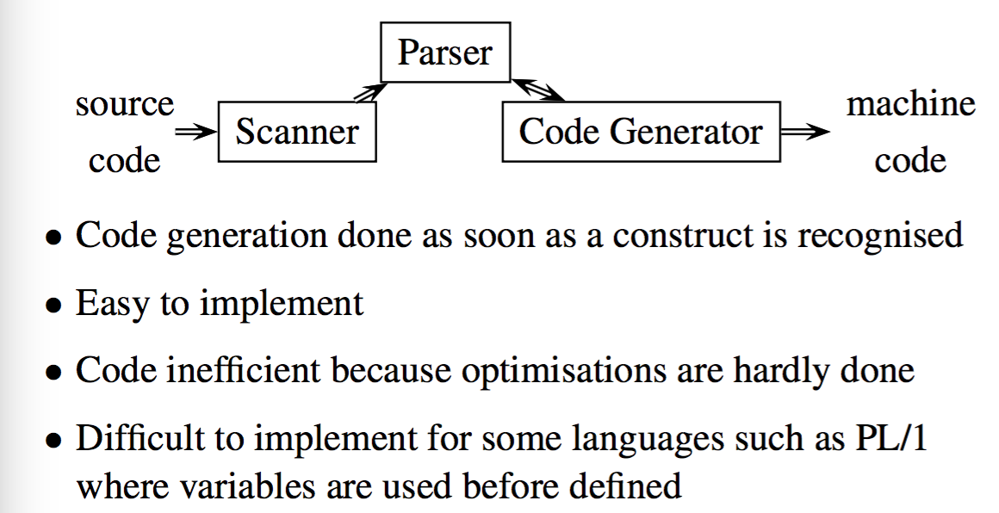
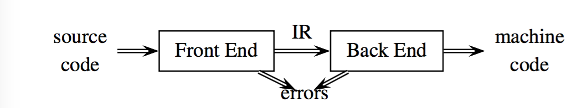
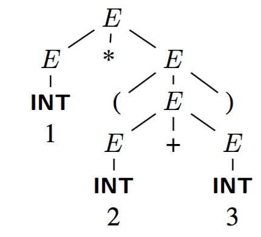
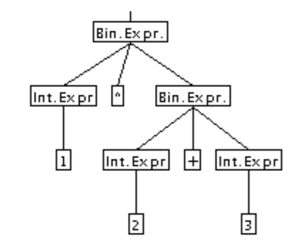
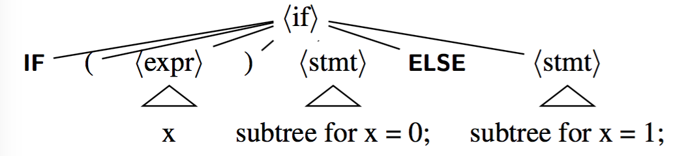
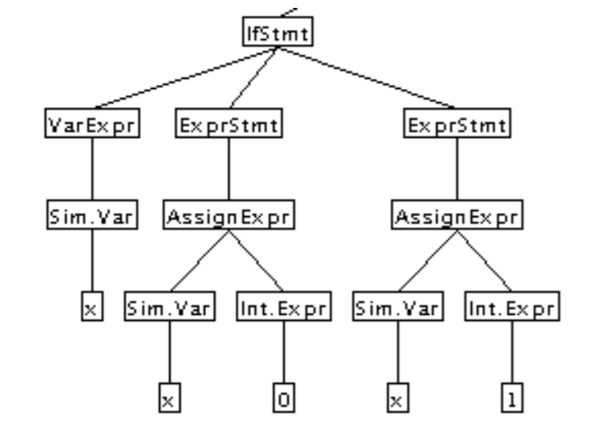
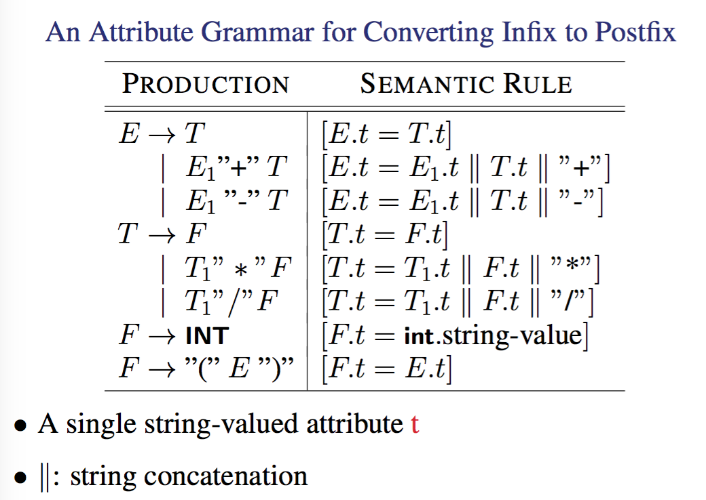
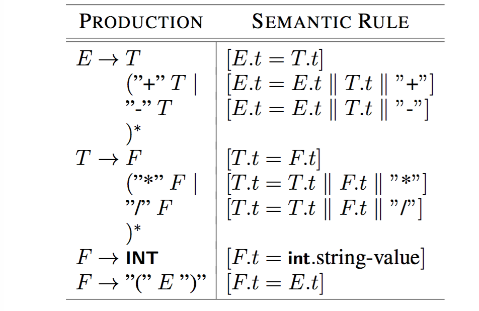
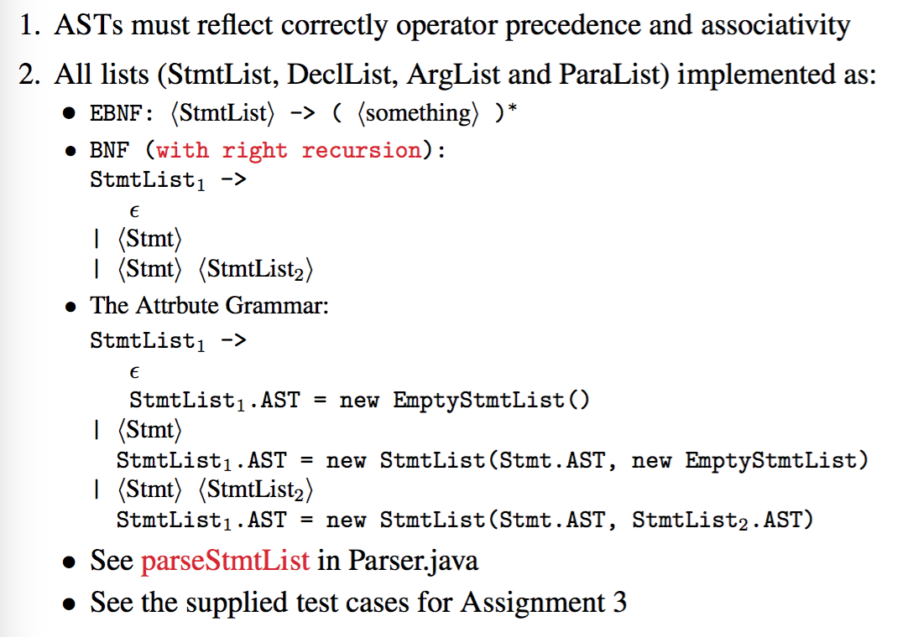

# Abstract Syntax Trees (ASTs)

## Depth-First Left To Right Traversal
---

This is used in all the tree packaged included for assignment 3 and is basically just a traversal where for every node you descend down the leftmost node until you can't anymore, then process the node then continue visiting children left to right. It's a LNR traversal. 

## Passes
---

#### Definition

A Pass does 3 things

1. Reads the source program or output from a previous pass
2. makes some transformation
3. writes output to a file or an internal data structure

Traditionally, a pass is the process of reading a file from the disk and writing a file to the disk. This concept is getting murky now.

In general a pass is some process of input, processing and output. 

#### One-Pass Compilers



#### Two-Pass Compilers

Most compilers are multi-pass compilers. 



In a two pass compiler we have a added intermediate representation which allows us to have

- Simplified retargeting, as in it is relatively easy to modify this to generate code for different CPU instruction set architectures given that the IR is created to mimic a lower level generic instruction set. 
- Sophisticated optimisations
- The ability to process the IR in any order without the constraint of the parser. i.e parse the whole file then do processing rather then on the fly. 

A Tree is a type of IR which allows us to have a syntactic structure of the code explicitly represented. 

It is called a two pass compiler because we have the first parsing pass the the second parse on the IR. 

#### Modern Optimising Compilers (3+ pass compilers)

Most of these work in multiple passes of the IR. Java bytecode optimisers will optimise to a level depending on the number of passes they do as do a lot of others. 

These can perform such optimisations (covered in COMP4133) such as 

- Loop optimisation
- Software pipelining
- Locality optimisation
- Inter-procedural analysis and optimisation – etc.


## Parse Trees vs Syntax Trees
---

#### Phrases

A `phrase` of a grammar G is a string of terminals labelling the terminal nodes (from left to right) of a parse tree

An `A-phrase` of G is a string of terminals labelling the terminal nodes of the subtree whose root is labelled A.

an phrase is thus just an A-phrase rooted at the starting symbol. 

An if-phrase has 3 sub-phrases: an expression and two statements
An while-phrase has 2 sub-phrases: an expression and a statement

#### Parse Trees

> specifies the syntactic structure of the input

The underlying grammar is a concrete syntax for the language

This is used for parsing, deciding if a sentence is legal and has one leaf for every token in the input and one interior node for every production used during the parse to reach the token. 

#### Syntax Trees or (Abstract Syntax Trees)

This specified the phrase structure of the input, it's a more compressed representation of the parse tree and is used in type checking, code optimisation and code generation. 

- Nonterminals are used for defining operators precedence and associativity are removed here
- Separators (punctuation) tokens are removed because they are redundant
- Keywords are implicit in the tree nodes

Abstract syntax can be specified using an attribute grammar. (covered later int his lecture)

note the terms abstract syntax and syntax trees are largely interchangeable. 

Lets look at a parse tree and it's equivalent Abstract Syntax Tree. 

`1 * (2+3)`



the parse tree is unique for this expression and contains everything needed to ensure that a set of input tokens is syntactically legal. 



Non terminals such as term and factor are not needed because the operator precedence is clear from the tree. Furthermore brackets arn't needed either, we are sure the input program is syntactically legal at this point and we don't need them to ensure correct grouping. 

Note in addition that with the line `if (x) x = 0 else x = 1;` the parse tree would have this. 



and the AST takes out the key words as it is obvious given we are in a `if-stmt` what we are looking at. 




## Making a AST Class
---

you CAN define it via a formal grammar and pass that into a generator. 

in general we have AST.java as the top-level abstract class, in general one abstract class for a nonterminal and one concrete class for each of its production alternatives. 

In VC,

- the EmptyXYZ AST classes introduced to avoid the use
of null (nothing fundamental but a design decision made here)
- Package TreeDrawer assumes no null references

Remember all the Tree packages use the Visitor Design Pattern. We need to know it too but not right now, next lecture. Still get a basic idea of it. 

#### Visitor Design Pattern

This is a good video (https://www.youtube.com/watch?v=pL4mOUDi54o)
basically what this is, is a way that you can have multiple classes implement a new method without having massive code changed. 

In the video each of the classes we want to change has 1 extra function added in. 
The visiter then can use this 1 function to implement some more complex programming via a overloaded function. 

the idea is that if we have a more complex tax system that changes often every class would need to be changed. 

With this you can just have each class pass itself to the visitor class which will handle the new functionality. 

Now this is used in TreeDrawer. Layout visitor is the visitor with all the additional functionality. 


## Attribute Grammars
---

#### Formal Definition

An attribute grammar is a triple:

\\(\\)A = (G,V,F)\\(\\)

Where G is a CFG, V is a finite set of distinct attributes and F is a finite set of semantic rules about the attributes. 

Here each attributes is associated with a grammar symbol and each semantic rule is associated with a production that makes reference only to the attributes associated with the symbols in the production. 

Long story short this converts out grammar from transformation on symbols into one with semantic rules on attributes. 

#### Why?

Attribute grammar is a special form of context-free grammar where some additional information (attributes) are appended to one or more of its non-terminals in order to provide context-sensitive information. Each attribute has well-defined domain of values, such as integer, float, character, string, and expressions.

Context Free Grammars are by definition, context free, and will treat any if statement the same. The issue is, we care about what's in the brackets, we care what the int string terminals are.

a Attribute grammar lets us take out all the fluff we had in the CFG to help with checking program legality and add in extra info on how to construct a representation of the input code that includes relevant context information. 

it also can help specify the syntax and semantics of a programming language

```
E → E + T { E.value = E.value + T.value }
```
The right part of the CFG contains the semantic rules that specify how the grammar should be interpreted. Here, the values of non-terminals E and T are added together and the result is copied to the non-terminal E.

#### Attribute

A attribute can represent anything we choose:

- a string
- a number
- a type
- a memory location
- a node
- etc.

#### An Attribute Grammar for Converting Infix to Postfix





This works off every token having a attribute t which holds it's actual string and we can now specify how we want the input code to be interpreted such as having the tree constructed postfix even if the input was infix. 

#### An Attribute Grammar for Constructing ASTs


here we build up a ast rather then a string. 
Now it's more obvious to see that a attribute grammar takes a normal CFG, removes all the stuff we don't care about and lets us deal with it in terms on attributes. 

Now this attribute grammar lets us construct a AST describing the language which also has context information such as the value of strings and ints past the fact that they are instances of string and int tokens. 


#### The Parsing Method for Statement

```java
Stmt parseStmt() throws SyntaxError {
    Stmt sAST = null;
	switch (currentToken.kind) {
		case Token.LCURLY:
  			sAST = parseCompoundStmt();
  			break;
		case Token.IF:
  			sAST = parseIfStmt();
  			break;
  		...
  	}
}
```

Here parseCompoundStmt, parseIfStmt, ... return concrete nodes or objects, which are instances of concrete AST classes, CompoundStmt, IfStmt, ...

The return type Stmt is abstract; Stmt is the abstract class for the nonterminal stmt in the VC grammar

## Ass 3
--- 





