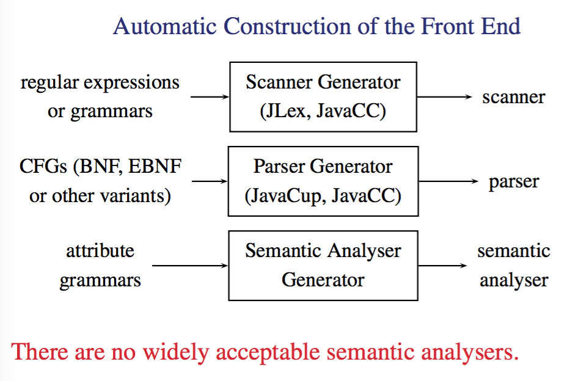
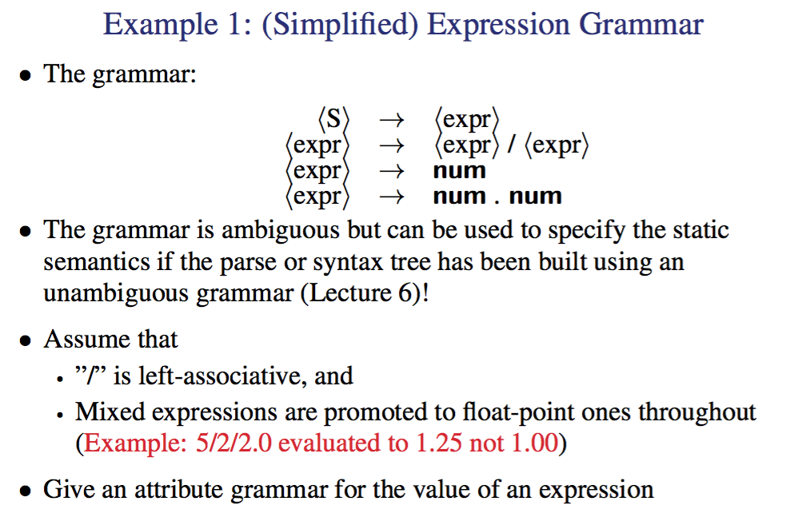
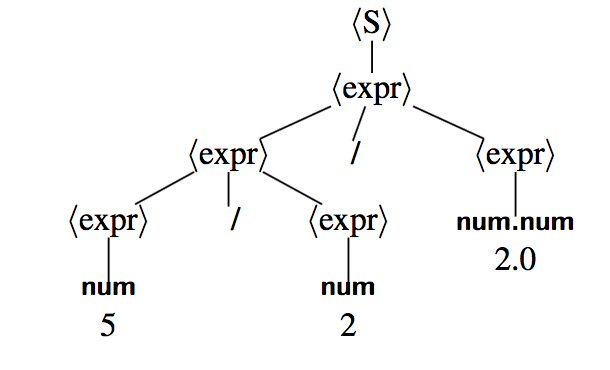
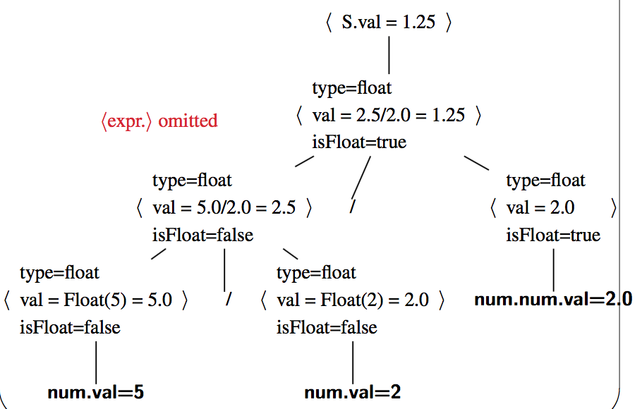
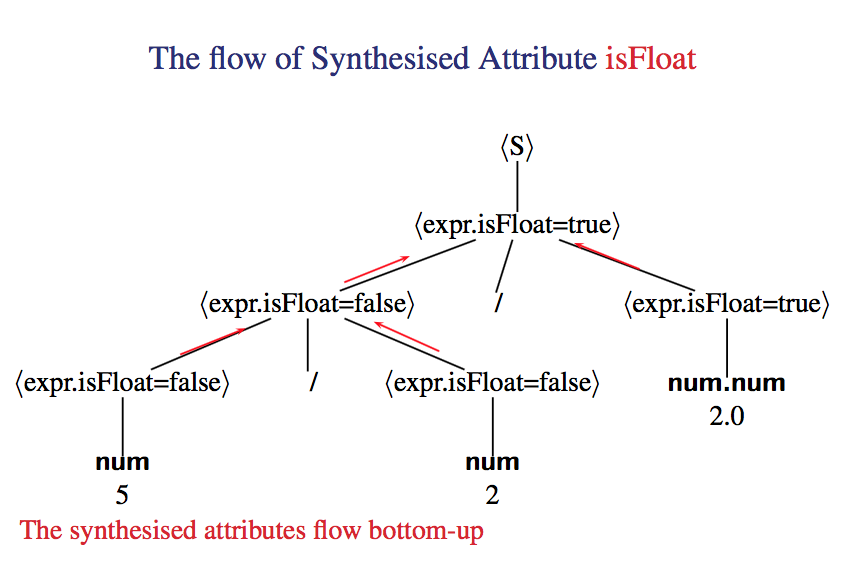
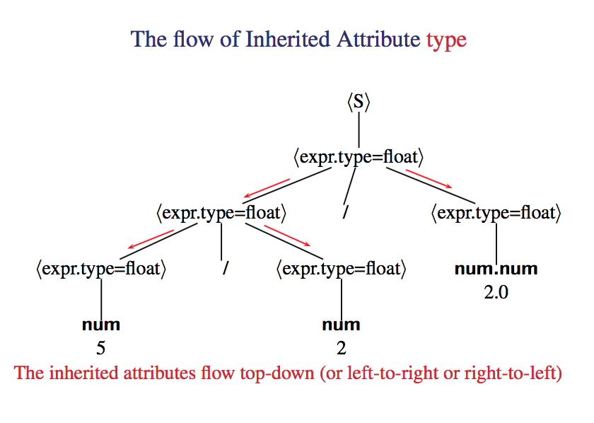

# Attribute Grammars

## Compiler Front End
---

This does the Semantic analysis to enforce `static semantics` that is to say type checking and the construction of a symbol table. 

Then we can enforce context sensitive semantics with a attribute grammar to complete the specification of what legal programs look like. 

## CFG Restrictions
---

There are many things we want to enforce in a legal program that we just can't specify in a CFG. For Example

1. is X a variable, method, array, class or package?
2. is x declared before used (in programs that don't have the enforced declaration block)
3. Which declaration of x does this specific instance reference (`identification`)
4. Is an expression type-consistent, you aren't multiplying a bool with a string
5. Does the dimension of an array match with the declaration, you can't treat a 1D array as if it's 2D
6. Is an array reference in bounds
7. is a method called with the right number and types of args
8. Is break or continue enclosed in a loop
9. etc...

All of these things should be caught before run time but can't be caught without a attribute grammar. 

#### Examples

```java
// a is used but not declared
void main() {
	a = 3;
}

// f is called with the wrong # of arguments
int f(int i) { }

void main() {
	f(1,2);
}

// incompatible operands
void main() {
	int i;
	i = true + 1;
}
```
## Context-Sensitive Analysis (Semantic Analysis)
---

Ad hoc techniques

- Symbol table and codes
- “Action routines” in parser generators

Formal methods:

- Attribute grammars (or other variants)
- Type systems and checking algorithms

Our approach for VC:

- Static semantics specified
	- in English (the VC Language Specification), and
	- by an attribute grammar in part
- Build a semantic analyser by hand



## Attribute Grammars
---

#### Informal

they are just generalisations of CFGs where each attribute is associated with a grammar symbol. Each semantic rule is associated with a production but has the added bit of info defining attributes. 

It's a high level spec, independent of any evaluation order. 

It also specifies dependences between attributes, i.e attributes computed from other attributes. But with that comes 2 types of attributes

**Synthesised attributes**
computed from children
**Inherited attributes**
computed from parent and siblings

#### Formal

An Attribute Grammer is a triple
\\( A = (G,V,F) \\)

Here G is a CFG, V is the set of attributes and F is the set of semantic rules about the attributes. 

Remember that a attribute can be anything, code, memory, type, string etc. 
Because of this each attribute has a name and a type. 

## Example
---



The entire grammar worked out is on the slides but it's basically just defining attributes of the tokens. 

for example for the transformation <expr> -> num we can now to <expr.isFloat> = false and <expr.val> = num.val if expr.type = int. if the type is float that means the whole expression should be evaluated to a float so convert this int into a float. 

this goes on...

Note that a Synthesised attribute is isFloat which indicates if any part of a subexpression has a floating point value. i.e is is computed from the children to describe the higher level token. 

An inherited attribute is "type" which gives each subexpression a type, this depends on the decleration of the type higher up, i.e is computed from parents. 

note that val is a synthesised attribute because it's computed by the token itself, i.e it's not given to it, it's generated/always present. 

## Decorated Trees
---

So we have parse trees as such



a Decorated or annotated parse tree is as such



it just includes some of the attribute information. 

#### Synthesised Attributes



#### Inherited Attributes


## Formal Definitions
---

Look them up, they just repeat what was said above

## Attribute Evaluators
---

#### Tree Walkers

Traverse the parse or syntax tree in one pass or multiple passes at compile time, it's capable of evaluating any noncircular attribute grammar. can decide the circularity in exponential time which is a issue and furthermore it's too complex to be used in practice. But it is possible. 

#### Rule-Based Methods

The compiler writer analyses the attribute grammar and fixes an evaluation order at compiler-construction time. 

Trees can still be used for attribute evaluation, almost all reasonable grammars can be handled this way and this is this the more practical use. 

> note that a circular grammar is just one where an attribute depends on itself'

#### A Non-Circular Attribute Grammar Evaluator

```java
while ( attributes remain to be evaluated ) {
	visitNode(S) // S is the start symbol
}

void visitNode (AST N) { // i.e., ProcessNode(AST N)
	if(N is a nonterminal) { / /N->X1, X2...Xm
		for(i=1;i<=m;i++) {
			if ( Xi is nonterminal ) {
				Evaluate all possible inherited attributes of Xi
				visitNode(Xi)
			}
		}
	}
	Evaluate all possible synthesised attributes of N
}
```

This is just a fancy algorithm for traversing the tree down to the non terminals evaluating as you go. 

## Visitor Design Pattern
---

We have the Visitor interface which defines that any Visitor must be able to handle all the different types of visit. I.e visitS, visitBinaryExpr, visitIntExpr etc. 

Then each of these objects must implement a Visit function that allows a visitor to come in, get some info or do some changes and leave. 


## L-Attributed Grammars
---

An L attributed Grammar is one where you can traverse the decorated parse tree left to right in 1 pass and have all the attributes filled in. 

If you can't do this then the grammar is not L-Attributed. 

We care because a L-Attributed grammar has parsing and semantic analysis in one pass in top-down parsers (recursive descent and LL parsers)

#### Formal defintion

An attribute grammar is L-attributed if the inherited symbols on the right hand side of every non-terminal transformation depend only on the attributes of symbols to the left of the symbol and the inherited attributes of the symbol. I.e we don't need information from the right to perform a transformation. 

The L: the information flowing from left to right

so if you look at 
```
⟨S⟩ → ⟨expr⟩
⟨expr⟩ → ⟨expr⟩ / ⟨expr⟩
⟨expr⟩ → num
⟨expr⟩ → num . num

```
This grammar is not L-attributed (because in ⟨S → expr⟩, the inherited attribute ⟨expr.type⟩ depends on the synthesised attribute ⟨expr.isFloat⟩)

that is to say in S -> expr the right hand side contains a inherited attribute expr.type which relies on a synthesised attribute expr.isFloat. The idea is that since expr.isFloat will needs both left and right node information to be evaluated, as is the case with synthesised attributes, this won't be able to continue without visiting the right node first. And because expr.type is a INHERITED attribute (lower instances of expr need to know this) it must be evaluated before continuing. 


#### Evaluation

```java
void dfvisit (AST N) {
  for ( each child M of N from left to right ) {
		evaluate inherited attributes of M;
 		 dfvisit(m);
	}
  evaluate synthesised attributes of N
}
```

## S-Attributed Grammars
---

An attribute grammar is S-attributed if it uses synthesised attributes only. These grammars allow for parsing and semantic analysis in one pass in bottom-up parsers. 

The information always flows up in the tree as all attributes are synthesised and don't need any information from higher in the tree to be derrived. 

Every S-attributed grammar is L-attributed. This is because if there are no inherited attributes there is nothing that MUST be evaluated before contining a traversal. So we can happily progress left to right. 


