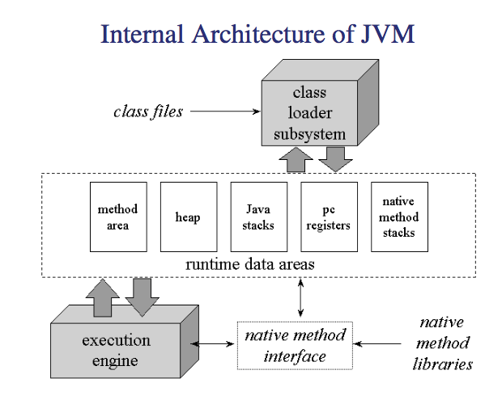
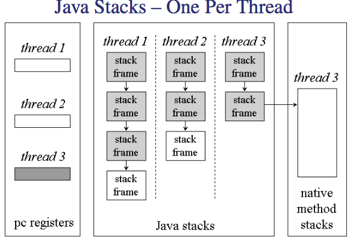

# Java Class FIle Format and Runtime Areas

## Example
---

Lets look at a small peice of code for java

```java
class Test {
   public static void main(String argv[]) { }
}
```

now this gets compiled down to bytecode yeah, the way it does is defined by the sun standard. 

```
ca fe ba be     magic
00 03  minor version
00 2d  major version
00 0f  constant pool count
-------------------- constant pool table --------------------------
07 00 0b
07 00 0d
0a 00 02 00 04
0c 00 07 00 05
01 00 03 28 29 56
01 00 16 28 5b 4c 6a 61 76 61 2f 6c 61 6e 67 2f 53 74 72 69 6e 67 3b 29 56
01 00 06 3c 69 6e 69 74 3e
01 00 04 43 6f 64 65
01 00 0f 4c 69 6e 65 4e 75 6d 62 65 72 54 61 62 6c 65
01 00 0a 53 6f 75 72 63 65 46 69 6c 65
01 00 04 54 65 73 74
01 00 09 54 65 73 74 2e 6a 61 76 61
01 00 10 6a 61 76 61 2f 6c 61 6e 67 2f 4f 62 6a 65 63 74
01 00 04 6d 61 69 6e
-------------------- end of constant pool table --------------------------
00 20  access_flags
00 01  this_class
00 02  super_class
00 00  interfaces_count
✬✩
00 00  fields_count
00 02  methods_count
------------------ <init> ---------------------------------------
00 00  access_flags
00 07  name_index
00 05  desc_index
00 01  attr_count
00 08  attr_name_index
00 00 00 1d  attr_length
00 01  max_stack
00 01  max_locals
00 00 00 05  code_length
2a b7 00 03 b1  code
00 00  exception_table_length
00 01 attr_count
00 09  LineNumberTable
00 00 00 06  attr_length
00 01    line_number_table_length
00 00  start_pc
00 01  line_number
------------------ end of <init> ---------------------------------
------------------------------ main  -----------------------------
00 09  access_flags
00 0e name_index
00 06  desc_index
00 01  attr_count
00 08  attr_name_index
00 00 00 19  attr_length
00 00  max_stack
00 01  max_locals
00 00 00 01  code_length
b1  code
00 00  exception_table_length
00 01  attr_count
00 09  attr_name_index
00 00 00 06  attr_length
00 01  line_number_table_length
00 00  start_pc
00 03  line_number
------------------------------ end of main  ------------------------
00 01  attr_count
00 0a  attr_name_index
00 00 00 02  attr_length
00 0c sourcefile_index
```

Thre are other ways to annotate this but you get the point

## Java Runtime Areas
---

We have the pc registers, the jaca stacks (more then one due to multi threading), the method area and the heap. 

The Class loaded subsystem colds all the class files and loads them into the runtime data areas. These pass executables into the exectuion engine which can use the native method interface to reaccess the runtime data areas. 
I think. 



The method area contains just class data and the heap contains objects, i.e class instances. Note that an array is just a object in java. 

#### Stacks
The java stacks are given 1 per thread and can transfer execution into the native method stacks to run a native method. Note that pc registers obviously have the program counters for all the threads. 



A new stack frame is created for eveyr method inocation and contains local variabels, frame data and the operand stack. 

## Java bytecode verification
---

just note that via the JVM spec, If an instruction can be executed along several different execution paths, the operand stack must have the same depth (2.6.2) prior to the execution of the instruction, regardless of the path taken.

## Final Exam
---

• 2 hours, closed book
• 6 questions
• The papers and solutions for 2000 – 2003 available on the subject home page

