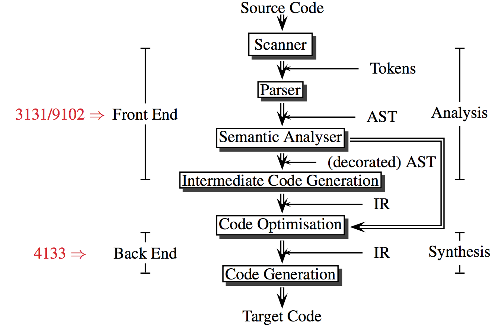
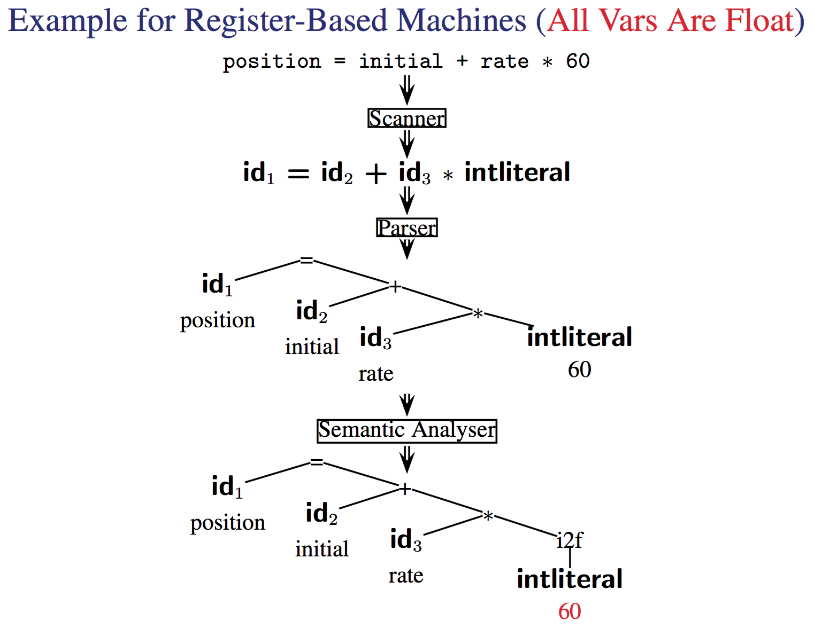
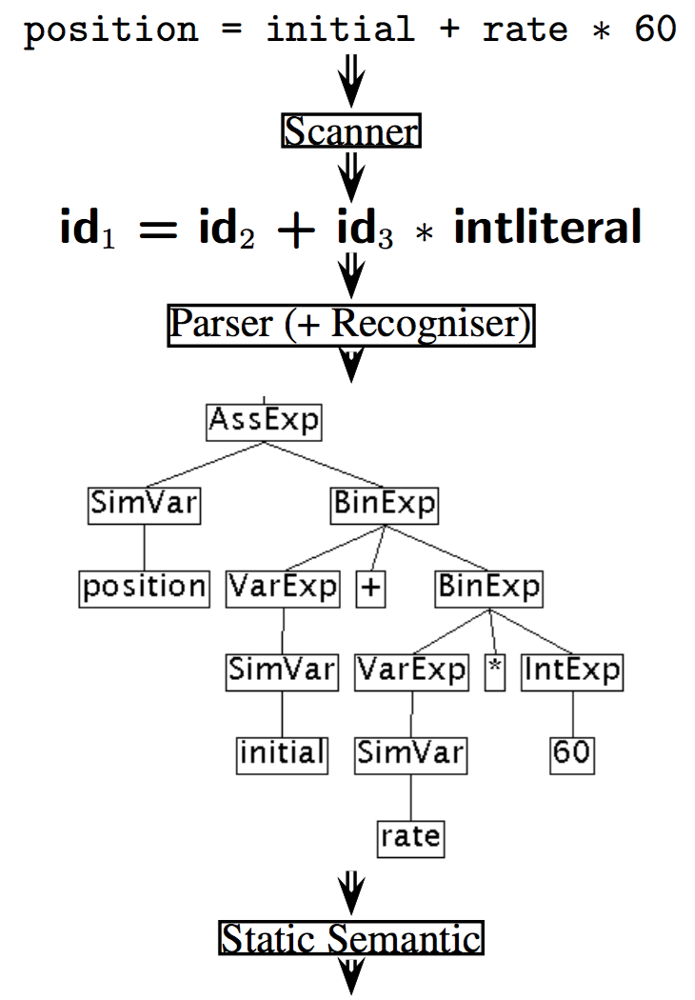
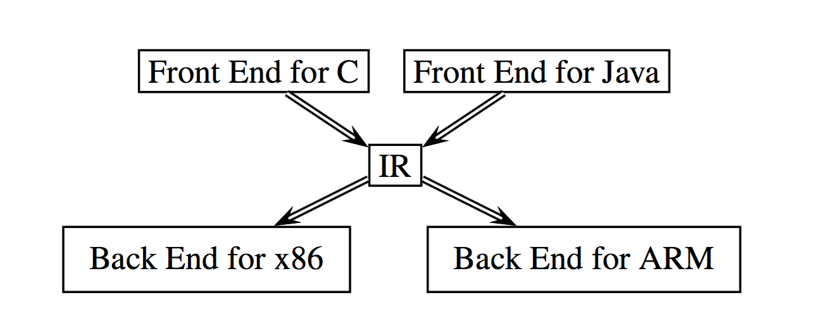
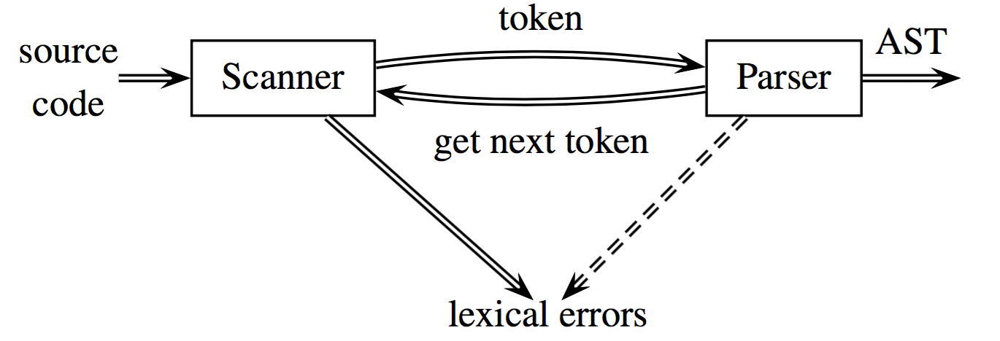

# Course Information

- Assignment 1 : week 3
- Assignment 2 : week 6
- Assignment 3 : week 8
- Assignment 4 : week 11
- Assignment 5 : week 12

The 5 assignments build upon one another:

1. Scanner – reads text and produces tokens
2. Recogniser – reads tokens and checks syntax errors
3. Parser – builds abstract syntax tree (AST)
4. Static Semantics – checks semantics at compile time
5. Code Generator – generates Java bytecode

Tutorials start week 3

Work on the assignments should be consistent in leu of regular labs. There are 5 and the first is due in week 3 before the first tutorial. Start working on it in week 1./Set aside a regular amount of time maybe 4-10 hours a week to consistently work on the next assignment.

> Future zain comment: The assignments get progressively harder, the first 3 you can do in a couple days or so but the last 2 you should give a solid bit of love

# Compiler overview

#### What is a compiler
---
It is just a program to take in code and produce Machine code / other representation of code, usually at a lower level of abstraction. In doing this the compiler will output errors and warnings to the user.

This is because as well as just compiling down a language a compiler must be able to recognise what a legal program is and ensure that it only produces legal programs.

It may generate a program that does not have the expected behavior but it should not produce code that can not run.

Although not always true a compiler should strive to generate optimal and efficient code wherever possible.

#### Typical Compiler structure
---
We take in code and we start by feeding it into a scanner. This will split the code into tokens.

These tokens are then passed into the parser which produces a abstract syntax tree, A tree representation of the code that holds the syntactical meaning of the original code.

This then goes through the Semantic analyser to produce a decorated tree. At this point the analysis stage of the compilation is over and the compiler now moves into the synthesis stage.

An intermediate code generator creates the IR (Intermediate Representation) which can then be fed into code optimization and code generators (out of the scope of this course lmao)

Note that the decorated AST can be passed directly into the code optimization stage but IR's are more commonly used because they are easier to optimise and also can be more easily passed into different code generators depending on the machine architecture.



#### Examples
---

Here you should note that the decorated tree simply adds in the step to convert the int literal to a float because all values in this register based machines are floats.



```
Temp1 = i2f(60)
Temp2 = id3 ∗ Temp1
Temp3 = id2 + Temp2
id1 = Temp3
```

You may already notice that here the code is a bit inefficient.
rather then moving 60 into a temp we can multiply it by id3 directly. And rather then assigning id2 * Temp2 to Temp 3 only to have that reassigned to id1 we can just assign it directly to id1

```
Temp2 = id3 ∗ 60.0
id1 = id2 + Temp2
```

This now can be used to generate some machine code as it is split up into simple single arithmetic steps. Note that this is the main step that relies on specific chip architecture and thus this step will need to know if there is a multiply by immediate command or not

> The fact that only one section of the compiler requires hardware knowledge means that a language and it's associated compiler can be ported to many different machines.

> I.e if you can get this one section to work correctly for a machine, you can get doom™ running on it


```
MOVF rate, R2
MULF #60.0, R2
MOVF initial, R1
ADDF R2, R1
MOVF R1, position
```

Take a look at this example for the java compiler



Here we have assignment expressions (`AssExp` lol) which splits up the expression into a left side and right side. I.e left = right or `position = initial + rate * 60`
This is then split into a simple variables called position to the left and a binary expression to the right.

a binary expression being a expression with 2 variables involved.
this continues to be split down until we have the syntax tree.

Note that we need to know what variables are simple because in java sometimes variables may be more complex such as objects/pointers.

#### Retargetble compilers
----
The idea is that multiple different languages can be compiled into the same IR using multiple front ends.
Once in this form you can use generic IR optimization tools and then feed this ir into different back ends depending on the system



This means we can simplify retargeting using this "everybody gets the same IR" thing

M languages + N architectures -> M frontends + N backends not MN frontends + NN backends

#### Overview
---

#### Lexical Analysis

The tool that does this is the scanner!
It just groups characters into tokens.

> Tokens are just the basic unit of syntax

A line like this

```
position = initial + rate * 60
```

splits into 7 tokens

1. The identifier position
2. The assignment operator =
3. The identifier initial
4. The plus sign
5. The identifier rate
6. The multiplication sign
7. The integer constant 60.

The key issue with this is speed. You need it to be fast but it is a inherently slow process.
Think trying to grep a 5 GB file

Note the difference between a token and a lexme.

A lexeme is a sequence of characters in the source program that matches the pattern for a token and is identified by the lexical analyzer as an instance of that token.

A token is a pair consisting of a token name and an optional attribute value. The token name is an abstract symbol representing a kind of lexical unit, e.g., a particular keyword, or sequence of input characters denoting an identifier. The token names are the input symbols that the parser processes.

i.e if we do `x=5` we have that x is a `VARIABLE` token but this tokens lexme is `x`.

> The lexeme is the actual text forming a token

#### Syntax analysis

> Note from zain : i mispel grammar at basically every point and i really ceebs fixing it
and now we come to the parser

This just groups tokens together into gramatical phrases, which it represents as a AST usually.

In doing this it can produce meaningful error messages that define what the issue is in terms of grammer rather then what actually goes wrong on the compiler level, because it understands the grammer is can also attempt error detection and recovery.

Saying that "This wont work because the machine code doesn't form correctly" is not as useful as
"i was expecting a semicolon but got something else"

Note that how this tree is constructed is defined by the grammar, usually this is context free (Context free grammer or CFG). This instructs how the tree is to be built.

A context free grammer is just a grammer that does not depend on context amazingly enough.
That is to say that 7=5 is interperted the same way regardless of the context it is seen in. A non context free grammer is something like html as because the compiler will fix issues instead of raising compiler warnings it must treat the same tags differently depending on where they are. I.e if a tag is in a illegal place it doesn't raise a warning it just compiles it differently to fix the issue.

anyway usually the typical grammer is defined something like

```
⟨expr⟩ → ⟨expr⟩ + ⟨term⟩ | ⟨expr⟩ − ⟨term⟩ | ⟨term⟩
⟨term⟩ → ⟨term⟩ ∗ ⟨factor⟩ | ⟨term⟩ / ⟨factor⟩ | ⟨factor⟩
⟨factor⟩ → ( ⟨expr⟩ ) | ID | INTLITERAL
```

This just says that a expression is either a expression + a term, a expression - a term or a term.
so something like `7 + 5 - 8` breaks down as such

```
(7 + 5) - 8      // expr - term
((7)+5)-8        // (expr + term) - term
((7)+5)-8        // (term + term) - term
```

> Note how because of the grammar we evaluated the addition before the multiplication.

> 3 lines of grammer allow the parser to parse any concievable expression which is a amazing exponential growth of complexity

#### Semantic analyser

This is when we get to the Static Semantics section of the compiler.

suprise suprise it checks the program for semantic errors

1. variables defined before used
2. operands called with compatible types
3. procedures called with the right number and types of arguments

It also does a incredibly important task in some languages: `Type checking`

It usually just uses a symbol table that defines every variable and it's type
And then makes sure that given this type the context the variable is used in is valid. You can't use a float to index an array! Do note that this step will convert types if permitted by the language.

This is also when we go from a AST to a _decorated_ AST, the decoration adds information like type.
(i think)

#### Immediate code generation

The Intermediate Code Generator generates an explicit IR from the AST.
The IR isn't like universally defined but it must be easy to generate while also being easy to convert into machine code.

This usually is the place where subtle small changes effect the speed and effectivness of a compiler.

Popular IRs:
1. Abstract Syntax trees (ASTs)
	Note that this means that the parser tree is edited minimally.
2. Directed acyclic graphs (DAGs)
3. Postfix notation
4. Three address code (3AC or quadruples)

#### Optimization

Some common optimization is to remove code that can never be reached, discover some constant value and propergate it so it doesn't have to be called from a variable, remove redundant computation and remove it or sometimes moving a computation to a different place where it has equal effect but is run redundantly less often.

(Code optimisation isn't covered in this course and the course that does cover it isn't run anymore)
(If it sounds interesting well sucks to be you)

#### Generation

- generates target code: either relocatable machine code or assembly code
- chooses instructions for each IR operation
- decide what to keep in registers at each point

A crucial aspect is the assignment of variables to registers.

#### Errors

Handling errors is split up into 3 parts

1. What is the error
	- Is it lexical like a unterminated string "123
	- is it syntax like forgetting a closing parentheses
	- is it semantic like passing a int where a float was expected
2. Report
	a. report the error and importantly `WHERE` it occurred
3. Recover
	a. you could crash right here but it's more useful to recover what you can and keep compiling so you can find other errors

We can optionally implement error recovery in your parser.

#### The Role of a scanner
---



Due to this structure usually the scanner runs as a sub routine within the parser

note that we will not be using a symbol table until assignment 3

So anyway java has a stringTokeniser built in!

```
import java.util.*;
// the first string in the input
// the second is the token deliminators
// the third is if the delimator should be included in the token or not
StringTokenizer s = new StringTokenizer("(02) 9385 4889", "() ", false);

while (s.hasMoreTokens())
  System.out.println(s.nextToken());
```

You can have different tokens depending on the language. In english tokens are words and can be classified as noun tokens or verb tokens etc.

In VC (variant of C) there are 5

1. identifiers
	- This is just variables
2. keywords
	- int, if, while, etc
3. operators
	- “+” or “∗”, “<=” ...
4. separators
	- “{”, ‘}”, “;” ...
5. literals
	- integer, real, boolean and string constants

Now you define tokens with regex patterns (just called patterns in the context of compilers) but do note you have to do assignment 1 `without regex`

Some patterns:

| Token Type   | Pattern | example |
|--------------|---------|---------|
| intLiteral   | `\d+` | 764     |
| floatLiteral | `\d(.\d+)?( [Ee][\+\-]?\d+)` | 7.2 E3 |

There is also a formal system for defining tokens revolving around finate state machines but this is covered in more detail week 2

we can represent tokens as such

```
Token                   Representation
------------------------------------------------------------
sum      new Token(Token.ID, "sum", sourcePosition);
123      new Token(Token.INTLITERAL, "123", sourcePosition);
1.1      new Token(Token.FLOATLITERAL, "1.1", sourcePosition);
+        new Token(Token.PLUS, "+", sourcePosition);
,        new Token(Token.COMMA, ",", sourcePosition);
```

SourcePosition is an instance of the Class SourcePosition and has these fields:
- charStart: the beginning column position of the token
- charFinish: the ending column position of the token
- lineStart=lineFinish: the number of the line where the token is found.

note you can have the scanner return a error token if it reaches some text that it does not have a matching pattern for. This can thus raise a `lexical error`. This would happen with a string with no end " as this isn't a valid token at all! some examples from VC:

```
/*  -> prints an error message (unterminated comment)
|, ^, %, etc.   -> returns an error token and continues lexical analysis
```

note how we can't recover from a untermined comment because it could very well comment out all the code in the document.
now there are many different ways to create a scanner but 2 things must always be true when the scanner is called to produce a token.
1. currentChar is pointing to either the beginning of whitespace, a comment or a token.
2. The pattern must always be a greedy match. Always match the longest possible string. ">=" not ">"

#### Design Issues in Hand-Crafting a Scanner (for VC)
---

1. What are the tokens of the language?
	`see Token.java`
2. Are keywords reserved?
	`yes in VC, as in C and Java`
3. How to distinguish identifiers and keywords?
	`see Token.java`
4. How to handle the end of file
	`return a special Token`
5. How to represent the tokens?
	`see Token.java`
6. How to handle whitespace and comments?
	`throw them away`
7. What is the structure of a scanner?
	`see Scanner.java`
8. How to detect and recover from lexical errors?

	`have partial token matches to detect them and possible fix them by adding in a missing "?`
9. How many characters of lookahead are needed to recognise a token?

	`depends on the token, for a exponent it's 3 and for i++ it's 2`

#### Reserved words
---

you may have used languages like python that let you use words defined by the language as variables (known as identifiers in this course)

there is a language called PL/1 where the line `if then = else then if = then; else then = if` is legal because `if` and `then` are used as variables

How does the compiler handle this? well either the scanner interacts with the parser to help it out by giving it more context or it regards the identifiers and keyword as having the same token type, leaving the task of distinguishing them to the parser. here you could do something like "any `if` that isn't followed by a expression is a variable"

You really don't have to handle that for VC. an if is a if, if you want to use if as a variable if your crazy you just don't. if.
