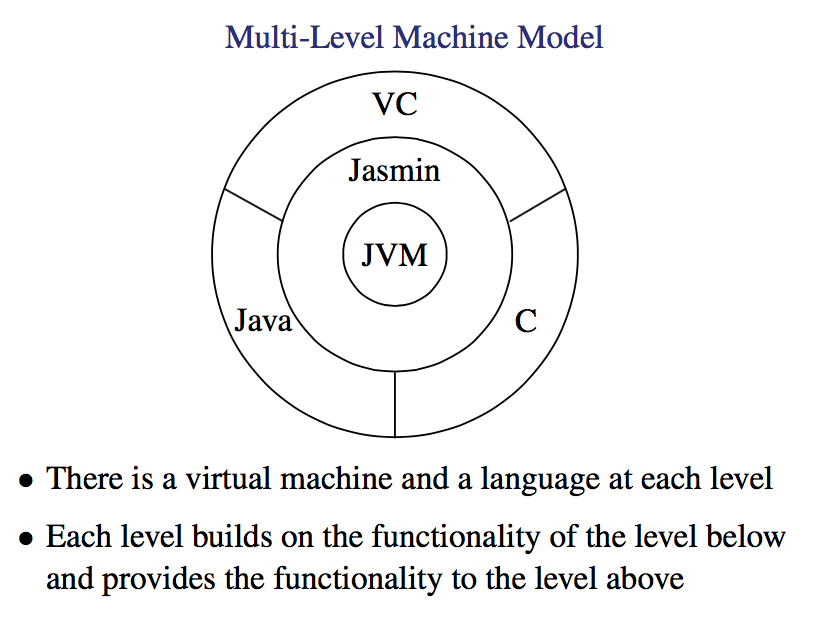

# JVM

## Intro
---

This is the section where we convert our decorated AST into Jasmin Assembly Code, a sort of assembly code that we can then convert down to actual Java Byte code.

Jasmin is actually a open source thing because Sun has not defined as assembler format so people build a java assembler themselves.

It's great because it has a 1 to 1 correspondence to Bytecode.

| Jasmin Instr | Java Byte Code |
| --- | --- |
| iload | `0x60` |
| bupush 20 | `0x1614`
| getstatic Test.i | `oxb2????` ???? is an index into the constant pool entry for Test.i |

The constant pool is discussed in lecture 11 but isn't needed for the assignments.

Note there is BCEL (Byte Code Engineering Library) formally known as JavaClass which comes with a Jasmin disassembler

## Muli-Level Machine Model
---



## JVM Language
---

#### Data Types

There are multiple data types in java and hence in jasmin which can be used to define what constants/variables are.

| Type | Range  | Field Desc
| ---- | ------ | -----------
| boolean | {0,1} | Z
| byte | 8 bit signed 2's complement | B
| short | 16 bit signed 2's complement | S
| int | 32 bit signed 2's complement | I
| long | 64 bit signed 2's complement | L
| char | 16 bit unsigned unicode | C
| float | 32-bit IEEE 754 single-precision | F
| double | 32-bit IEEE 754 double-precision | D
| reference | 32 bit unsigned reference | N/A (more complex)
| returnAddress | 32 bit unsigned reference | N/A

> V is void

#### References

a class reference is Lclass-name; and a interface reference is Linterface-name and an array reference is [component-type, where the number of `[` is equal to the number of dimentions in the array

#### Method Descriptors

Basically conform to `(ParamTypes)ReturnType`
for example `int gcd(int i, int j)` becomes `(II)I` and `void main(String argv[])` is `([Ljava/lang/String;)V` note we use [Lclass-name. A reference to an array of string objects.

## JVM Mechanics
---

#### Operand Stack

This is accessed by pushing and popping values, shocking i know.

It allows us to store operands and recive arithmatic results as well as pass arguments and recive method results.
This unified view is one of the main reasons why code generation for stack based machines is easier then register based machines.

a `new` op stack is created everytime a method is called.

Let's say you are given a Integral Expression as such `1+2*3+4` this actually translates to

```
iconst_1  ; stack: 1
iconst_2  ; stack: 1 2
iconst_3  ; stack: 1 2 3
imul      ; stack: 1 6
iadd      ; stack: 7
iconst_4  ; stack: 7 4
iadd      : stack: 11
```

#### Local Variable Array

a new local variable array is created  each time a method is called and is addressed by index, i.e variable 0,1..n

Paramters if any are given consecutive indicies starting from 1 for instance methods as if methods called in a instance of a object, slot 0 is always given to "this" a reference to the current instance of the object.

Paramters for a class method are given indicies starting from 0 (no this)

one slit can hold the value of a any 32 bit value. If a 64 bit value is needed a pair of slots are needed.

```java
// class method
public static void foo() {
    int i1=1; //index0
    int i2=2; //index1
    int i3=3; //index2
    int i = i1 + i2 * i3; // index 3
}
```

```java
// instance method
public void foo() { // "this" given index 0
    int i1=1; //index1
    int i2=2; //index2
    int i3=3; //index3
    int i = i1 + i2 * i3; // index 4
}
```

> Note that a instance method is just a method that must be called on a specific instance of a class whereas a class method can be called more freely from the class itself. i.e String.format() is a class method but String s = new String(); s.count() is a instance method!!

Now if you want to use a long it gets interesting

```java
public static void foo() {
    int i1=1; //index0
    long i2=2; //indices1and2
    int i3=3; //index3
    long i = i1 + i2 * i3; // indices 4 and 5
}
```

```
iconst_1
istore_0 // store top of stack into var 0
ldc2_w 2 // load long onto stack
lstore_1 // load into var 1 and 2
iconst_3
istore_3 // load 3 int var 3
iload_0
i2l
lload_1
iload_3
i2l
lmul
ladd
lstore 4
```

here accessing index 2 or 5 is disallowed, you should never need to!

## Instructions
---

These slides are just from the language spec, it's mostly not worth writing notes on, important stuff is below.

There are special instructions for loading and stroring arrays. loading pushs onto the stack and storing pops into a local variable.

Instructions are present for loading constants into the operand stack

note that the if comparisons pop off two values off the stack ad compare them.

fcmpg and fcmpl doesn't jump anywhere but pops 2 values off the stack comapres them and puts in 0 , -1, or 1 depending on the instructions.

You also can edit the stack diretly, swapping the top 2 elements or removing one or duplicating top most value etc.

Only dup and pop are used in VC. Dup for `a=b=c=...` and pop for translating expression statements such as `1;`.

## Object Creation and Manipulation
---

you can use the jasmin command `new` to create a new class instance. and `invokespecial` to run functions. For example

```java
public class StaticField {
    static int i = 1;
    int j = 1;
    public static void main(String argv[]) {
        StaticField o = new StaticField();
        System.out.println(i);
        System.out.println(o.j);
    }
}

```

```
; Declare Fields of object
.field static i I
.field j I

; gt new StaticField
.method public static main([Ljava/lang/String;)V
.line 5
new StaticField
dup

; run built in init
invokespecial StaticField/<init>()V
astore_1
.line 6
        getstatic java.lang.System.out Ljava/io/PrintStream;
        getstatic StaticField.i I
        invokevirtual java/io/PrintStream/println(I)V
.line 7
        getstatic java.lang.System.out Ljava/io/PrintStream;
        aload_1
        getfield StaticField.j I
        invokevirtual java/io/PrintStream/println(I)V
Label0:
.line 8
        return
.end method
```

Note that getfield and putfield are not used in the VC compiler.
Also note that getfield's last argument is the type of the field.

## Method Invocation
---

invokestatic
invokevirtual
invokespecial // also known as invokenonvirtual
    - the instance initialisation method <init>
    - a private method of "this"
    - a method in a super class of "this"
invokeinterface

ther all work like `invokexx method-spec` and uses n arguments on the stack as the n arguments to take in, it then pushes on the result when done. invoke static ann invoke special/virtual are onyl different because of the arguments. Static doesn't have slot 0 contain `this`.

• invokevirtual: on the dynamic type of objref `strInstance.count()`

• invokespecial: based on the static class of objref `String.format()`
