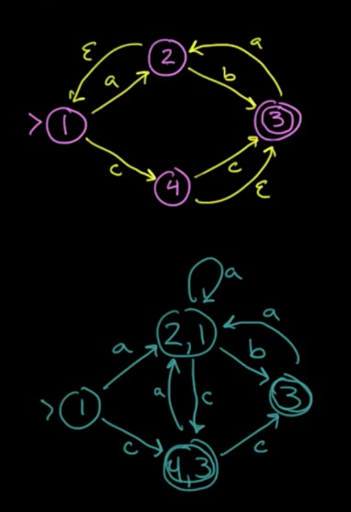

# Alphabet, Strings and Languages

## Definitions
---

#### Alphabet
denoted by Σ is any finite set of symbols.
For example this set {0,1} is a alphabet that describes every symbol used in binary strings.

#### String
A finite sequence of symbols drawn from Σ, i.e a string is just a series of symbols from a alphabet connected together.

Note that in this notation |s| means the length of string which is just the number of symbols contained.

We use the symbol $\epsilon$

#### Language
any set of strings over Σ, that is to say a series of strings.
note that it has two special cases

- ∅: the empty set
- $\epsilon$ : the set with only empty strings

#### Examples of languages

Σ = {0, 1} defines the language where the only valid symbols are 0 and 1, in this language strings are just 0's and 1's.
lets say every string in this language is a instruction
This language now defines the set of M68K, MIPS, Pentium instructions etc.

now if we say Σ = {a,b,c,...} i.e Σ = ASCII set. We can now define most high level languages such as C, Haskell, VC etc. as every program in C is just a set of strings in this alphabet. The '\n' is just another symbol.

## String transformations
---

We can split up a string into multiple parts

| Term | Definition |
| --- | --- |
| prefix of s | s with 0 or more trailing (on the end) symbols removed|
| suffix of s | same as prefix but done with the leading symbols |
| substring of s | s after a prefix and suffix have been removed |
proper prefix suffix, substring of s | Any nonempty string x that is, respectively, a prefix, suffix or substring of s such that s != x |

We can also concatenate strings, `key + word = keyword!` amazing i know.

Not too complicated, but do note that with this we have this property with $\epsilon$

$\epsilon x= x\epsilon = x$

Again kinda obvious but it's good to have this formalised.

## Language Transformations

Here is a quick table to outline some of these transformations on two languages L and M


This may seem hard to visualise, take a look at the example first


The union of two languages is just a combination of all the symbols in both.

The superscript number just defines length of the string.

the concatenation of two languages is a set of all combinations of a symbol from L followed by a symbol of M.

The Kleene Closure is just the same as the `*` in regex. I.e it represents 0 or more consecutive instances of a string.
The mathematical representation just says that L* is the set of every possible number of repetitions of L including the empty string, otherwise known as 0 or more concatenations of L.

The Positive closure just states that the empty string is not included in this set.

# Regular Expressions

RE is build on top of this.

REs define `regular languages` (RL) or regular sets. That is to say a certain Regular Expression simply refers to a specific regular language or regular set of strings.

This makes sense as a RE is used to match a certain type of string and thus must represent some set of correct matching expressions.

You can formally define regular expressions in two steps, the inductive base (setting up the base cases) and then inductive steps which is the general cases. (don't worry if that means nothing, read on!)

## Inductive Base
---

1. $\epsilon$ is a RE, denoting the RL {$\epsilon$}
2. a ∈ Σ is a RE, denoting the RL{a}

In simple terms, $\epsilon$ represents a set of empty strings so the regular expression "" matching nothing.
And in addition a regular expression with just a symbol defines a set with that symbol. i.e it can only match with every instance of that symbol.

##  Inductive Step
---

Suppose r and s are REs, denoting the RLs L(r) and L(s)

Now we can start forming the regular expression language while linking it to our formal definition of languages, strings and alphabets.

1. (r)|(s) is a RE, denoting the RL L(r) $\cup$ L(s)
2. (r)(s) is a RE, denoting the RL concatination L(r)L(s)
3. (r)∗ is a RE, denoting the RL kleene closure L(r)∗
4. (r)+ is a RE, denoting the RL postive closure L(r)+

## Rules
---

But we do have to define some rules around this now

#### Precedence

- “∗” has the highest precedence
- “Concatenation” has the second highest precedence
- “|” has the lowest precedence

#### Associativity

all are left-associative, if you don't have brackets, evaluate left to right, and all special symbols apply to the symbol to the left of it.

$a|b^c$ is the same as $(a)|((b)^c)$

## Examples
---

• Alphabet: Σ = {0, 1}
• RE: 0(0|1)*

What is the language defined by the RE?

Well we know from basic regex that 0(0|1)* is just any string that starts with a 0 and contains any combination of 0's and 1's afterwards.

how this breaks down formally though is

$L(0(0|1)^* )$
$= L(0)L((0|1)^* )$
$= \{0\}L(0|1)^*$
$= \{0\}(L(0) \cup L(1))^*$
$= \{0\}(\{0\} \cup \{1\})^*$
$= \{0\}\{0, 1\}^*$
$= \{0\}\{\epsilon ,0,1,00,01,10,11,...\}$
$= \{0,00,01,000,001,010,011,...\}$

Kinda takes the magic out of regex doesn't it?

## Notational Shorthands
---

If you have used regex before you may be thinking what about the life savers like `?` or `[]`. These are actually defined by the language but just in longer forms. So we use these shorthands

$r? = r|\epsilon$
$[a-z] = \{abcdefghijklmnopqrstuvwxyz\}$

and using the caret (`^`) just means the set of all valid symbols in the alphabet excluding the symbols specified.

## VC
---

Just note that in VC you can use the following regex to tag identifiers (variable names etc.)
`letter(letter|digit)*`

But note that in the spec letter includes the `_` character. For us letter will be ascii letters but in java it can be any unicode character awesome enough.
You can have variable names in greek letters or mandarin.

Just has a heads up the RE for reals is a bit complex because you can have digits fractions and exponents.
It ends up being a set of regex: (NOTE that in this `.` does not represent any character)

```perl
digit: 			/0|1|2|3|4|5|6|7|8|9/
fraction: 		/.digit+/
exponent: 		/(E|e)(+|-)?digit+/
floatLiteral:	/digit* fraction exponent? | digit+. | digit+.?exponent/
```

# Finite Automata / Finite State Machines

## Defintion
---

A finite automaton consists of a 5-tuple:
`(Σ,S,T,F,I)`

- Σ is an alphabet
- S is a finite set of states
- T is a state transition function: T : S × Σ → S
- F is a finite set of final or accepting states
- I is the start state: I ∈ S.

In essence it is just a way to represent a machine/automata/system which has a finite number of states and a fixed set of ways to transition between those states.

A good example is a game character

```
[Resting] -(press shoot)-> [Shooting]

[Resting] -(press jump)-> [Jumping]

[Jumping] -(land on ground)-> [Resting]
```

## Representation
---

We can represent finite state automata (FA) with Transition graphs. Details below


Note that a FA will only accept a string x if there is some path on the machine which fits in with the string. I.e if x was hello there must be some path in the machine that starts with h at a valid start state and transitions legally to a end state with o.

## Example
---


This state will accept `strings of 0 and 1 with an odd number of 1's`

if we were to break this down into it's 5 tuple we would get this

- Σ : {0,1}
- S : {S,A}
- T <br>
	- T(S,0) = S<br>
	- T(S,1) = A<br>
	- T(A,0) = A<br>
	- T(A,1) = S<br>
- F : {A}
- I : S

The alphabet is just 0 or 1, there are 2 states S or A. there is only 1 Final ending state, A, and there is only 1 start state, S.

The transitions are listed as T(state, symbol) = result
Thus we can summarise the Transition functions as

S -- 0 --> S
S -- 1 --> A
A -- 0 --> A
A -- 1 --> S

Remember that T is a function S×Σ to S.
But aside from this we also need to consider invalid input.

Lets say that A -- 0 --> A wasn't defined and suddenly we get to the point where we need to calculate T(A, 0). Although this isn't on the graph it is implied to be = to error. These extra error transitions arn't drawn on but implied, by convention at least.

## Determinism
---

You are filled with `DETERMINATION`

#### Deterministic Finite State Automata
a FA is a DFA if

- no state has an $\epsilon$-transition, i.e. an transition on an empty string input
- for each state s and input symbol a, there is
at most one path out of the state. I.e there arn't two paths that you could take.

#### Nondeterministic Finite State Automata
a FA is NFA if it is not a DFA i.e

- you can make several parallel transitions on a given input
- you can have a $\epsilon$ state

but a NFA still must have Acceptance, the existence of at least one path that leads to a finishing or accepting state.

#### Difference

`from http://math.stackexchange.com/questions/563829/difference-between-nfa-and-dfa`

in a DFA each possible input determines the resulting state uniquely. Every input causes a state change, and the new state is completely determined by the input. Moreover, the automaton can change state only after reading an input.

If it’s an NFA, some inputs may allow a choice of resulting states, and some may cause the automaton to choke, because there is no new state corresponding to that input. Moreover, the automaton may be constructed so that it can change state to some new state without reading any input at all. (epsilon loops for example)

If you start a DFA in its initial state and input some word w, the state in which the DFA ends up is completely determined by w and w will produce a `deterministic` consistent result.

If you start an NFA in its initial state and input some word w, there may be several possible states in which it can end up, since some of the inputs along the way may have allowed a choice of state changes.

Consequently, you can’t predict from ww alone in exactly which state the automaton will finish; hence `nondeterministic`.

If it’s a DFA, we know that each word completely determines the final state of the automaton, and we say that the word is accepted if that state is an acceptor state.

If it’s an NFA, there might be several possible final states that could result from reading a given word; as long as at least one of them is an acceptor state, we say that the automaton accepts the word.

Note that this is why we want to soon be able to go from a nfa to a dfa. DFA is a lot more reliable in producing a output, something we want in our program.

## Thompson’s Construction of NFA from REs
---

You can convert RE into NFA's through a series of ways, One of those ways is Thompsons construction.
This method is syntax driven, Inductive, and important.

Inductive just means the cases in the construction of the NFA follow
the cases in the definition of REs and important means that if a symbol occurs several times in a RE , a separate NFA is constructed for each occurrence

#### Inductive base


#### Inductive step
suppose N(r) and N(s) are NFAs for REs r and s.


note that `r|s` branches off into two NFA's. Also note that you can take a epsilon path without taking in another token. great for looping.

The `rs` blends together so you transition from r to s to acceptance.

the $r^*$ can either skip the NFA or enter into it with a variable number of repeats before exit. again the repeat happens without needing a specific input token.*

#### Example

Converting $(0|10^{*}1)^{*}10^*$ to an NFA

now we have some rules on how to handle r|s rs and r* so lets break this down into those terms

Let (0|10\*1) be A and 0 be B (following precendence)

thus we get

A* -- 1 --> B*

and as we know `*`'s are represented with 4 states, something like this


Where you can go from one state to the next then check if you are done and if not keep looping. There is also of course the option to skip as this is a * not a +.

now using this we can evaluate B quite easily. note the numbers on the states are arbitrary.

0* is represented as


We enter in, and we can either skip if there is no 0 or register the 0 as many times as there is one. Once it's done we go to the terminal state.

A is more complex. We have (0|10*1) which we need to break up into two branches 0 and 10\*1. both of which can be looped due to the \*.

so we start the loop, either branch into 0 or 1 -> 0* -> 1 and then at the end of both loop back and repeat the branch.
Thus we get this at the end


## Subset construction NFA to DFA
---

It's actually very difficult to go from a RE to DFA directly but going first to a NFA then to a DFA is very possible, especially in code.
Why would we want to do this? NFA's are easy to generate in code but not as efficient to execute as DFA's. for similar reasons we usually take a DFA and minimise it to further increase the speed and efficiency of the graph. (as well as this DFA's are way better to run in code because they are deterministic and give consistent results)

Note this algorithm is called subset construction because a DFA corresponds to a subset of the possible NFA paths. This is because in DFA we can't have $\epsilon$ so part of this is compressing those and reducing the total number of states as a result

There are at most $2^n$ DFA states, where $n$ is the total number of the NFA states. This is because the conversion can increase the number of states in attempting to make a deterministic graph.

#### Operations

There are 3 main operations used to help convert NFA's to DFA's
Note that T is a set of NFA states and s is a single NFA state

OPERATION | DESCRIPTION
--- | ---
$\epsilon$-closure(`s`) | the set of states that you can get to from a given state `s` via a $\epsilon$ link/transition
$\epsilon$-closure(T) | Same as above but takes in a set and checks every s
move(T , `a`) | Looks through all the states in T and finds all the states you can get to via a `a` transition. I.e every state you can get too from a given set of states if the input character was `a`

#### Algorithm

1. Create the start state of the DFA by taking the $\varepsilon$-closure of the start state of the NFA.
2. Perform the following for the new DFA state:
	- For each possible input symbol:
		- Apply move(T,a) to the newly-created state and the input symbol; this will return a set of states.
		- Apply the $\varepsilon$-closure to this set of states, possibly resulting in a new set.
	- This set of NFA states will be a single state in the DFA.
3. Each time we generate a new DFA state, we must apply step 2 to it. The process is complete when applying step 2 does not yield any new states.
4. The finish states of the DFA are those which contain any of the finish states of the NFA.

> Honestly watch this video it's really useful

[video](https://www.youtube.com/watch?v=taClnxU-nao)

Here is a small example



the overall code is something like this

```python
for state in todo:
	for input in state.paths():
		new = closure(move(state, input))
		if new not in todo:
			todo.append(new)
		finalGraph((state, input)) = new
```
What we did here was take state 1 and throw it into the $\epsilon$-closure function to get the set of states that you can get to via a epsilion transition, this is just 1 in this case, a empty string can only result in the state staying the same as there is no epsilon path.

so lets say `todo = [1]`

Now we go through all the possible input symbols and apply move after we remove 1 from the todo list.  

`move(1,a) -> 2`
as a input character a can take you to 2

`move(1,c) -> (4,3)`

now we apply closure to these 2 and if we haven't done them yet, add them to the todo list.

`closure(2) -> (2,1) // add to list`
`closure(4) -> (4,3)  // add to list`

Now just take the result of the closure of the moves and add them to the final graph.

`1 -- a --> (2,1)`
`1 -- c --> (4,3)`

at this point the todo list is `[(2,1),(4,3)]` lets repeat

`move((2,1),a) --> (2) --> (2,1) //done`
`move((2,1),b) --> (3) --> (3) // add`
`move((2,1),c) --> (4) --> (4,3) //done`

`(2,1) -- a --> (2,1)`
`(2,1) -- b --> 3`
`(2,1) -- c --> (4,3)`

now we have `[(4,3),3]`

`move((4,3),a) --> 2 -->(2,1) // done`
`move((4,3),b) --> none --> none`
`move((4,3),c) --> (3) --> (3) // done`

`(4,3) -- a --> (2,1)`
`(4,3) -- b --> None`
`(4,3) -- c --> (3)`

todo is `[3]`

`move((3),a) --> 2 --> (2,1)`
`move((3),b) --> none`
`move((3),c) --> none`

`(3) -- a --> (2,1)`
`(3) -- b --> None`
`(3) -- c --> none`

and we are done!!

#### Fun

You can understand the basis of how this works without even needing the mathematical proof, because the main functions we use are move and closure. Move is obvious is just telling us neighbours of a node but closure is just as obvious. a dfa is not allowed to have any empty string transitions, closure takes two nodes connected by a empty string and "closes" them, merging them into 1 state while maintaining relevant connections.

#### Definition

given a original NFA with (Σ, S, T, F, s0)
The resultant DFA is:
• The alphabet: Σ
• The states: all states in our finalGraph
• The start state: ε-closure(s0)
• The accepting states: all states in DFAstates containing at least one accepting state from the original NFA
• The transitions: All the transitions in the final graph

##  Minimising DFA Statements
---
This is just the process to take a DFA and minimise it down to it's simplest form so it can run faster and be represented with less complexity and space.

#### Algorithm

Initially, let $\Pi$ be the partition with the two groups:

1. one is the set of all final states
2. the other is the set of all non-final states

Let $\Pi_{new} = \Pi$

for each group G in $\Pi_{new}$:
- Create subgroups from G that group together states with identical transitions to states within G.
replace G in $\Pi_{new}$ by the set of subgroups formed

 Begins with the most optimistic assumption

 observe below

 

 the DFA is first split into 2 groups

 1. {A,D,E}
 2. {B,C}

 now for 1, A transitions into D with 0 and D transitions into D with 0 and E transitions into D with 0.

for 2. B ans C both transition into C with 0.

we now have 2 sub groups, ADE and BC.

now ADE all transition into B with 1 and B and C both transition into E with 1.

hence the final graph.

# Scanner Generators

## Jflex
---

Jflex is a java generated scanner. What happens is a set of token specs via RE are taken in, a DFA is generated through some method and that can then be used as the actual scanner.

This can generate any scanner given a arbitrary set of regex tokens.

How jflex works is it takes in a spec in the form

```
	user code
  	%%
  	Jflex directives
  	%%
  	regular expression rules
```

an example is

```java
	some user code
  	%%
  	LETTER=[A-Za-z_]
  	DIGIT=[0-9]
  	%%
  	"if"  { return new Token(Token.IF, "if", pos); }
  	"<"   { return new Token(Token.LT, "<", pos); }
  	"<="  { return new Token(Token.LE, "<=", pos); }
  	{LETTER}({LETTER}|{DIGIT})*
   	     { return new Token(Token.ID, "itsSpelling", pos); }
```

This matches as much as possible into 1 token and also will take the first match if in the list of token regexs you give multiple match with a given input.
so first we create a NFA


then we generate a DFA (note this is already minimal so we can skip that step)


Note you can represent every DFA as a transition table (refer to the video in the section above

Note though these are usually spase as some will be empty and thus represent errors (you can compress these though, check the textbook for some techniques)

Now what jflex does is actually SIMULATE a DFS through code without actually generating one.

```java
 state = initial_state
  while (TRUE) {
    next_state = T[state][current_char];
    if (next_state == ERROR)  // cannot move any further
      break;
    state = next_state;
    if (current_char == EOF)  // input exhausted
      break;
    current_char = getchar(); // fetch the next char
  }
  Backtrack to the most recent accepting state
  if (such a state exists)
    /* return the corresponding token
       reset current_char to the first after the token
*/ else
    lexical_error(state);
```

## Limitations of RE
---

- Cannot “count”
- Cannot recognise palindromes (e.g., racecar & rotator)
- The language of the balanced parentheses {(n)n |n􏰀1}
is not a regular language and can't be encoded in RE
	- but this can be specified by a CFG (covered Week 3)

## Chomsky’s Hierarchy
---

Depending on the form of production
$\alpha \rightarrow \beta$
four types of grammars (and accordingly, languages) are distinguished:


Not really tested tbh
