# Syntax And Semantics

## Defintion
---

Syntax is the the form or structure of English sentences, there is No concern with the meaning of English sentences.

`john ate the apple` vs `apple ate the john`

The english grammar defines how english is put together and hence defines the syntax.

Semantics is the meaning of English sentences, which can be defined by a dictionary or more broadly humans in general.

## Semantics
---

For programming languages this can be split into two parts

#### Static Semantics
Context-sensitive restrictions enforced at compile-time stuff like

```c
// All identifiers declared before used
int c;
c = 0;

// Assignment must be type-compatible
c = 6; //rather then
c="hi";

//Operands must be type-compatible with operators
5 + "hi" - 6.7

//Methods called with the proper number of arguments
printf("hi");
```
#### Run Time Semantics
What the program does or computes, i.e the meaning of a program or what happens when it is executed

This is specified by code generation routines.

# Grammer / CFG

## Why?
---

we use grammars as a way to give a generic language a precise and easy-to-understand syntactic specification.

Because it is a defined structure we can add to it over time to extend a language or to remove obsolete features without having to make large changes to the compiler code base.

Furthermore because of grammars we can now create language specifications and in turn languages incredibly quickly.

In 1950s, the first FORTRAN took 18 man-years, Now, a compiler written can be written by a student in a semester.

In addition they also allow for syntax-directed translation, covered more later but in essence allows us to skip everything after the parser (where the AST is generated)

You just tokenise and the parser will create the bytecode. This is impossible without a standard set out way to define language semantics.

## Define CFG
---

Context free grammar is one of the ways we can define a languages syntax. It's not as powerful as more complex context-sensitive grammars and phrase-structure grammars but is Simple, widely used, and sufficient for most purposes.

You can also define a languages grammar via a Regular grammars (i.e., regular expressions) but without the extra info defined in a CFG they are much less powerful, limited to smaller less robust languages.

In this course we use both CFG and RG.

## Formal Definition of CFG
---

#### Intro

A grammar G is a quadruple ($V_T$,$V_N$,$S$,$P$), where

- $V_T$ is a finite set of terminal symbols or tokens (end points)
- $V_N$ is a finite set of nonterminal symbols
	- $V_T$ ∩ $V_N$ = ∅, i.e a symbol has to be either a terminal or non terminal symbol, not both.
- $S$ is a unique start symbol (S ∈ N)
- $P$ is a finite set of rules or productions of the form (A, α) where
A is a nonterminal, and
	- α is a string of zero or more terminals and nonterminals
	- Note: zero means that α = ǫ is possible

#### Backus-Naur Form (BNF)

just a notation for writing a CFG, here the (A, $\alpha$) production is the same as saying that A is defined to be $\alpha$ and is denoted as $A \rightarrow \alpha$

It also allows us to abbreviate something like this

$A \rightarrow \alpha 1$

$A \rightarrow \alpha 2$

$A \rightarrow \alpha 3$

$A \rightarrow \alpha 4$

to something like this

$A \rightarrow \alpha 1$

$| \rightarrow \alpha 2$

$| \rightarrow \alpha 3$

$| \rightarrow \alpha 4$

where the pipe is just a "or else"

#### Conventions
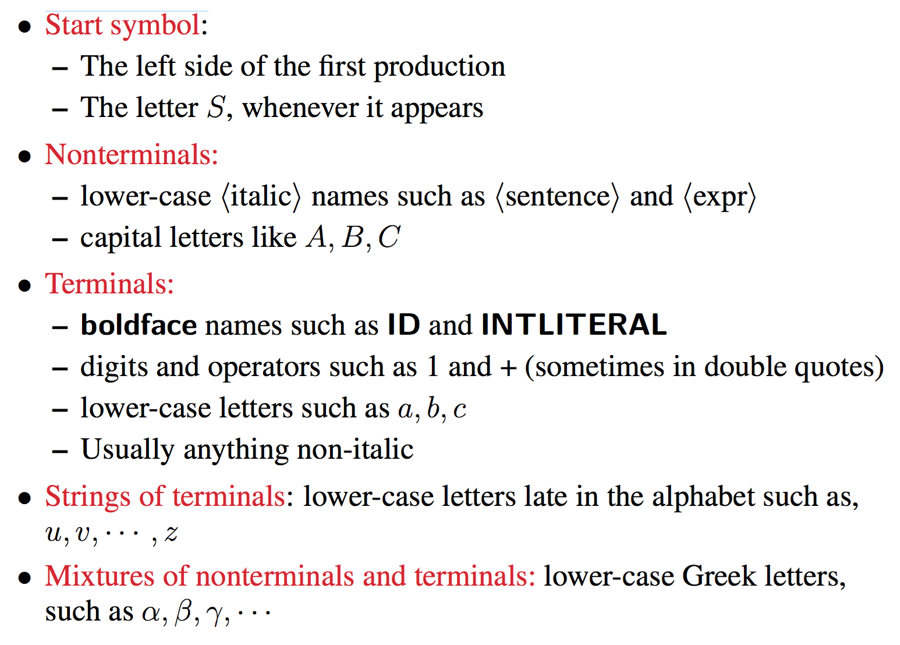

## Micro English
---

lets take a very small simple subset of english and define the CFG for it in BNF.

```
1 ⟨sentence⟩ → ⟨subject⟩ ⟨predicate⟩
2 ⟨subject⟩ → NOUN
3		| ARTICLENOUN
4 ⟨predicate⟩ → VERB ⟨object⟩
5 ⟨object⟩ → NOUN
6 		| ARTICLENOUN
```

This just says the a sentence is a subject followed by a predicate and then defines a subject as either a noun or article noun and a predicate as a verb followed by a noun or article noun

For example "John ate pasta"

```
sentence
subject predicate
noun<'john'> predicate
noun<'john'> verb<'ate'> object
noun<'john'> verb<'ate'> noun<'pasta'>
```

## Derivation
---

A grammar derives sentences by
1. beginning with the start symbol, and
2. repeatedly replacing a nonterminal by the right-hand side of a production with that nonterminal on the left-hand side, until there are no more nonterminals to replace.

Such a sequence of replacements is called a `derivation` of the sentence being analysed

The strings of terminals and nonterminals appearing in the various derivation steps are called `sentential forms`

A `sentence` is a sentential form with terminals only and the language is  the set of all sentences thus derived

#### Example

given micro english and given a sentence `PETER PASSED THE TEST` verify that it is a valid sentence given our grammar.

alright lets break it down

```
Sentence -> subject predicate
	Peter (subject) passed the test (predicate)
subject -> Noun | article noun
	Peter (noun) passed the test (predicate)
predicate -> verb object
	Peter (noun) passed (verb) the test (object)
object -> noun | article noun
	peter (noun) passed (verb) the (article) test (noun)
```
Thus the sentence is `NOUN VERB ARTICLE NOUN`

#### Notation

The context-free language (CFL) is the language generated by a CFG

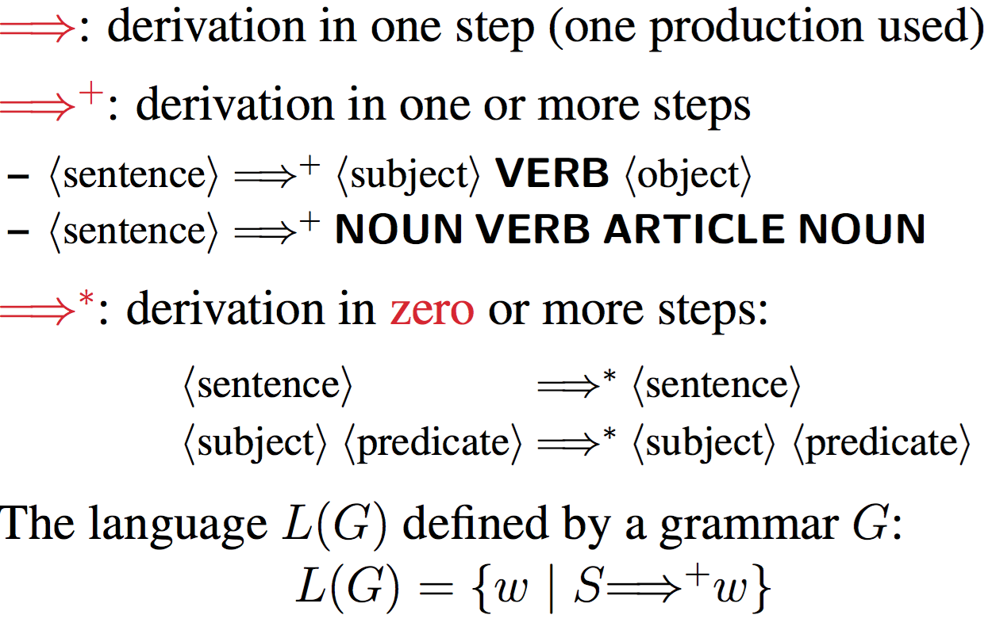

## Leftmost and Rightmost Derivations
---

The algorithm is basically saying "alright what's non terminal and what can i replace it with so it gets closer to non terminal"

and which non terminal the algorithm picks next can be set to be either

1. The Leftmost derivation: always replace the leftmost nonterminal.
2. The Rightmost derivation: always replace the rightmost nonterminal.

## The language defined by a grammar
---

The language defined by a grammar: all the sentences derived from the grammar.
The language defined by the micro-English grammar:
	`NOUN VERB NOUN`
	`NOUN VERB ARTICLE NOUN`
	`ARTICLE NOUN VERB NOUN`
	`ARTICLE NOUN VERB ARTICLE NOUN`

# Parsing

## Intro
---

We can use syntactic rules to break a sentence into its component parts and analyse their relationship. A parser is thus a program that uses a CFG to parse a sentence or a program (Assignment 3). In particular, it constructs its leftmost or rightmost derivation, or builds the parse tree for the sentence.

A recogniser is a parser that checks only the syntax (without having to build the parse tree). It outputs YES if the program is legal and NO otherwise (Assignment 2).

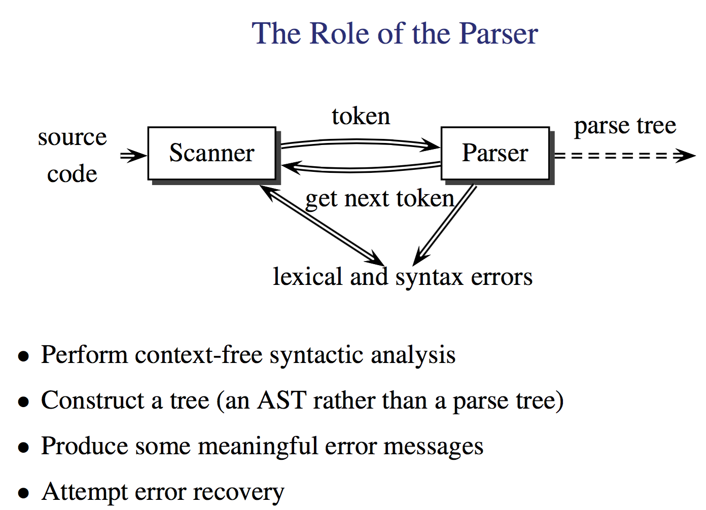

## Parse Trees
---

so you can do the left most and right more derivations to parse a sentence but it's much more useful to use that to construct a parse tree.

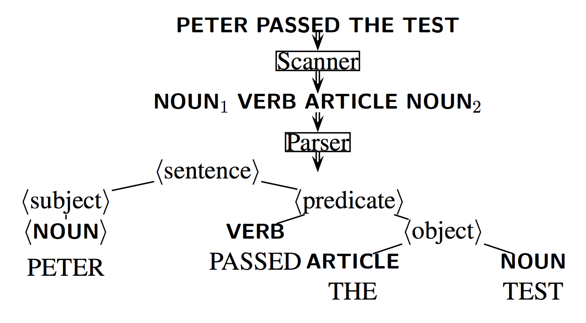

the start symbol here is the root of the tree and non terminals are nodes, the leafs are obviously terminal symbols.

with this tree we can get the sentence if we read the leafs left to right.

#### Why?

So we can get the same sort of information from a derivation rather then a parse tree, so why use the tree?
It's a graphical representation of the same information and makes it easier to think, furthermore computer science is deeply familiar  with tree structures and has gotten very good at manipulating them.

effectively we end up using derivation to construct the tree.

## Extended Backus-Naur Form (EBNF)
---

This is just BNF + regular expressions.

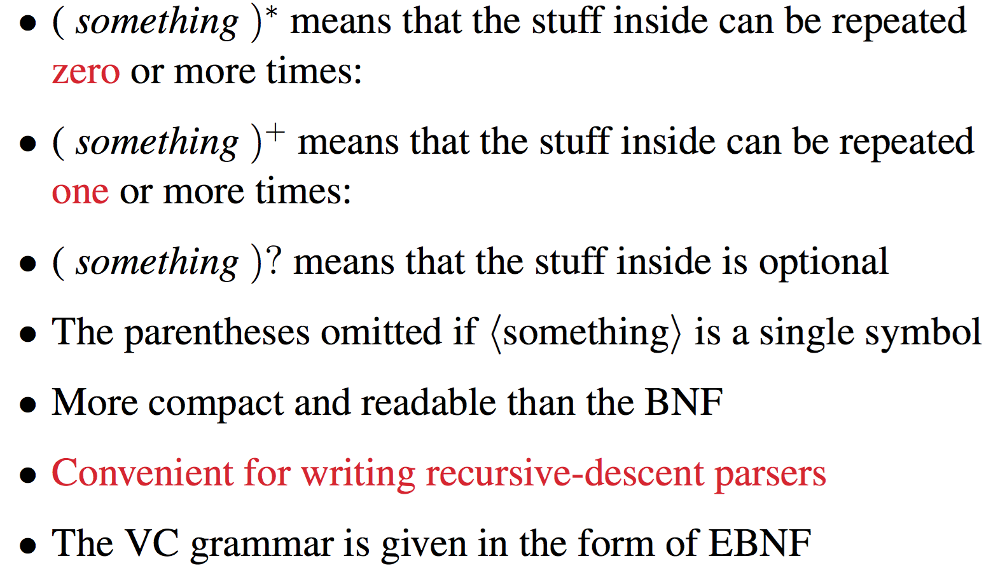

#### Example

lets say that a VC program is a sequence of zero or more functions

in BNF that would be

```
program → decl-list
decl-list → decl-list func-decl
		| decl-list var-decl
		| ϵ
```
as in a program is declaration list which in tern is either empty strings or function / variable declarations.

If we wrote this in EBNF we get

```
program → (func-decl | var-decl)∗
```

Reads easier doesn't it?

## Structure of Grammars
---

#### Top Down
This is a grammar which is structured much like the example for a VC Program above where we start with a top level definition of a program and get more detailed as we go down.

#### Bottom Up
here the deeper nodes in the parse tree processed first and the deeper operators in the parse tree have higher precedence, think that rather then classifying a whole program you jump right to classifying the first thing you see as a leaf node then building up.
This is assignment 5 (where we traverse our tree to build actual code) and will be covered more later.

#### Expressions and Operator associativity

There is this classic expression grammar

```
⟨expr⟩ → ⟨expr⟩ + ⟨term⟩
		| ⟨expr⟩ − ⟨term⟩
		| ⟨term⟩
⟨term⟩ → ⟨term⟩ ∗ ⟨factor⟩
		| ⟨term⟩/⟨factor⟩
		| ⟨factor⟩
⟨factor⟩ → ( ⟨expr⟩ )
		|ID
		| INT    //Note:integer numbers not the type
```

I.e any math expression can be broken down into some + / - of terms first and then those terms can be expressed as a factor or multiple of factors and terms.
Finally factors can themselves be contained expressions or leaf ints or ids.

Thus something like `A + B ∗ 10` becomes this

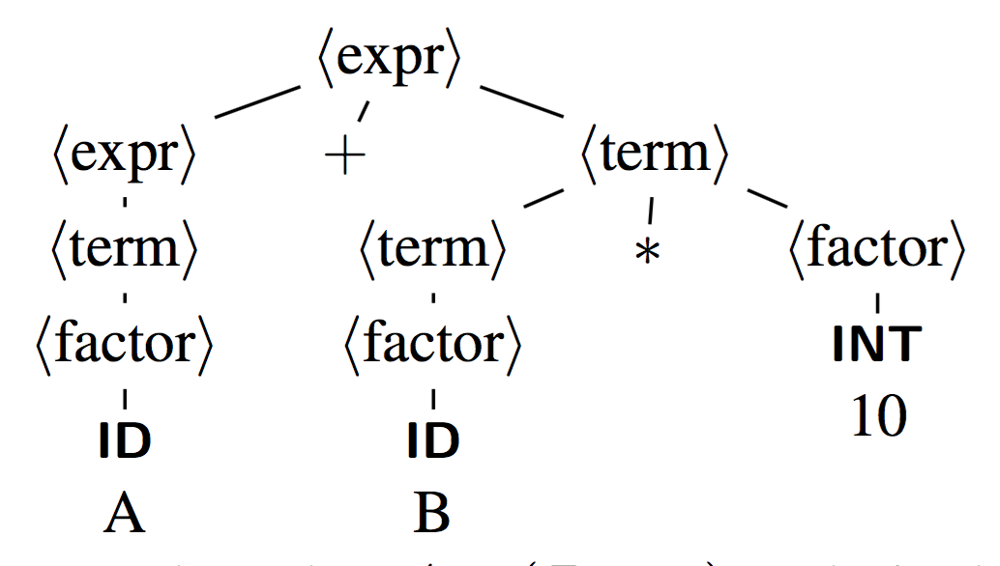

This is because higher precedence operators bind to their operands before lower precedence operators and thus appear lower in the tree.

the multiply symbol attaches to the B first, forming a term group meaning that it gets evaluated first. Which is what we want because basic PEDMAS dictates that `A+B*10` is `A+(B*10)`

ok but what if we said `(A+B)*10`?
The tree expands differently then:

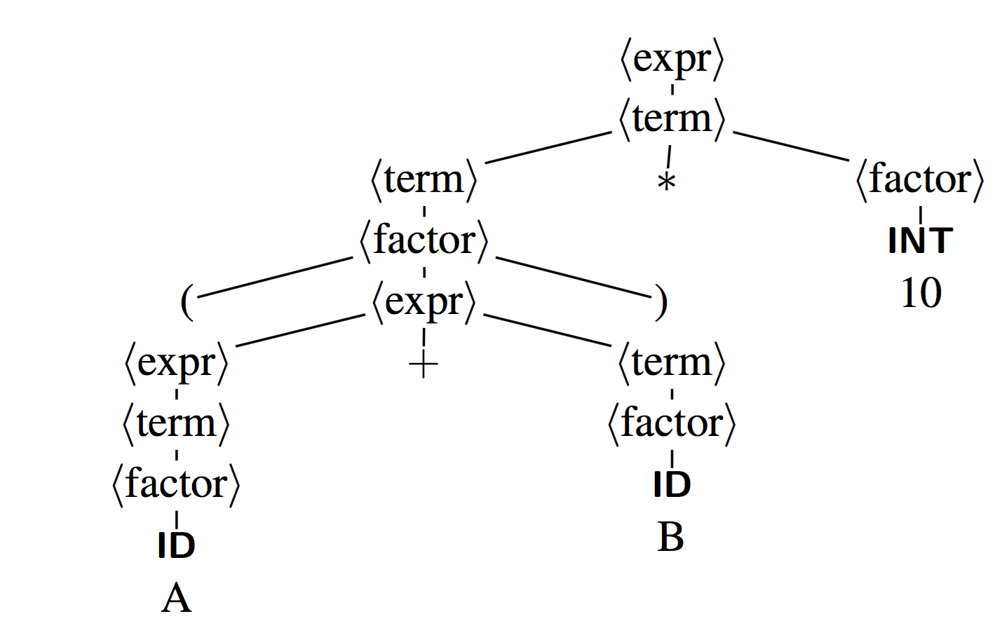

Here the expr goes directly to a term which goes to a `term * factor`.
the term then evaluates to a factor which evaluates back to a expression.

Because of this the plus now appears lower in the tree then the multiply and thus is evaluated first at higher precedence

#### Left and Right Recursive productions

So remember that as part of a grammar definition we define a set of productions, well those can be left or right and depending on which one they are we get a different tree being formed.

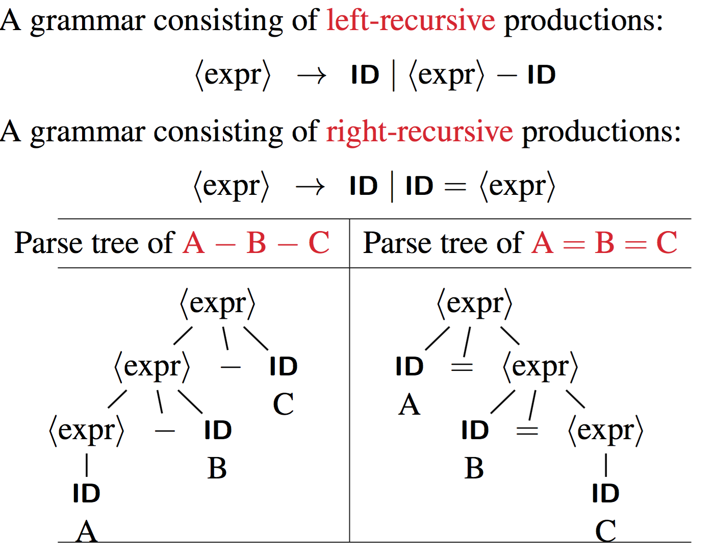

The formal definition is that `Left-Recursive Productions` have the form

*A→Aα*

and `Right-Recursive Productions` have the form

*A→αA*


This is important because with equations with equal precedence like `A-B-C` the order they are calculated in depends on the direction of the productions.

This has an important role later on when we look at what kind of grammars we can actually use so keep it at the back of ur pretty little head.

## Ambiguity
----

#### intro
Anyone who speaks english knows that it's a bit fucked, for example, real sentences written into medical records:

1. By the time he was admitted, his rapid heart had stopped, and he was feeling better.
2. Patient has chest pain if she lies on her left side for over a year.
3. On the second day the knee was better and on the third day it had completely disappeared.
4. The patient was tearful and crying constantly. She also appears to be depressed.
5. Discharge status: Alive but without permission. The patient will need disposition, and therefore we will get Dr. Blank to dispose of him.

`PURE FUCKEN GOLD`

A grammar is ambiguous if it permits

- more than one parse tree for a sentence,
or in other words,
- more than one leftmost derivation or more than one
rightmost derivation for a sentence.

Basically if the same sentence can be interpreted in more then one way.

#### Example

An ambiguous expression grammar:

```
⟨expr⟩ → ⟨expr⟩ ⟨op⟩ ⟨expr⟩ | ID | INT | ( ⟨expr⟩ )
⟨op⟩ →+|−|∗|/
```

if we take the Lm (Leftmost derivation) we can get 2 results

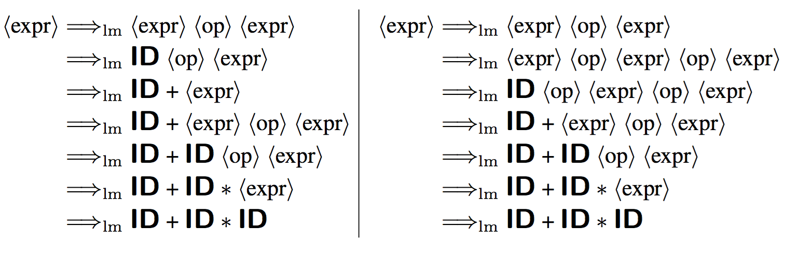

#### Coping

well the obvious thing is to rewrite the grammar so it is unambiguous

we can also use disambiguating rules to throw away undesirable parse trees, leaving only one tree for each sentence. I.e we get multiple results but have a system for choosing 1 each time. i.e
- Rule 1: * and / have higher precedence than + and −
- Rule 2: The operators of equal precedence associate to the left.

#### Ambiguous Context-Free Languages

These are languages such that every grammar generating the language is ambiguous

But a interesting theoretical result from looking at these languages is that there can be no algorithm that can tell us if a CFL is ambigious or not.

some tools can semi predict if a language is ambiguous or not but because this problem relates directly to the `Post correspondence problem` a simpler varied version of the `halting problem` which have been proven to be undecidable problems.

#### The “Dangling-Else” Grammar

We can recognise one line if else statements with this

```
⟨stmt⟩ -> IF “(” ⟨expr⟩ “)” ⟨stmt⟩
		|	IF “(” ⟨expr⟩ “)” ⟨stmt⟩ ELSE ⟨stmt⟩
		|  other
```

but note that input such as `IF(e1) if (e2) s1 else s2` can produce
either

```
if(e1)
	if(e2)
		s1
	else
		s2
```

OR

```
if(e1)
	if(e2)
		s1
else
	s2
```

What we do here is match the else with the closest previous unmatched if (an example of a disambiguation rule)

so the first interpretation is correct

#### Chomsky

Remember this table?

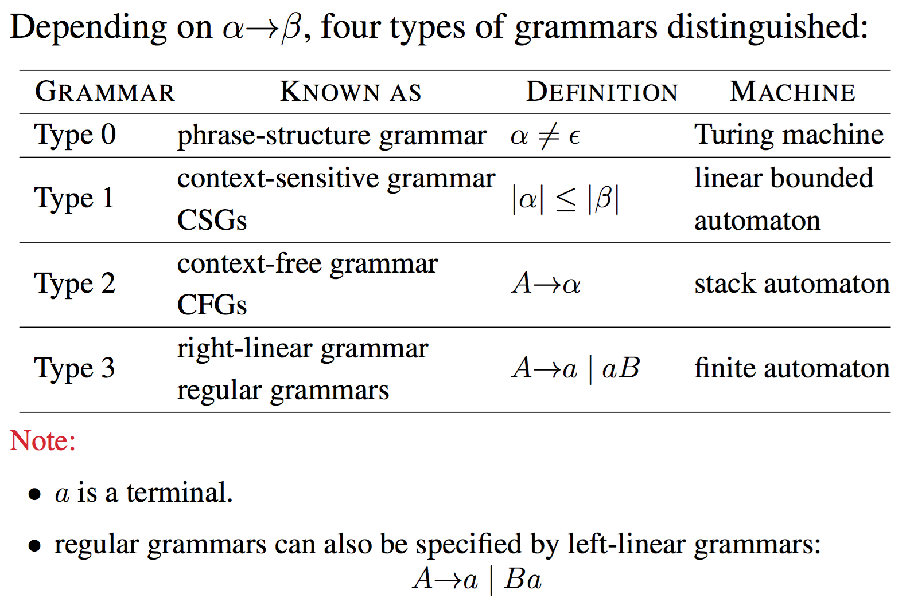

note that each type is a subset of the previous.

Type 0 is all languages, type 1 is a subset of type 0 and type 2 is a subset of type 1 (and hence also a subset of type 0).

we'll go into more detail on this later maybe.

## Regular Expressions, Regular Grammars and Finite Automata
---

All three are equivalent:

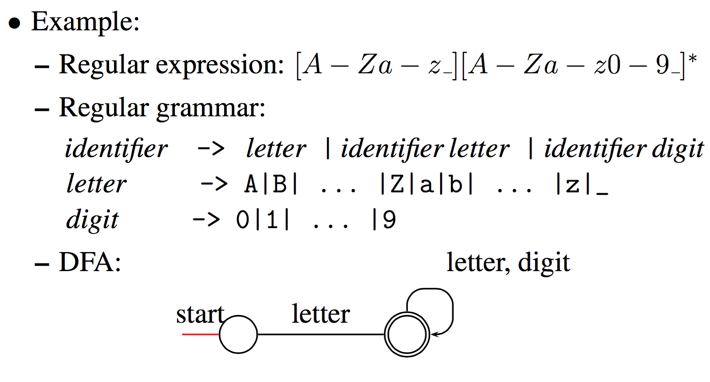

#### Limitations

**can't count**, can't nest, great for tokens but not much else.

#### Limitations of CFG

can't define ALL languages, must only define a subset.

it also can't enforce declaration before use of functions or variables, it just recognise a declaration and a variable.

it also can't enforce that a function is called with the right number of arguments, again this has to be done externally.

can count but only up to 2, if it tries to count more then 2 variables it becomes context sensitive. in essence this is because with more then two variables to keep track off your production rules now have to take in forward and backwards context into consideration (this rule only applies if there is a certain number of a's behind and b's infront)

where as with 2 variables you can just state the relationship before OR after.

(i think)

# Equivalence between Regular Grammars and FAs

## Converting NFAs to Right-Linear Grammars
---

#### Right Linear Grammars

this is just a CFG which every production rule has at most 1 non-terminal on the right end of the result side.

This can effectively describe the regular languages.

#### how?

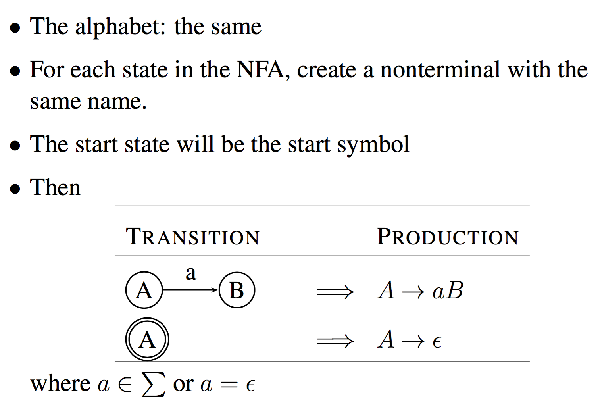

#### Example

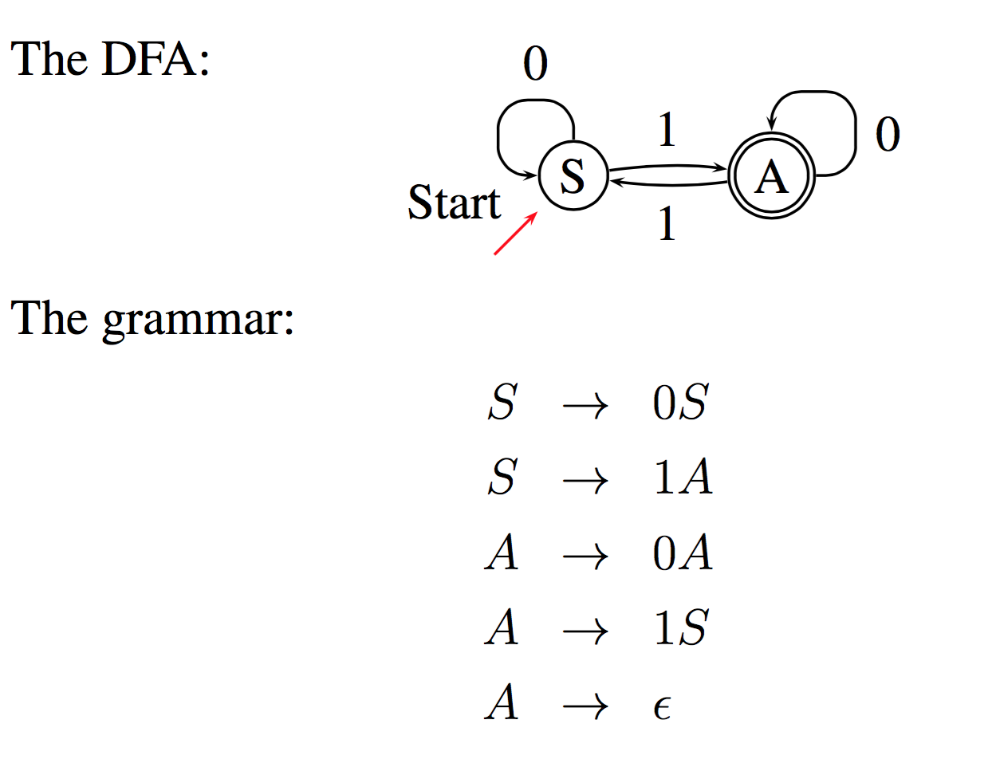


## Converting Right-Linear Grammars to NFAs
---

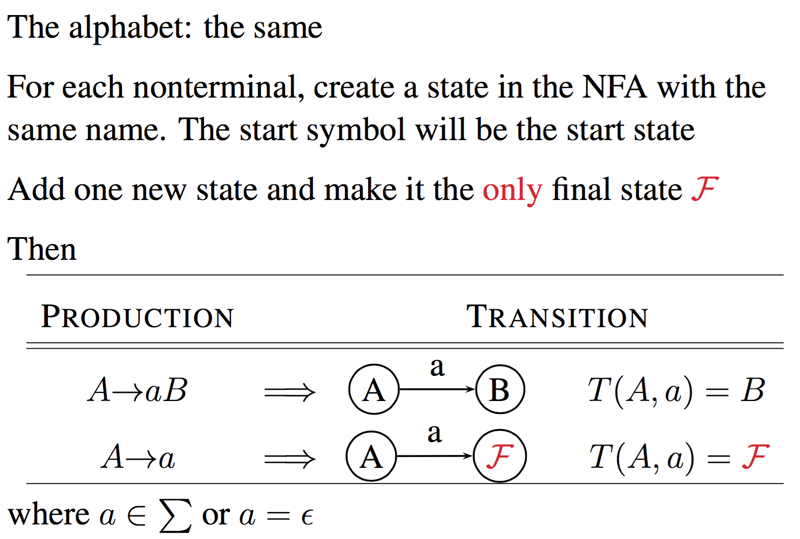

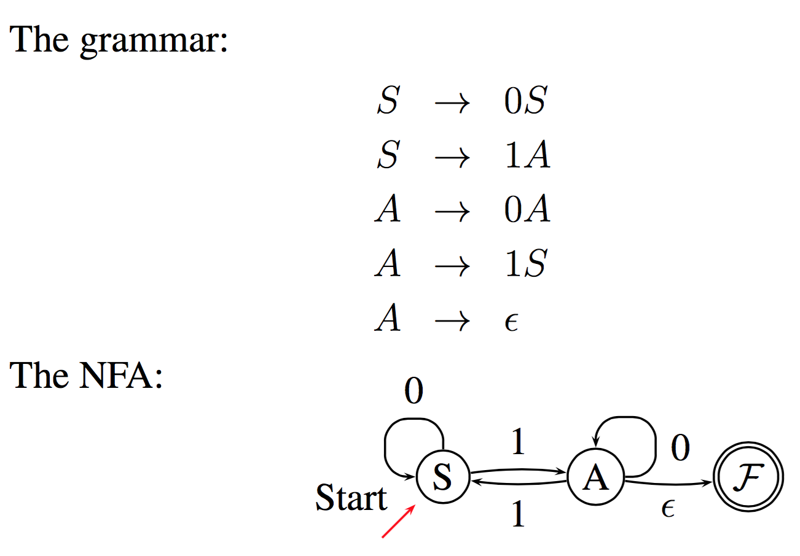
