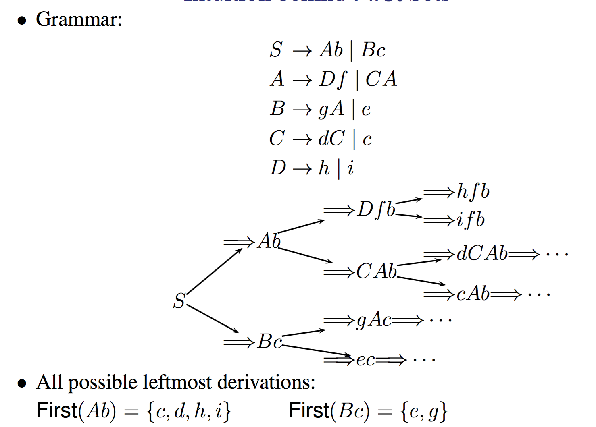

# Top-Down Parsing: Recursive-Descent

## Lookahead Token(s)
---
The currently scanned token(s) in the input. In Recogniser.java, currentToken represents the lookahead token
For most programming languages, one token lookahead only is needed.
Initially, the lookahead token is the leftmost token in the input.

## Top Down Parsing
---

#### Intro

This is the process of building the parse tree.
we start with the start symbol (i.e., the root) and grow towards the sentence being analysed (i.e., leaves).

in general we can do this with just 1 lookahead token

a top down parse will discover the leftmost derivation, basically the productions used in expanding the parse tree represent a leftmost derivation

#### Predictive (Non-Backtracking) Top-Down Parsing

To expand a nonterminal, the parser always `predicts` (choose) the right alternative for the nonterminal by looking at the lookahead symbol only.
Note this is why we call it the lookahead symbol, it's been read from the file but hasn't been added to the tree and hence is not the current symbol.

Flow-of-control constructs, with their distinguishing keywords, are detectable this way, e.g. in the VC grammar:

```
⟨stmt⟩ → ⟨compound-stmt⟩
	| if ”(” ⟨expr⟩ ”)” (ELSE ⟨stmt⟩)?
	| break ”;”
	| continue ”;”
	| ...
```
Prediction happens before the actual match begins! the code can look at the lookahead symbol and be able to tell which of the multiple cases to go to i.e it can see if the next symbol is a if or a break or a continue.

#### Example
Which of the Two Alternatives on S to Choose?

```
S → aA|bB
A → ···
B → ···

lookahead token: a
```

The leftmost derivation:
`S -> lm aA`
Thus we select the first alternative aA

How about here?

```
S → Ab|Bc
A → Df | CA
B → gA | e
C → dC | c
D → h | i

sentence: gchfc
```

We follow the following sequence

```
S -> Bc	Bc
B -> gA	gAc
A -> CA	gCAc
C -> c		gcAc
A -> Df	gcDfc
D -> h		gchfc
```

To do this though notice that we need a little more information then just the next token. Usually what we do is look at First Sets

## First Sets
---

All possible leftmost derivations, i.e what would happen if you reduced the left hand side as much as possible till you hit terminals.



This lets us look at all the possible ends of something like Bc {e,g} compares to Ab {c,d,h,i} and this of course we pick Bc because g is the next token.

#### Formal Defintion

$First(\alpha)$ : The set of all terminals that can begin any strings derived from α. Basically if we were to look at all possible derivations of $\alpha$ the First would be the set of all the terminals that appeared at the start of the strings.

$First(\alpha)$ can also include $\epsilon$ if it is a valid end state for a given $\alpha$

#### Nullable Nonterminals

A nonterminal A is nullable if it can be derived to a $\epsilon$.

#### A Procedure to Compute First(α)

The simple explanation:

We want to be able to grab the leftmost terminal symbols for any string right? so the basic equation for a input sentence s is

```python
def first(s):
	result = emptySet()
	# empty string input is empty string output
	if len(s) == 1 and s == epsilon:
		result.add(epsilon)
	# if we have a non terminal descend into all branches
	if len(s) == 1 and s is nonterminal:
		# i.e if s -> es|b go through first(es) + first(b)
		for e in s.getOptions():
			setUnion(result, first(e))
	# if we have a string just decend into all symbols
	# up to and including the the first non
	# terminal, i.e Keep searching until you get a
	# symbol that gives you a definite non epsilon end point.
	if len(s) > 1:
		# i.e if s is ABcd go though A then B then ...
		for e in s.split():
			if e.isNullable() == False:
				result.add(First(e))
				break
			result.add(First(e))
	return result
```
The formal explanation:

We have two cases, in the first case α is a single symbol or \\(\epsilon\\), Here we can do this

```
if α is a terminal a:
	First(α) = First(a) = {a}
elif α is epsilon:
 First(α) = First(epsilon) = {epsilon}
elif α is a nonterminal and α→ β1 |β2 |β3 | ···:
	First(α) = ∪kFirst(βk)
```
This makes a lot of sense, if the have nothing we return nothing and if we have just 1 terminal then that is the obvious first.
if we have multiple options basically decend into each one and grab the first non nullable character that pops out!

For the Second case we have α = X1X2 ···Xn, i.e a combination of symbols. Here we basically just travel along until we reach something that isn't nullable which gives us a definite end point.
We add in the epsilon as a option obviously if the entire set can possibly evaluate to epsilon.

```
if X1X2 . . . Xi is nullable but Xi+1 is not:
	# add everything up to and including the first non nullable symbol
	First(α) = First(X1) ∪ First(X2) ∪ · · · ∪ First(Xi+1)
if α is nullable:
	Add epsilon to First(α)
```

#### Example

Given the grammar

```
S → ABCd
A → e|f|epsilon
B → g|h|epsilon
C → p|q
```

find First(ABCd).

Now first of all ABCd is a combination of symbols so we go to case 2.

First(A) + First(B) + First(C)

as C is the first non nullable symbol.

Now to evaluate these we go to case 1.

if $\alpha$ is a non terminal, the First of it is the union of all it's possible productions.

i.e First(A) = {e,f}
First(B) = {g,h}
First(C) = {p,q}

Note that we do not add in epsilon in this case as ABCd doesn't evaluate to $\epsilon*$

but in this case

```
S → ABC
A → e|f|epsilon
B → g|h|epsilon
C → p|q|epsilon
```
First(ABC) = {e,f,g,h,p,q,$\epsilon$}

#### Linking it back

```
S → Ab|Bc
A → Df | CA
B → gA | e
C → dC | c
D → h | i

sentence: gchfc
```

now First(Ab) is First(A) as A is not nullable.

First(A) = First(Df) + First(CA)
remember depend through all the options and get the first non-nullable from any string of multiple symbols.

First(A) = First(D) + First(C)
First(A) = {h,i,d,c}

You can do the same thing with First(Bc) and get {e,g}
thus allowing us to pick Bc because it contains the g terminal.

## The Expression Grammar
---

Basically a form of grammar that does not have any ambiguity, note below


Taking out recursion gives us a more defined grammar. The choice operator (|) here selects the first match, while it is ambiguous in CFG

btw this makes more sense if you remember the E is expression and T is term and F is factor.

## Follow Sets
---

First of all Follow sets tell us the series of symbols that Follow a given nonterminal A. Why do we care?

First sets do not tell us when to apply A→α such that α=⇒$\epsilon$\* (the important special case is A→$\epsilon$)

Basically First sets can tell us what to expand to get a symbol we need, i.e if First(E) gives us a gA and the lookahead symbol is a g perfect!
But it can not tell us how to get rid of something. FOLLOW covers the possibility that the leftmost non-terminal can disappear, so that the lookahead symbol is not actually a part of what we're presently expanding, but rather the beginning of the next construct.

take this example
```
S -> aAb
A -> a | <epsilon>
```
consider parsing the string 'ab'
we go S->aAb then A->epsilon

when we have aAb our logic would go "alright we have a, the lookahead symbol is now b, how can we convert A into b" and would crash. BUT if we said "alright well Follow(A) = {b} lets just have A go to epsilon to get our lookahead token in a round about way"

Follow sets constructed only for nonterminals and by convention, assume every input is terminated by a special end marker (i.e., the EOF marker), denoted by `$`
Follow sets do not contain $\epsilon$

#### Definition

For a nonterminal A, Follow(A) is the set of terminals that can appear immediately to the right of A in some sentential form

#### Algorithm

```python
def follow(A):
	result = emptySet()
	if A.isStartSymbol():
		result.add($)
	for transformation in grammar:
		# Here we look for a transformation in the
		# form B → αAβ
		if transformation.rightSide.contains(A):
			# add in the First(β) but without epislons
			toAdd = First(transformation.rightSide.beta)
			toAdd.removeElemFromSet(epsilon)
			results.add(toAdd)
			# if β is epsilon* then the previous step
			# did nothing, here chuck in Follow(B) because
			# if beta is empty string, there is no right terminal
			# so descend and keep looking
			if transformation.rightSide.beta.isOneOrMoreEpislons():
				results.add(follow(transformation.leftSide))
	return result
```

#### Example

recall grammar 1

```
E → E+T | E−T |T
T → T∗F | T/F | F
F → INT | (E)
```

get Follow(E).

So E is a start symbol, so add `$` to our set `{$}`
Now E is on the right of the first and third transformations.

```
E → E+T | E−T |T
F → INT | (E)
```

for the 3rd one we add in the First(')') which is just gives us `{),$}`

for the second one we get First(+) and First(-) giving us our final set of

`{+,-,),$}`

this tells us all the valid terminal symbols which can FOLLOW e.
If it's a start symbol then it can be followed by nothing (`$`) and then we go through and find all other instances.

## Select Set
---

There is one Select set for every production in the grammar

It is in essence it just combines our rules for First and Follow into one set so for any given transformation we have all of our possible options in one set. Remember that in sets with epsilon terminals sometimes we need to look at the follow set for a symbol not just the first set.
In the case there are no epsilons the first is more then enough because the follow set really only kicks in when we have the option to destroy/vanish a symbol.

#### Defintion

The select set for a production $A\rightarrow \alpha$:

1. If $epsilon$ is in First(α), then
	- Select(A→$\epsilon$ = (First($\alpha$) − {$\epsilon$}) $\cup$ Follow(A)
2. Otherwise:
	- Select(A→$\epsilon$) = First($\epsilon$)

This assumes that the production you give it to be used in some derivation. Thus, the Select not needed if A has has one alternative i.e A -> a this is obvious, we don't need to make a decision her so a select set is useless.

## Predictive Recursive Descent
---

Predictive (or non-backtracking): The parser always predicts the right production to use at every derivation step

Recursive, a parsing method may call itself recursively either directly or indirectly. i.e A -> A+A
Descent: the parser builds the parse tree (or AST) by descending through it as it parses the program. In this case we think of the parse tree as already existing implicitly in the code and as we read through it we traverse this imaginary tree.

#### Basis of writing one

The variable currentToken is the lookahead token, which is initialised to the leftmost token in the program

#### Match

A method, called match, for matching the tokens at production right-hand sides, This just handles incorrect format errors. i.e `int =` instead of `int x =` would trigger a error at `=` as it was expecting a token of type `<id>`

```java
void match(int tokenExpected) {
	if (currentToken.kind == tokenExpected) {
		// Progress
		currentToken = scanner.getToken();
	} else {
		error: "tokenExpected" expected but "currentToken" found
	}
}
```

#### Nonterminal parsing
A method, called parseA, for every nonterminal

First how can we parse a non terminal A in the form
of $A\rightarrow a_{1}|a_{2}|...|a_{n}$

Basically we go through every possible options $a_1$ to $a_n$ and find which one out currentToken matches with.
i.e if our next token was \<expr\> and we had $A \rightarrow <expr> | <fact>$ the parse code would match the expr and parse that not the fact.

```java
void parseA() {
	switch (currentToken.kind) {
		cases in Select(A→α1)
			parse α1
			break;
			···
		cases in Select(A→αn)
			parse αn
			break;
		default:
			syntacticError(...);
			break;
	}
}
```

Of course if we have $A\rightarrow \alpha$ then we just do

```java
void parseA() {
	parse α
}
```
note that A is variable here it could be parseExpr or parseDick

#### String parsing
Ok now comes the fun part, parsing multisymbol strings.

Suppose $\alpha_i = aABbC$, where A, B and C are nonterminals

parse $\alpha_{i}$ implemented as:

```java
match("a");
parseA();
parseB();
match("b");
parseC();
```

If $\alpha_{i} = \epsilon$, then parse $\alpha_{i}$ implemented as:

```
/* empty statement */
```

This does mean that we need a parse statement for every one of these

```java
void parseWhileStmt() throws SyntaxError {
   match(Token.WHILE);
   match(Token.LPAREN);
   parseExpr();
   match(Token.RPAREN);
   parseStmt();
}
```

#### Managing the start symbol


# LL(1)

## Intro
---


It is called LL because it parses the input from `L`eft to right, performing `L`eftmost derivation of the sentence.

## Grammar
---

A LL(1) grammer is a grammer where you can do a lefthand derivation with just one lookahead token.

A grammar is LL(1) if for every nonterminal of the form $A \rightarrow \alpha_{1}|...|\alpha_{n}$
the select sets are pairwise disjoint, i.e.:
$Select(A\rightarrow \alpha_{i}) \cap Select(A\ rightarrow\alpha_{j}) = \emptyset$
for all i and j such that i != j.

Basically for any given non terminal every derivation must only appear once.
This implies there can be at most one nullable alternative as every derivation has a unique Select set and thus path to it.

When we have this we can have a parse function with only 1 nullable alternative in the transformation. Lets say that $\alpha_{n}$ is the only nullable alternative. In this case we can set every other alpha simply as $Select(A\rightarrow \alpha_{i}) = First(\alpha_{i}) $ because remember we only really case about the Follow sets in relation to nonterminals that can me eliminated.

This simplifies the code significantly.


#### Left-Recursive Grammars Are Not LL(1)

Lets take the left recursive grammar from slide 213 and try and form a parsing function for that

```
E → E+T | E−T | T
T → T∗F | T/F | F
F → INT | (E)
```

```java
void parseE() {
    switch (currentToken.kind) {
    	case Token.INT: case Token.LPAREN:
          parseE();
          break;
    	case Token.INT: case Token.LPAREN:
          parseE();
          match(Token.PLUS);
          parseT();
          break;
    	case Token.INT: case Token.LPAREN:
          parseE();
          match(Token.MINUS);
          parseT();
          break;
    	default:
          syntacticError(...);
    break;
    }
} /* this does not work */

```

`I can't say for sure but i think this code is wrong given all the cases are the same.`

This doesn't work because it goes into a infinite loop, note how in the first case there is no match but a recursive call to parseE()

so what we generally do is remove recursion from the grammar

Just for the test note that `Non-Direct Left Recursion` is just something like this

$A \rightarrow B\alpha $
$B \rightarrow A\beta $

#### Grammar Rewriting

This is a method for removing left recursion from a grammar

Lets say given the following grammar

$A \rightarrow \alpha$
$A \rightarrow A\beta_{1}|A\beta_{2}$

We can transform into this to remove the left recursion on the second transformation.

$A \rightarrow \alpha A'$
$A' \rightarrow \beta_{1}A'|\beta_{2}A'|\epsilon$

Note the use of a intermediate to convert this into a form that uses RIGHT recursion instead, i.e you can parse but after a match to make sure a loop doesn't hit.

#### Eliminating Direct Left Recursion Using Regular Operators

We could also take the above defined grammar and convert it into

$A \rightarrow \alpha(\beta_{1}|\beta_{2})*$
**
This also eliminates left recursion.

Here we basically just substituted A for alpha in the second transformation.

> This is Recommended for Ass 2


#### Grammars with Common Prefixes Are Not LL(1)

Basically if you have two cases both of which rely on the same prefix (i.e common prefix) then the code becomes sorta non-deterministic.


#### Left Factoring

Just like we have ways to convert grammars with left recursion into ones without, we can deal with common prefixes.

Given

$A \rightarrow \alpha \beta_{1}|\alpha \beta_{2}$
$A \rightarrow\gamma$

we can get

$A \rightarrow \alpha A'$
$A \rightarrow\gamma$
$A'\rightarrow \beta_{1}|\beta_{2}$

All we did here was `left factor` the grammar i.e make transformation 1 into $A \rightarrow \alpha(\beta_{1}|\beta_{2})$ and then replace that with a intermediate.

Here is an example


#### Choice Operator

This is the recommended way to do ass 2 which is match the common prefix first THEN use the choice operator.

$A \rightarrow \alpha(\beta_{1}|\beta_{2})$

Here is an example


#### Coding parse in the presence of regular operators


## LL(k)
---

A grammar is LL(k) if it can be parsed deterministically using k tokens of lookahead. hence LL(1) only needs 1 lookahead token.

## Ass 2
---

• A subset of VC already implemented for you
• For expressions, you need to eliminate left-recursion on
several nonterminals as illustrated in Slide 242
• You also need to eliminate some common prefixes (e.g.,
one for ⟨primary-expr⟩) as illustrated in Slide 247.
• A simple left-factoring can fix the LL(2) construct:
⟨prog⟩ → ( ⟨func-decl⟩ | ⟨var-decl⟩ )∗
• Everything else should be quite straightforward

## General cases
---

These are just extra formal definitions of how to do the grammar rewriting / use regular operators. Can be found in the slides, i found them sorta not useful so i left them out of this already long af lecture.
