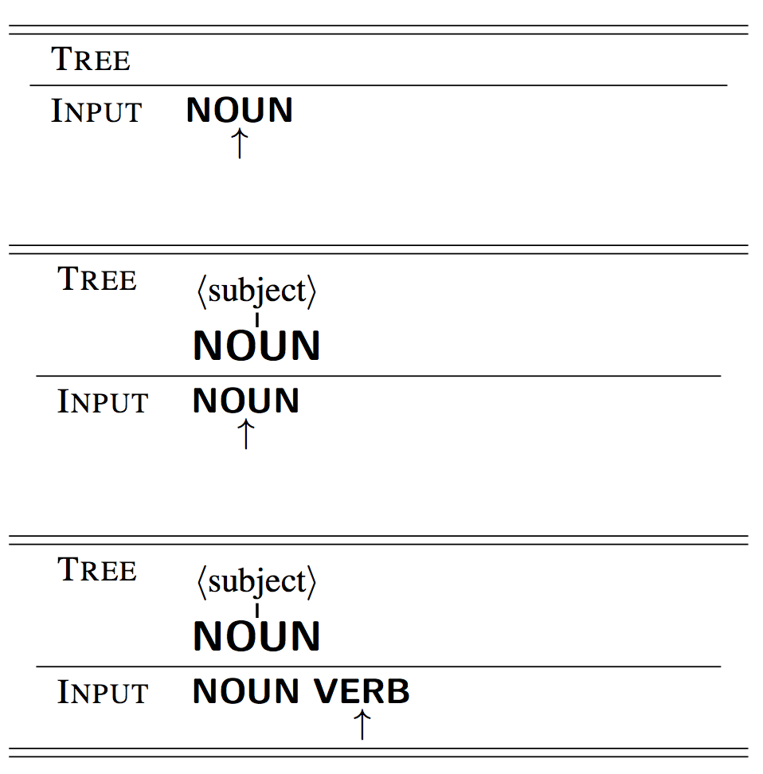
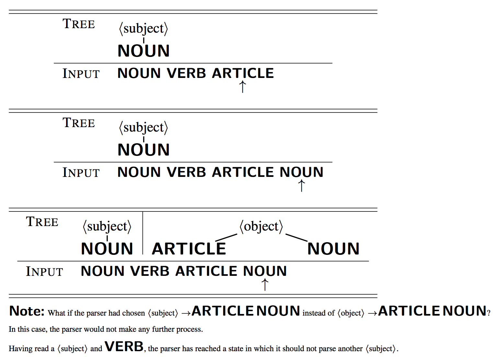
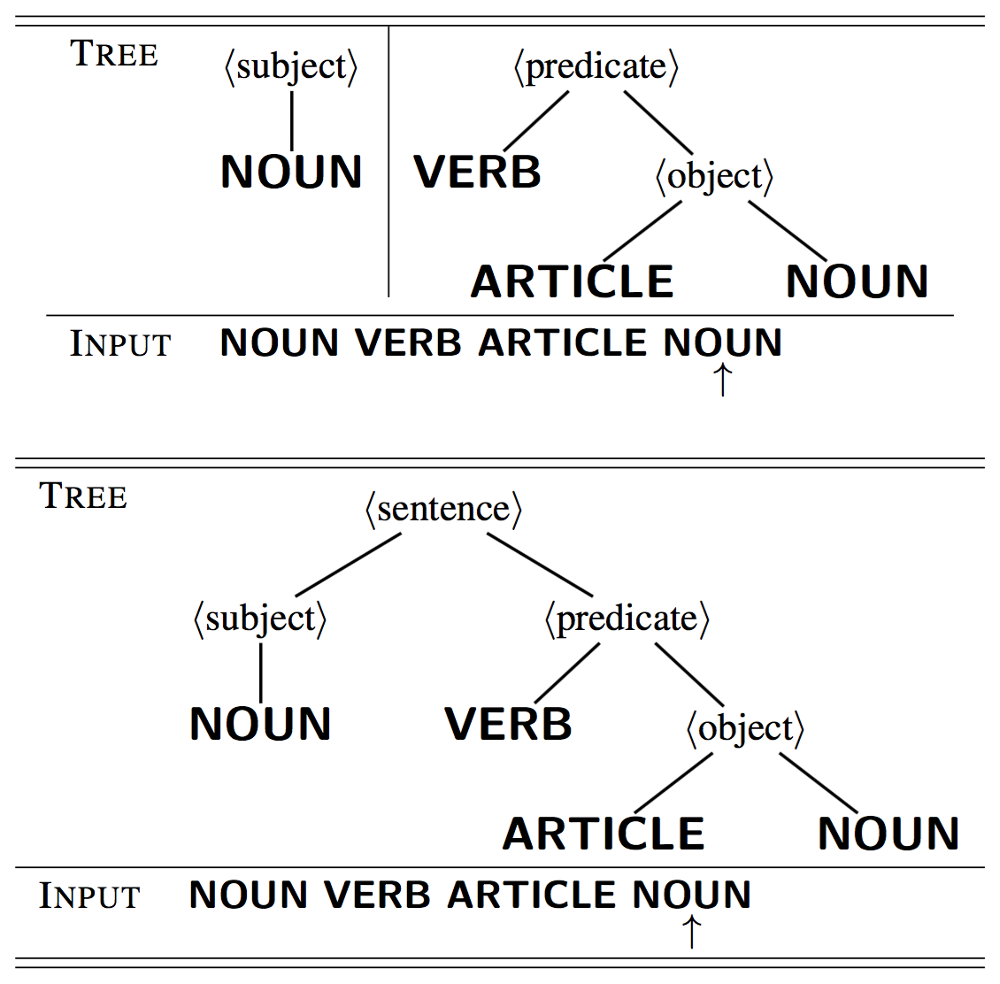
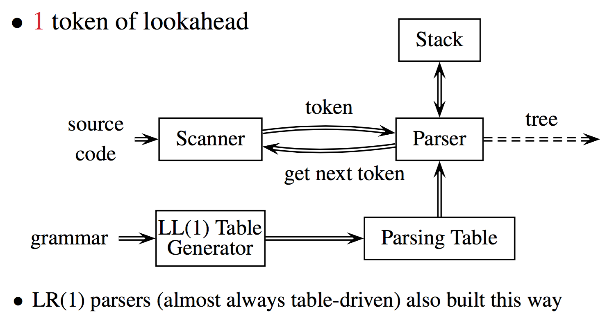
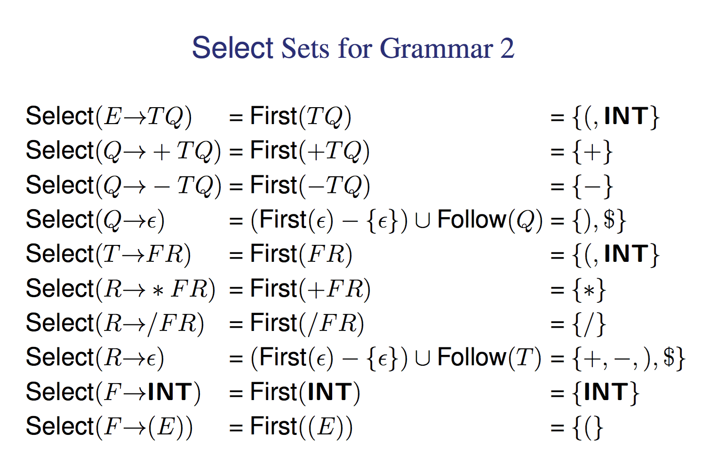
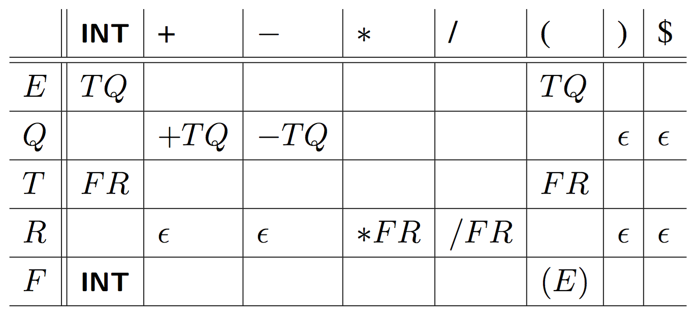
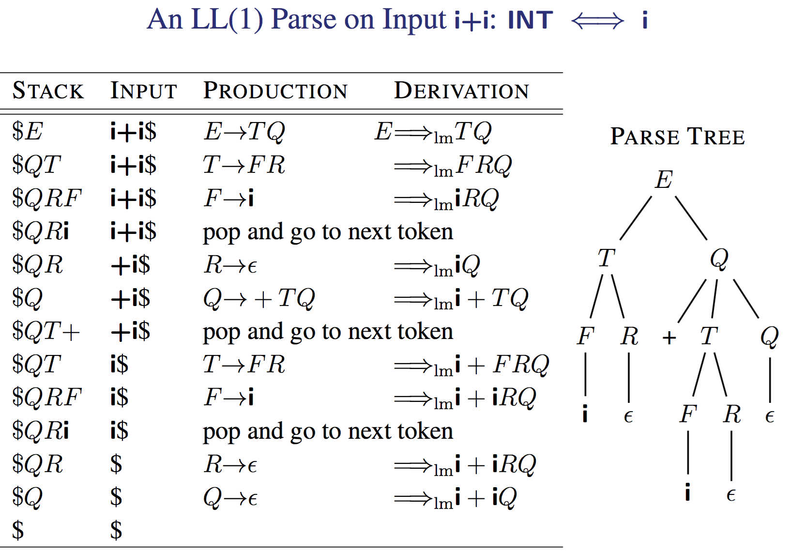
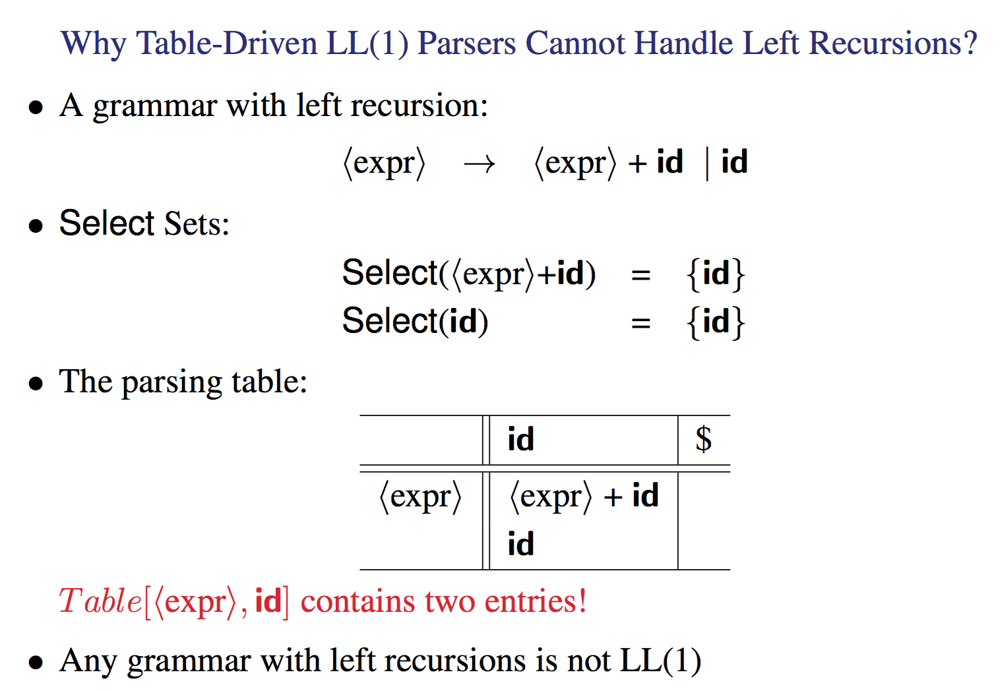
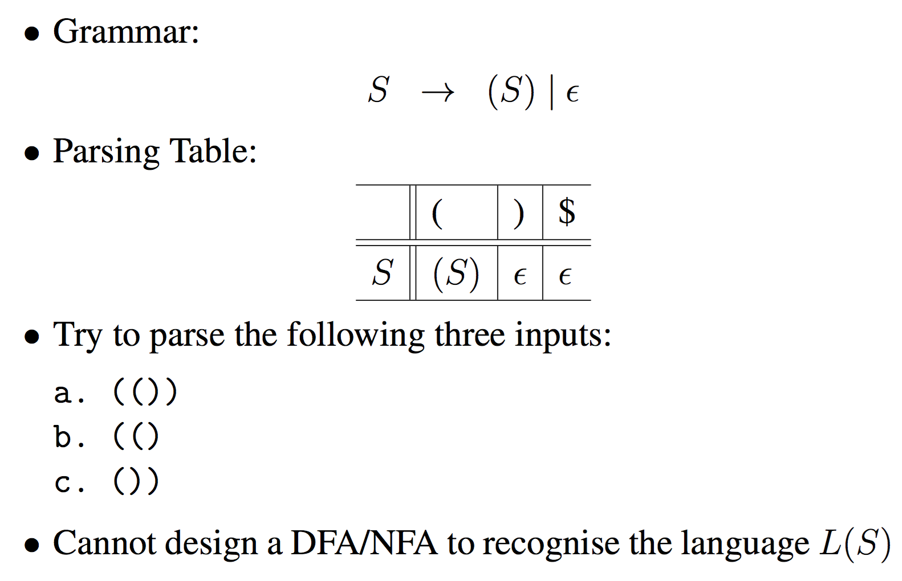
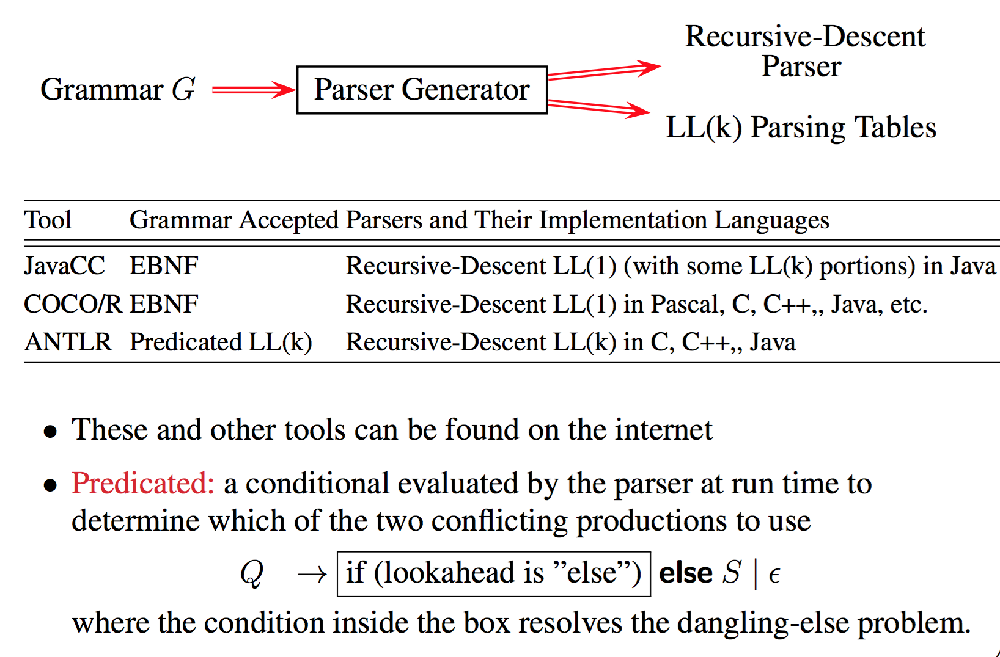

# Top-Down Parsing: Table-Driven

## Intro
---

This is another way to do top down parsing rather then using the recursive decent method we learnt last lecture.

## Two general parsing methods
---

1. Top-down parsing – Build the parse tree top-down:
	- Productions used represent the leftmost derivation.
	- The best known and widely used methods
		- Recursive descent
		- Table-driven
		- LL(k) (Left-to-right scan of input, Leftmost derivation, k tokens of
lookahead).
	- Almost all programming languages can be specified by LL(1) grammars, but such grammars may not reflect the structure of a language
    - In practice, LL(k) for small k is used
  	- Implemented more easily by hand.
  	- Used in parser generators such as JavaCC
2. Bottom-up parsing – Build the parse tree bottom-up:
	- Productions used represent the rightmost derivation in reverse.
	- The best known and widely used method: LR(1) (Left-to- right scan of input, Rightmost derivation in reverse, 1 token of lookahead)
	- More powerful – every LL(1) is LR(1) but the converse is false
	- Used by parser generators (e.g., Yacc and JavaCUP).

## Top Down
---

Build the parse tree starting with the start symbol (i.e., the root) towards the sentence being analysed (i.e., leaves).

Use one token of lookahead, in general, Discover the leftmost derivation

I.e, the productions used in expanding the parse tree represent a leftmost derivation

#### Predictive Non-Recursive Top-Down Parsers

Recursion = Iteration + Stack

Recursive calls in a recursive-descent parser can be
implemented using

- an explicit stack, and
- a parsing table

Understanding one helps your understanding the other

## Bottom Up
---





 Build the parse tree starting with the the sentence being analysed (i.e., leaves) towards the start symbol (i.e., the root).

Use one token of lookahead, in general.

The basic (smallest) language constructs recognised first, then they are used to discover more complex constructs.

Discover the rightmost derivation in reverse — the productions used in expanding the parse tree represent a rightmost derivation in reverse order

## Table-Driven LL(1) Parser
---
#### Structure

LL means left to right taking the Left most derivation and the (1) means only 1 lookahead token is needed.



This program can output a AST OR the productions it used to get the input, basically a leftmost derivation.

#### Algorithm

```python
stack = []
lookAheadToken = getNextLookaheadToken()
table = new2DList()
# Push on the end of input
# Push on the start symbol
stack.push($)
stack.push(start_symbol)
# While the stack is not empty
while(len(stack) > 0):
	X = stack.top()
	# if top of stack is the next token, pop it off and progress
	if X.terminal == True and X.value == lookAheadToken:
		stack.pop()
		lookAheadToken = getNextLookaheadToken()
	# is a terminal but not the right terminal, there is invalid input
	elif X.terminal == True and X.value != lookAheadToken:
		raiseError()
	# is a nonterminal
	else:
		if table[X, lookAheadToken] is nonBlank:
			stack.pop()
			stack.push(table[X,lookAheadToken])
		else:
			raiseError()
```

#### Construction

For every production of the A→α in the grammar, do:
	for all a in Select(A→α), set Table[A, a] = α





The First select E -> TQ leads to the table entry Table[E,(] = TQ and Table[E,INT] = TQ

#### Example



So we push on the start symbol E and out lookahead token is i.

E is a non terminal so we just add in the table entry for E,i onto the stack which is QT. We treat I like a int here remember.

So then we look at T and repeat, now making out Stack `$`QRF. We then get F to convert to i. Now we can pop i off and move the look ahead token.

this goes on until we have built the parse.

So you can see the usefulness of the table as it basically lets us exchange non terminals for their alternate forms given the current lookahead symbol.
It tells us what the next set of correct tokens are given a input.

This also catches errors as if we reach a non terminal we don't expect we can just fail. Furthermore if we get a non terminal that has no production given a look ahead token we can also fail.

That would be a case such as E -> F | Q but the lookahead token is in neither First(F) or First(Q).

#### LL(1)-ness

A grammar is LL(1) if every table entry contains at most one production. If we have more lookahead tokens we can then have multiple different productions depending on the level we are looking for.

#### Why Table-Driven LL(1) Parsers Cannot Handle Left Recursions



a production with left recursion can lead to ambiguity.

Note that if you convert this into a LL(1) grammar without recurrsion it all works, you do have to remember that the end of input character `$` is a valid terminal that you can put int the x axis of the table.

#### Why Table-Driven LL(1) Parsers Cannot Handle Common Prefix

same reason, you have two table entries in one cell.

#### Palindromes

remember how you couldn't use a finite state automa to see if brackets were balanced WELL WE CAN WITH THIS



## Parser Generators (Generating Top-Down Parsers)
---


